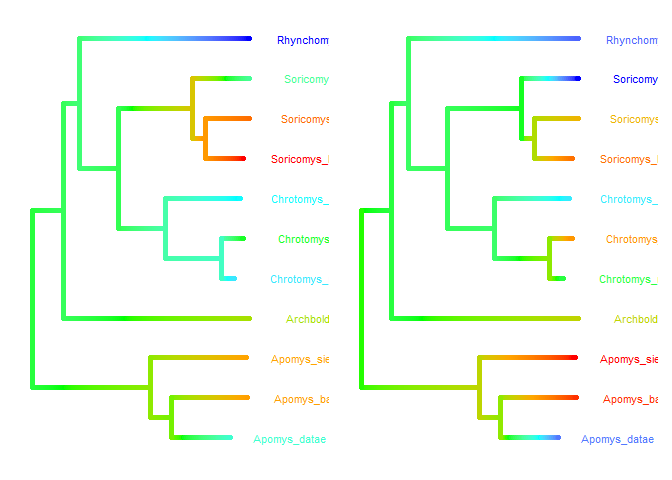

Load up Chrotomyini trabecular bone architecture (TBA) data and standardize variables:

```r
d <- read.csv(file = "G:\\My Drive\\Philippine rodents\\chrotomyini\\05062022 Philippine Murids segmentation parameters and morphological data - TBA data total BoneJ (full).csv", header = T)

d <- d[d$tribe=="chroto",c(1:2, 4:23)]

d <- 
  d %>% 
  mutate(bvtv = as.numeric(bvtv))

d <- 
  d %>%
  mutate(mass_s = rethinking::standardize(log10(mass_g)),
         elev_s = rethinking::standardize(elev), 
         bvtv_s = rethinking::standardize(bvtv),
         tbth_s = rethinking::standardize(tbth),
         tbsp_s = rethinking::standardize(tbsp),
         conn_s = rethinking::standardize(conn),
         cond_s = rethinking::standardize(m_connd),
         cond_s2 = rethinking::standardize(connd), 
         da_s = rethinking::standardize(da))

# remove C. gonzalesi and R. isarogensis, singletons:
d <- 
  d %>% 
  filter(taxon!="Chrotomys_gonzalesi") %>% 
  filter(taxon!="Rhynchomys_isarogensis")

# Make categorical vars into factors
d <- 
  d %>%
  mutate(loco = factor(loco), 
         hab_simp = factor(hab_simp),
         genus = factor(genus))

# Specify colors for plots:
cols = c("#86acca","#ab685b", "#3370a3", "#1f314c","#5a9fa8")
```

Load in phylogeny: 
REMEMBER: A <- ape::vcv.phylo(phylo), add corr = T if your tree is NOT SCALED TO 1. 

```r
ch.tre <- read.nexus(file = "G:\\My Drive\\Philippine rodents\\Chrotomys\\analysis\\SMS_PRUNED_and_COLLAPSED_03292022_OTUsrenamed_Rowsey_PhBgMCC_LzChrotomyini.nex")

ch <- ape::vcv.phylo(ch.tre, corr = T)

d <- 
  d %>% 
  mutate(phylo = taxon)
```

Ancestral state reconstruction as demonstrated here:
http://www.phytools.org/eqg2015/asr.html

Calculate species means:

```r
# Species means
dmean <- d %>%
  group_by(taxon) %>% 
  summarize(mass_s = mean(mass_s),
            bvtv_s = mean(bvtv_s),
            tbth_s = mean(tbth_s),
            tbsp_s = mean(tbsp_s),
            cond_s = mean(cond_s))
```


```r
mass_ace <- dmean$mass_s
names(mass_ace) <- dmean$taxon

fit<-fastAnc(ch.tre,mass_ace,vars=TRUE,CI=TRUE)
obj<-contMap(ch.tre,mass_ace,plot=FALSE)
plot(obj,legend=0.7*max(nodeHeights(ch.tre)),
    fsize=c(0.7,0.9))
```

<!-- -->

########################################

Use ggtree because then you can also use patchwork to look at stuff side by side. 

Bone Volume fraction:

```r
# Without size as predictor - just mean of scaled vars by species.
bvtv_ace <- dmean$bvtv_s
names(bvtv_ace) <- dmean$taxon
# Fit and make tree
fit<-fastAnc(ch.tre,bvtv_ace,vars=TRUE,CI=TRUE)
td <- data.frame(node = nodeid(ch.tre, names(bvtv_ace)),
               trait = bvtv_ace)
nd <- data.frame(node = names(fit$ace), trait = fit$ace)
d <- rbind(td, nd)
d$node <- as.numeric(d$node)
tree <- full_join(ch.tre, d, by = 'node')
p1bvtv <- ggtree(tree, aes(color=trait), 
        ladderize = FALSE, continuous = 'colour', size=2) +
    scale_color_gradientn(colours=c("red", 'orange', 'green', 'cyan', 'blue')) +
    geom_tiplab(size = 3, hjust=-0.3) + 
    theme(legend.position = "none") +
    xlim(0, 12)

# With size as predictor
ch.75.4 <- 
  brm(file = "G:\\My Drive\\Philippine rodents\\chrotomyini\\fits\\ch.75.4")
print(ch.75.4)
```

```
##  Family: student 
##   Links: mu = identity; sigma = identity; nu = identity 
## Formula: bvtv_s ~ 0 + taxon + mass_s 
##    Data: d (Number of observations: 67) 
##   Draws: 4 chains, each with iter = 2000; warmup = 1000; thin = 1;
##          total post-warmup draws = 4000
## 
## Population-Level Effects: 
##                            Estimate Est.Error l-95% CI u-95% CI Rhat Bulk_ESS
## taxonApomys_banahao            0.23      0.27    -0.30     0.76 1.00     4161
## taxonApomys_datae             -0.34      0.26    -0.84     0.19 1.00     3903
## taxonApomys_sierrae            0.48      0.29    -0.12     1.04 1.00     2633
## taxonArchboldomys_maximus     -0.45      0.30    -1.04     0.16 1.00     2337
## taxonChrotomys_mindorensis     0.45      0.40    -0.31     1.22 1.00     1458
## taxonChrotomys_silaceus       -0.62      0.26    -1.14    -0.11 1.00     2228
## taxonChrotomys_whiteheadi      0.53      0.36    -0.15     1.25 1.00     1668
## taxonRhynchomys_labo          -0.98      0.37    -1.70    -0.26 1.00     1446
## taxonSoricomys_kalinga         0.61      0.41    -0.18     1.41 1.00     1338
## taxonSoricomys_leonardocoi    -0.19      0.37    -0.92     0.52 1.01     1477
## taxonSoricomys_montanus        0.39      0.44    -0.46     1.27 1.00     1366
## mass_s                         0.67      0.24     0.19     1.13 1.01     1041
##                            Tail_ESS
## taxonApomys_banahao            2852
## taxonApomys_datae              2542
## taxonApomys_sierrae            2773
## taxonArchboldomys_maximus      2570
## taxonChrotomys_mindorensis     2252
## taxonChrotomys_silaceus        2698
## taxonChrotomys_whiteheadi      2342
## taxonRhynchomys_labo           2039
## taxonSoricomys_kalinga         2143
## taxonSoricomys_leonardocoi     2537
## taxonSoricomys_montanus        2274
## mass_s                         1667
## 
## Family Specific Parameters: 
##       Estimate Est.Error l-95% CI u-95% CI Rhat Bulk_ESS Tail_ESS
## sigma     0.61      0.08     0.45     0.77 1.00     2221     1664
## nu       18.69     13.04     3.36    51.72 1.00     2324     1746
## 
## Draws were sampled using sampling(NUTS). For each parameter, Bulk_ESS
## and Tail_ESS are effective sample size measures, and Rhat is the potential
## scale reduction factor on split chains (at convergence, Rhat = 1).
```

```r
bvtv_mu.0 <- ch.75.4 %>%    
  fixef() %>% 
  as.data.frame() %>% 
  select(matches("Estimate")) %>% 
  slice(1:11,)
bvtv_mu <- as.numeric(bvtv_mu.0$Estimate)
names(bvtv_mu) <- (gsub("taxon", "", rownames(bvtv_mu.0)))
# Fit and make tree
fit<-fastAnc(ch.tre,bvtv_mu,vars=TRUE,CI=TRUE)
td <- data.frame(node = nodeid(ch.tre, names(bvtv_mu)),trait = bvtv_mu)
nd <- data.frame(node = names(fit$ace), trait = fit$ace)
d <- rbind(td, nd)
d$node <- as.numeric(d$node)
tree <- full_join(ch.tre, d, by = 'node')

p2bvtv <- ggtree(tree, aes(color=trait), 
        ladderize = FALSE, continuous = 'colour', size=2) +
    scale_color_gradientn(colours=c("red", 'orange', 'green', 'cyan', 'blue')) +
    geom_tiplab(size = 3, hjust=-0.3) + 
    theme(legend.position = "none") +
    xlim(0, 12)

p1bvtv|p2bvtv
```

<!-- -->

Trabecular thickness:

```r
# Without size as predictor - just mean of scaled vars by species.
tbth_ace <- dmean$tbth_s
names(tbth_ace) <- dmean$taxon
# Fit and make tree
fit<-fastAnc(ch.tre,tbth_ace,vars=TRUE,CI=TRUE)
td <- data.frame(node = nodeid(ch.tre, names(tbth_ace)),
               trait = tbth_ace)
nd <- data.frame(node = names(fit$ace), trait = fit$ace)
d <- rbind(td, nd)
d$node <- as.numeric(d$node)
tree <- full_join(ch.tre, d, by = 'node')
p1tbth <- ggtree(tree, aes(color=trait), 
        ladderize = FALSE, continuous = 'colour', size=2) +
    scale_color_gradientn(colours=c("red", 'orange', 'green', 'cyan', 'blue')) +
    geom_tiplab(size = 3, hjust=-0.3) + 
    theme(legend.position = "none") +
    xlim(0, 12)

# With size as predictor
ch.76.4 <- 
  brm(file = "G:\\My Drive\\Philippine rodents\\chrotomyini\\fits\\ch.76.4")

tbth_mu.0 <- ch.76.4 %>%    
  fixef() %>% 
  as.data.frame() %>% 
  select(matches("Estimate")) %>% 
  slice(1:11,)
tbth_mu <- as.numeric(tbth_mu.0$Estimate)
names(tbth_mu) <- (gsub("taxon", "", rownames(tbth_mu.0)))
# Fit and make tree
fit<-fastAnc(ch.tre,tbth_mu,vars=TRUE,CI=TRUE)
td <- data.frame(node = nodeid(ch.tre, names(tbth_mu)),trait = tbth_mu)
nd <- data.frame(node = names(fit$ace), trait = fit$ace)
d <- rbind(td, nd)
d$node <- as.numeric(d$node)
tree <- full_join(ch.tre, d, by = 'node')

p2tbth <- ggtree(tree, aes(color=trait), 
        ladderize = FALSE, continuous = 'colour', size=2) +
    scale_color_gradientn(colours=c("red", 'orange', 'green', 'cyan', 'blue')) +
    geom_tiplab(size = 3, hjust=-0.3) + 
    theme(legend.position = "none") +
    xlim(0, 12)

p1tbth|p2tbth
```

<!-- -->
Trabecular spacing:

```r
# Without size as predictor - just mean of scaled vars by species.
tbsp_ace <- dmean$tbsp_s
names(tbsp_ace) <- dmean$taxon
# Fit and make tree
fit<-fastAnc(ch.tre,tbsp_ace,vars=TRUE,CI=TRUE)
td <- data.frame(node = nodeid(ch.tre, names(tbsp_ace)),
               trait = tbsp_ace)
nd <- data.frame(node = names(fit$ace), trait = fit$ace)
d <- rbind(td, nd)
d$node <- as.numeric(d$node)
tree <- full_join(ch.tre, d, by = 'node')
p1tbsp <- ggtree(tree, aes(color=trait), 
        ladderize = FALSE, continuous = 'colour', size=2) +
    scale_color_gradientn(colours=c("red", 'orange', 'green', 'cyan', 'blue')) +
    geom_tiplab(size = 3, hjust=-0.3) + 
    theme(legend.position = "none") +
    xlim(0, 12)

# With size as predictor
ch.77.4 <- 
  brm(file = "G:\\My Drive\\Philippine rodents\\chrotomyini\\fits\\ch.77.4")

tbsp_mu.0 <- ch.77.4 %>%    
  fixef() %>% 
  as.data.frame() %>% 
  select(matches("Estimate")) %>% 
  slice(1:11,)
tbsp_mu <- as.numeric(tbsp_mu.0$Estimate)
names(tbsp_mu) <- (gsub("taxon", "", rownames(tbsp_mu.0)))
# Fit and make tree
fit<-fastAnc(ch.tre,tbsp_mu,vars=TRUE,CI=TRUE)
td <- data.frame(node = nodeid(ch.tre, names(tbsp_mu)),trait = tbsp_mu)
nd <- data.frame(node = names(fit$ace), trait = fit$ace)
d <- rbind(td, nd)
d$node <- as.numeric(d$node)
tree <- full_join(ch.tre, d, by = 'node')

p2tbsp <- ggtree(tree, aes(color=trait), 
        ladderize = FALSE, continuous = 'colour', size=2) +
    scale_color_gradientn(colours=c("red", 'orange', 'green', 'cyan', 'blue')) +
    geom_tiplab(size = 3, hjust=-0.3) + 
    theme(legend.position = "none") +
    xlim(0, 12)

p1tbsp|p2tbsp
```

<!-- -->


Connectivity density:

```r
# Without size as predictor - just mean of scaled vars by species.
cond_ace <- dmean$cond_s
names(cond_ace) <- dmean$taxon
# Fit and make tree
fit<-fastAnc(ch.tre,cond_ace,vars=TRUE,CI=TRUE)
td <- data.frame(node = nodeid(ch.tre, names(cond_ace)),
               trait = cond_ace)
nd <- data.frame(node = names(fit$ace), trait = fit$ace)
d <- rbind(td, nd)
d$node <- as.numeric(d$node)
tree <- full_join(ch.tre, d, by = 'node')
p1cond <- ggtree(tree, aes(color=trait), 
        ladderize = FALSE, continuous = 'colour', size=2) +
    scale_color_gradientn(colours=c("red", 'orange', 'green', 'cyan', 'blue')) +
    geom_tiplab(size = 3, hjust=-0.3) + 
    theme(legend.position = "none") +
    xlim(0, 12)

# With size as predictor
ch.78.4 <- 
  brm(file = "G:\\My Drive\\Philippine rodents\\chrotomyini\\fits\\ch.78.4")

cond_mu.0 <- ch.78.4 %>%    
  fixef() %>% 
  as.data.frame() %>% 
  select(matches("Estimate")) %>% 
  slice(1:11,)
cond_mu <- as.numeric(cond_mu.0$Estimate)
names(cond_mu) <- (gsub("taxon", "", rownames(cond_mu.0)))
# Fit and make tree
fit<-fastAnc(ch.tre,cond_mu,vars=TRUE,CI=TRUE)
td <- data.frame(node = nodeid(ch.tre, names(cond_mu)),trait = cond_mu)
nd <- data.frame(node = names(fit$ace), trait = fit$ace)
d <- rbind(td, nd)
d$node <- as.numeric(d$node)
tree <- full_join(ch.tre, d, by = 'node')

p2cond <- ggtree(tree, aes(color=trait), 
        ladderize = FALSE, continuous = 'colour', size=2) +
    scale_color_gradientn(colours=c("red", 'orange', 'green', 'cyan', 'blue')) +
    geom_tiplab(size = 3, hjust=-0.3) + 
    theme(legend.position = "none") +
    xlim(0, 12)

p1cond|p2cond
```

<!-- -->


