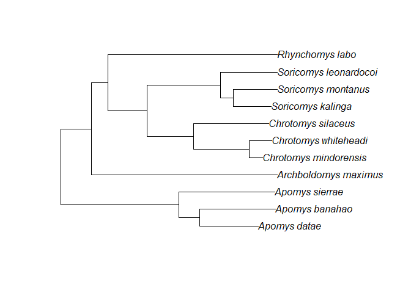
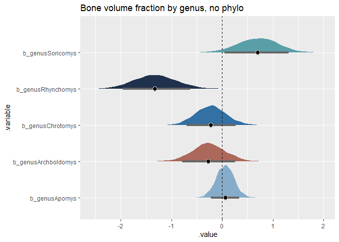
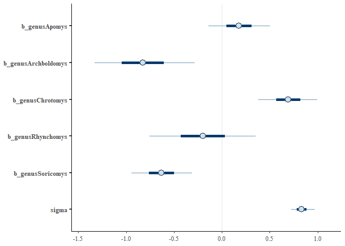
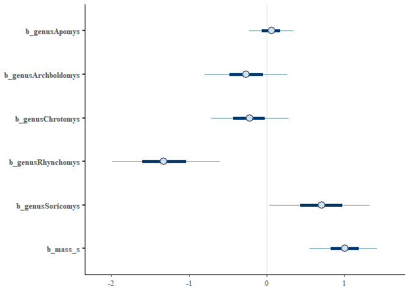
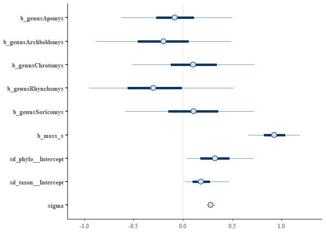
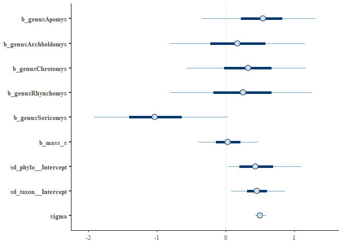

A handy reminder: a new %>% is made with ctrl+shift+m.


Load up your guys and standardize:

```r
d <- read.csv(file = "G:\\My Drive\\Philippine rodents\\Chrotomyini_brms\\04082022 Philippine Murids segmentation parameters and morphological data - TBA data total BoneJ (full).csv", header = T)

d <- d[d$tribe=="chroto",c(1:2, 4:22)]

d <- 
  d %>% 
  mutate(bvtv = as.numeric(bvtv))

d <- 
  d %>%
  mutate(mass_s = rethinking::standardize(log10(mass_g)),
         elev_s = rethinking::standardize(elev), 
         bvtv_s = rethinking::standardize(bvtv),
         tbth_s = rethinking::standardize(tbth),
         tbsp_s = rethinking::standardize(tbsp),
         conn_s = rethinking::standardize(conn),
         cond_s = rethinking::standardize(connd), 
         da_s = rethinking::standardize(da))

# remove C. gonzalesi and R. isarogensis
d <- 
  d %>% 
  filter(taxon!="Chrotomys_gonzalesi") %>% 
  filter(taxon!="Rhynchomys_isarogensis")

cols = c("#86acca","#ab685b", "#3370a3", "#1f314c","#5a9fa8")

d <- 
  d %>%
  mutate(loco = factor(loco), 
         hab_simp = factor(hab_simp),
         genus = factor(genus))
pairs(d[,c(22,24,25,26,28)])
```

<!-- -->

```r
dcov <- cov(d[,c(22,24,25,26,29)]) 
dcor <- cov2cor(dcov)
levelplot(dcor, col.regions = mako(100))
```

<!-- -->
Plot of Chrotomys only:

```r
chbvf<- d %>%
  filter(genus == "Chrotomys") %>% 
  ggplot()+
  geom_boxplot(aes(x=taxon, y = bvtv), lwd = 1.5, fill = "#3370A3", color = "#1F314C")

chtbth<- d %>%
  filter(genus == "Chrotomys") %>% 
  ggplot()+
  geom_boxplot(aes(x=taxon, y = tbth), lwd = 1.5, fill = "#3370A3", color = "#1F314C")

chtbsp<- d %>%
  filter(genus == "Chrotomys") %>% 
  ggplot()+
  geom_boxplot(aes(x=taxon, y = tbsp), lwd = 1.5, fill = "#3370A3", color = "#1F314C")

chbvf|chtbth
```

<!-- -->

Load in phylogeny: 
REMEMBER: A <- ape::vcv.phylo(phylo), add corr = T if your tree is NOT SCALED TO 1. 

```r
ch.tre <- read.nexus(file = "G:\\My Drive\\Philippine rodents\\Chrotomys\\analysis\\SMS_PRUNED_and_COLLAPSED_03292022_OTUsrenamed_Rowsey_PhBgMCC_LzChrotomyini.nex")
plot(ch.tre)
```

<!-- -->

```r
ch <- ape::vcv.phylo(ch.tre, corr = T)

d <- 
  d %>% 
  mutate(phylo = taxon)
```

ch.24: compare bvtv across genera, no phylo or nothin

```r
ch.24 <- 
  brm(data = d, 
      family = gaussian,
      bvtv_s ~ 0 + genus,
      prior = c(prior(normal(0, 1), class = b),
                prior(exponential(1), class = sigma)),
      iter = 2000, warmup = 1000, chains = 4, cores = 4,
      seed = 5,
      file = "G:\\My Drive\\Philippine rodents\\Chrotomyini_brms\\fits\\ch.24")
print(ch.24)
```

```
##  Family: gaussian 
##   Links: mu = identity; sigma = identity 
## Formula: bvtv_s ~ 0 + genus 
##    Data: d (Number of observations: 67) 
##   Draws: 4 chains, each with iter = 2000; warmup = 1000; thin = 1;
##          total post-warmup draws = 4000
## 
## Population-Level Effects: 
##                   Estimate Est.Error l-95% CI u-95% CI Rhat Bulk_ESS Tail_ESS
## genusApomys           0.18      0.19    -0.21     0.56 1.00     5779     2647
## genusArchboldomys    -0.82      0.32    -1.43    -0.19 1.00     6098     3360
## genusChrotomys        0.69      0.19     0.33     1.06 1.00     6144     2987
## genusRhynchomys      -0.20      0.34    -0.85     0.45 1.00     5480     2936
## genusSoricomys       -0.63      0.19    -1.01    -0.25 1.00     5510     2876
## 
## Family Specific Parameters: 
##       Estimate Est.Error l-95% CI u-95% CI Rhat Bulk_ESS Tail_ESS
## sigma     0.84      0.08     0.70     1.00 1.00     5015     2956
## 
## Draws were sampled using sampling(NUTS). For each parameter, Bulk_ESS
## and Tail_ESS are effective sample size measures, and Rhat is the potential
## scale reduction factor on split chains (at convergence, Rhat = 1).
```

```r
mcmc_plot(ch.24)
```

<!-- -->

```r
ch.24 %>%
  gather_draws(b_genusApomys,b_genusArchboldomys, b_genusChrotomys, b_genusRhynchomys, b_genusSoricomys) %>%
  ggplot(aes(y = .variable, x = .value)) +
  stat_halfeye(aes(fill = .variable), 
               point_fill = "#000000", 
               shape = 21, 
               point_size = 3, 
               point_color = "#FFFFFF",
               interval_size = 7,
               interval_color = "grey40",
               .width = .89) +
  scale_fill_manual(values = cols)+
  theme(legend.position = "none")+
  geom_vline(xintercept = 0, linetype = "dashed")+
  ggtitle(label = "Bone volume fraction by genus, no size or phylo")
```

<!-- -->
ch.25: compare bvtv across genera, mass but no phylo


```r
ch.25 <- 
  brm(data = d, 
      family = gaussian,
      bvtv_s ~ 0 + genus + mass_s,
      prior = c(prior(normal(0, 1), class = b),
                prior(exponential(1), class = sigma)),
      iter = 2000, warmup = 1000, chains = 4, cores = 4,
      seed = 5,
      file = "G:\\My Drive\\Philippine rodents\\Chrotomyini_brms\\fits\\ch.25")
print(ch.25)
```

```
##  Family: gaussian 
##   Links: mu = identity; sigma = identity 
## Formula: bvtv_s ~ 0 + genus + mass_s 
##    Data: d (Number of observations: 67) 
##   Draws: 4 chains, each with iter = 2000; warmup = 1000; thin = 1;
##          total post-warmup draws = 4000
## 
## Population-Level Effects: 
##                   Estimate Est.Error l-95% CI u-95% CI Rhat Bulk_ESS Tail_ESS
## genusApomys           0.06      0.17    -0.28     0.42 1.00     3220     2224
## genusArchboldomys    -0.26      0.33    -0.90     0.37 1.00     2355     2392
## genusChrotomys       -0.22      0.30    -0.78     0.38 1.00     1679     2052
## genusRhynchomys      -1.32      0.42    -2.10    -0.50 1.00     1809     2618
## genusSoricomys        0.70      0.40    -0.10     1.45 1.00     1512     2107
## mass_s                1.00      0.27     0.46     1.52 1.00     1389     1970
## 
## Family Specific Parameters: 
##       Estimate Est.Error l-95% CI u-95% CI Rhat Bulk_ESS Tail_ESS
## sigma     0.74      0.07     0.62     0.90 1.00     3381     2588
## 
## Draws were sampled using sampling(NUTS). For each parameter, Bulk_ESS
## and Tail_ESS are effective sample size measures, and Rhat is the potential
## scale reduction factor on split chains (at convergence, Rhat = 1).
```

```r
mcmc_plot(ch.25, "^b_", regex = T)
```

```
## Warning: Argument 'pars' is deprecated. Please use 'variable' instead.
```

<!-- -->

```r
ch.25 %>%
  gather_draws(b_genusApomys,b_genusArchboldomys, b_genusChrotomys, b_genusRhynchomys, b_genusSoricomys) %>%
  ggplot(aes(y = .variable, x = .value)) +
  stat_halfeye(aes(fill = .variable), 
               point_fill = "#000000", 
               shape = 21, 
               point_size = 3, 
               point_color = "#FFFFFF",
               interval_size = 7,
               interval_color = "grey40",
               .width = .89) +
  scale_fill_manual(values = cols)+
  theme(legend.position = "none")+
  geom_vline(xintercept = 0, linetype = "dashed")+
  ggtitle(label = "Bone volume fraction by genus, no phylo")
```

<!-- -->
...this is not at all what I expected?


ch.26: bvtv by genus + mass, Include phylo and intraspec:

```r
ch.26 <-
  brm(data = d, 
      family = gaussian,
      bvtv_s ~ 0 + genus + mass_s + (1|gr(phylo, cov = ch)) + (1|taxon),
      control = list(adapt_delta = 0.85), #inserted to decrease the number of divergent transitions here
      prior = c(
        prior(normal(0, 1), class = b, coef = genusApomys),
        prior(normal(0, 1), class = b, coef = genusArchboldomys),
        prior(normal(0, 1), class = b, coef = genusChrotomys),
        prior(normal(0, 1), class = b, coef = genusRhynchomys),
        prior(normal(0, 1), class = b, coef = genusSoricomys),
        prior(normal(0, 1), class = b, coef = mass_s),
        prior(normal(0, 1), class = sd),
        prior(exponential(1), class = sigma)
        ),
      data2 = list(ch = ch),
      iter = 2000, warmup = 1000, chains = 4, cores = 4,
      file = "G:\\My Drive\\Philippine rodents\\Chrotomyini_brms\\fits\\ch.26")

ch.26 <- add_criterion(ch.26, "waic")
ch.26 <- add_criterion(ch.26, "loo")

print(ch.26)
```

```
##  Family: gaussian 
##   Links: mu = identity; sigma = identity 
## Formula: bvtv_s ~ 0 + genus + mass_s + (1 | gr(phylo, cov = ch)) + (1 | taxon) 
##    Data: d (Number of observations: 67) 
##   Draws: 4 chains, each with iter = 2000; warmup = 1000; thin = 1;
##          total post-warmup draws = 4000
## 
## Group-Level Effects: 
## ~phylo (Number of levels: 11) 
##               Estimate Est.Error l-95% CI u-95% CI Rhat Bulk_ESS Tail_ESS
## sd(Intercept)     0.50      0.32     0.03     1.19 1.00     1273     2007
## 
## ~taxon (Number of levels: 11) 
##               Estimate Est.Error l-95% CI u-95% CI Rhat Bulk_ESS Tail_ESS
## sd(Intercept)     0.36      0.24     0.02     0.91 1.00     1039     1655
## 
## Population-Level Effects: 
##                   Estimate Est.Error l-95% CI u-95% CI Rhat Bulk_ESS Tail_ESS
## genusApomys           0.07      0.48    -0.92     1.04 1.00     3331     2470
## genusArchboldomys    -0.27      0.61    -1.44     0.98 1.00     3997     2763
## genusChrotomys       -0.02      0.55    -1.12     1.07 1.00     3260     2484
## genusRhynchomys      -0.78      0.65    -2.00     0.54 1.00     3363     2894
## genusSoricomys        0.35      0.61    -0.88     1.57 1.00     3543     2774
## mass_s                0.78      0.31     0.16     1.41 1.00     3657     3065
## 
## Family Specific Parameters: 
##       Estimate Est.Error l-95% CI u-95% CI Rhat Bulk_ESS Tail_ESS
## sigma     0.67      0.07     0.56     0.82 1.00     4037     2400
## 
## Draws were sampled using sampling(NUTS). For each parameter, Bulk_ESS
## and Tail_ESS are effective sample size measures, and Rhat is the potential
## scale reduction factor on split chains (at convergence, Rhat = 1).
```

```r
mcmc_plot(ch.26, "^b_", regex = T)
```

```
## Warning: Argument 'pars' is deprecated. Please use 'variable' instead.
```

<!-- -->

Halfeye plot: 

```r
ch.26 %>%
  gather_draws(b_genusApomys,b_genusArchboldomys, b_genusChrotomys, b_genusRhynchomys, b_genusSoricomys) %>%
  ggplot(aes(y = .variable, x = .value)) +
  stat_halfeye(aes(fill = .variable), 
               point_fill = "#000000", 
               shape = 21, 
               point_size = 3, 
               point_color = "#FFFFFF",
               interval_size = 7,
               interval_color = "grey40",
               .width = .89) +
  scale_fill_manual(values = cols)+
  theme(legend.position = "none")+
  geom_vline(xintercept = 0, linetype = "dashed")+
  ggtitle(label = "Bone volume fraction by genus")
```

<!-- -->

```r
ch.26 %>%
  gather_draws(b_genusApomys,b_genusArchboldomys, b_genusChrotomys, b_genusRhynchomys, b_genusSoricomys) %>%
  compare_levels(.value, by = .variable) %>%
  ungroup() %>%
  mutate(loco = reorder(.variable, .value)) %>%
  ggplot(aes(y = .variable, x = .value)) +
  stat_halfeye() +
  geom_vline(xintercept = 0, linetype = "dashed")
```

<!-- -->

Combined halfeye plot of gradual addition of features to the model:

```r
nomass_halfeye <- ch.24 %>%
  gather_draws(b_genusApomys,b_genusArchboldomys, b_genusChrotomys, b_genusRhynchomys, b_genusSoricomys) %>%
  ggplot(aes(y = .variable, x = .value)) +
  stat_halfeye(aes(fill = .variable), 
               point_fill = "#000000", 
               shape = 21, 
               point_size = 7, 
               point_color = "#FFFFFF",
               interval_size = 15,
               interval_color = "grey40",
               .width = .89) +
  scale_fill_manual(values = cols)+
  geom_vline(xintercept = 0, linetype = "dashed")+
  theme(legend.position = "none")#+
  #ggtitle(label = "Bone volume fraction by genus, no size or phylo")

nophy_halfeye <- ch.25 %>%
  gather_draws(b_genusApomys,b_genusArchboldomys, b_genusChrotomys, b_genusRhynchomys, b_genusSoricomys) %>%
  ggplot(aes(y = .variable, x = .value)) +
  stat_halfeye(aes(fill = .variable), 
               point_fill = "#000000", 
               shape = 21, 
               point_size = 7, 
               point_color = "#FFFFFF",
               interval_size = 15,
               interval_color = "grey40",
               .width = .89) +
  scale_fill_manual(values = cols)+
  geom_vline(xintercept = 0, linetype = "dashed")+
  #ggtitle(label = "Bone volume fraction by genus, no phylo")+
  theme(legend.position = "none",
        axis.text.y = element_blank(),
        axis.ticks.y = element_blank(),
        axis.title.y = element_blank())

all_halfeye <- ch.26 %>%
  gather_draws(b_genusApomys,b_genusArchboldomys, b_genusChrotomys, b_genusRhynchomys, b_genusSoricomys) %>%
  ggplot(aes(y = .variable, x = .value)) +
  stat_halfeye(aes(fill = .variable), 
               point_fill = "#000000", 
               shape = 21, 
               point_size = 7, 
               point_color = "#FFFFFF",
               interval_size = 15,
               interval_color = "grey40",
               .width = .89) +
  scale_fill_manual(values = cols)+
  geom_vline(xintercept = 0, linetype = "dashed")+
  #ggtitle(label = "Bone volume fraction by genus")+
  theme(legend.position = "none",
        axis.text.y = element_blank(),
        axis.ticks.y = element_blank(),
        axis.title.y = element_blank())

nomass_halfeye | nophy_halfeye | all_halfeye
```

<!-- -->


```r
loo(ch.26) # only one k above 0.5
```

```
## 
## Computed from 4000 by 67 log-likelihood matrix
## 
##          Estimate   SE
## elpd_loo    -74.6  6.6
## p_loo        10.8  2.0
## looic       149.1 13.3
## ------
## Monte Carlo SE of elpd_loo is 0.1.
## 
## Pareto k diagnostic values:
##                          Count Pct.    Min. n_eff
## (-Inf, 0.5]   (good)     66    98.5%   1034      
##  (0.5, 0.7]   (ok)        1     1.5%   310       
##    (0.7, 1]   (bad)       0     0.0%   <NA>      
##    (1, Inf)   (very bad)  0     0.0%   <NA>      
## 
## All Pareto k estimates are ok (k < 0.7).
## See help('pareto-k-diagnostic') for details.
```

```r
tibble(k   = ch.26$criteria$loo$diagnostics$pareto_k,
       row = 1:67,
       specimen = paste(d$specno[row], d$taxon[row])) %>% 
  arrange(desc(k))
```

```
## # A tibble: 67 x 3
##        k   row specimen                    
##    <dbl> <int> <chr>                       
##  1 0.693    16 216462 Apomys_sierrae       
##  2 0.495    19 193523 Archboldomys_maximus 
##  3 0.423    62 188313 Soricomys_montanus   
##  4 0.418    26 221833 Chrotomys_mindorensis
##  5 0.417     3 218312 Apomys_banahao       
##  6 0.416    22 193526 Archboldomys_maximus 
##  7 0.409    43 193744 Chrotomys_whiteheadi 
##  8 0.406    60 190968 Soricomys_leonardocoi
##  9 0.364    14 216435 Apomys_sierrae       
## 10 0.357    20 193524 Archboldomys_maximus 
## # ... with 57 more rows
```

ch.27: tbth by genus, Include phylo and intraspec:

```r
ch.27 <-
  brm(data = d, 
      family = gaussian,
      tbth_s ~ 0 + genus + mass_s + (1|gr(phylo, cov = ch)) + (1|taxon),
      control = list(adapt_delta = 0.95), #inserted to decrease the number of divergent transitions here
      prior = c(
        prior(normal(0, 1), class = b, coef = genusApomys),
        prior(normal(0, 1), class = b, coef = genusArchboldomys),
        prior(normal(0, 1), class = b, coef = genusChrotomys),
        prior(normal(0, 1), class = b, coef = genusRhynchomys),
        prior(normal(0, 1), class = b, coef = genusSoricomys),
        prior(normal(0, 1), class = b, coef = mass_s),
        prior(normal(0, 1), class = sd),
        prior(exponential(1), class = sigma)
        ),
      data2 = list(ch = ch),
      iter = 2000, warmup = 1000, chains = 4, cores = 4,
      file = "G:\\My Drive\\Philippine rodents\\Chrotomyini_brms\\fits\\ch.27")

print(ch.27)
```

```
## Warning: There were 2 divergent transitions after warmup. Increasing adapt_delta
## above 0.95 may help. See http://mc-stan.org/misc/warnings.html#divergent-
## transitions-after-warmup
```

```
##  Family: gaussian 
##   Links: mu = identity; sigma = identity 
## Formula: tbth_s ~ 0 + genus + mass_s + (1 | gr(phylo, cov = ch)) + (1 | taxon) 
##    Data: d (Number of observations: 67) 
##   Draws: 4 chains, each with iter = 2000; warmup = 1000; thin = 1;
##          total post-warmup draws = 4000
## 
## Group-Level Effects: 
## ~phylo (Number of levels: 11) 
##               Estimate Est.Error l-95% CI u-95% CI Rhat Bulk_ESS Tail_ESS
## sd(Intercept)     0.34      0.21     0.02     0.81 1.00     1158     1269
## 
## ~taxon (Number of levels: 11) 
##               Estimate Est.Error l-95% CI u-95% CI Rhat Bulk_ESS Tail_ESS
## sd(Intercept)     0.20      0.14     0.01     0.54 1.00     1113     1782
## 
## Population-Level Effects: 
##                   Estimate Est.Error l-95% CI u-95% CI Rhat Bulk_ESS Tail_ESS
## genusApomys          -0.08      0.35    -0.76     0.66 1.00     2315     1585
## genusArchboldomys    -0.20      0.42    -1.03     0.65 1.00     2973     2656
## genusChrotomys        0.11      0.38    -0.65     0.86 1.00     2532     2370
## genusRhynchomys      -0.27      0.45    -1.08     0.68 1.00     2924     2627
## genusSoricomys        0.09      0.40    -0.74     0.88 1.00     3042     2431
## mass_s                0.93      0.16     0.62     1.23 1.00     3138     3354
## 
## Family Specific Parameters: 
##       Estimate Est.Error l-95% CI u-95% CI Rhat Bulk_ESS Tail_ESS
## sigma     0.28      0.03     0.23     0.34 1.00     3973     2736
## 
## Draws were sampled using sampling(NUTS). For each parameter, Bulk_ESS
## and Tail_ESS are effective sample size measures, and Rhat is the potential
## scale reduction factor on split chains (at convergence, Rhat = 1).
```

```r
mcmc_plot(ch.27)
```

<!-- -->

```r
ch.27 <- add_criterion(ch.27, "waic")
ch.27 <- add_criterion(ch.27, "loo")

loo(ch.27) #only one k above 0.5
```

```
## 
## Computed from 4000 by 67 log-likelihood matrix
## 
##          Estimate   SE
## elpd_loo    -16.5  5.7
## p_loo        11.4  1.8
## looic        33.0 11.5
## ------
## Monte Carlo SE of elpd_loo is 0.1.
## 
## Pareto k diagnostic values:
##                          Count Pct.    Min. n_eff
## (-Inf, 0.5]   (good)     66    98.5%   578       
##  (0.5, 0.7]   (ok)        1     1.5%   1517      
##    (0.7, 1]   (bad)       0     0.0%   <NA>      
##    (1, Inf)   (very bad)  0     0.0%   <NA>      
## 
## All Pareto k estimates are ok (k < 0.7).
## See help('pareto-k-diagnostic') for details.
```

```r
ch.27 %>%
  gather_draws(b_genusApomys,b_genusArchboldomys, b_genusChrotomys, b_genusRhynchomys, b_genusSoricomys) %>%
  ggplot(aes(y = .variable, x = .value)) +
  stat_halfeye(aes(fill = .variable), 
               point_fill = "#000000", 
               shape = 21, 
               point_size = 7, 
               point_color = "#FFFFFF",
               interval_size = 15,
               interval_color = "grey40",
               .width = .89) +
  scale_fill_manual(values = cols)+
  geom_vline(xintercept = 0, linetype = "dashed")+
  #ggtitle(label = "tbth by genus")+
  theme(legend.position = "none",
        axis.text.y = element_blank(),
        axis.ticks.y = element_blank(),
        axis.title.y = element_blank())
```

<!-- -->

ch.28: da by genus, Include phylo and intraspec:

```r
ch.28 <-
  brm(data = d, 
      family = gaussian,
      da_s ~ 0 + genus + mass_s + (1|gr(phylo, cov = ch)) + (1|taxon),
      control = list(adapt_delta = 0.95), #inserted to decrease the number of divergent transitions here
      prior = c(
        prior(normal(0, 1), class = b, coef = genusApomys),
        prior(normal(0, 1), class = b, coef = genusArchboldomys),
        prior(normal(0, 1), class = b, coef = genusChrotomys),
        prior(normal(0, 1), class = b, coef = genusRhynchomys),
        prior(normal(0, 1), class = b, coef = genusSoricomys),
        prior(normal(0, 1), class = b, coef = mass_s),
        prior(normal(0, 1), class = sd),
        prior(exponential(1), class = sigma)
        ),
      data2 = list(ch = ch),
      iter = 2000, warmup = 1000, chains = 4, cores = 4,
      file = "G:\\My Drive\\Philippine rodents\\Chrotomyini_brms\\fits\\ch.28")

print(ch.28)
```

```
## Warning: There were 1 divergent transitions after warmup. Increasing adapt_delta
## above 0.95 may help. See http://mc-stan.org/misc/warnings.html#divergent-
## transitions-after-warmup
```

```
##  Family: gaussian 
##   Links: mu = identity; sigma = identity 
## Formula: da_s ~ 0 + genus + mass_s + (1 | gr(phylo, cov = ch)) + (1 | taxon) 
##    Data: d (Number of observations: 67) 
##   Draws: 4 chains, each with iter = 2000; warmup = 1000; thin = 1;
##          total post-warmup draws = 4000
## 
## Group-Level Effects: 
## ~phylo (Number of levels: 11) 
##               Estimate Est.Error l-95% CI u-95% CI Rhat Bulk_ESS Tail_ESS
## sd(Intercept)     0.48      0.35     0.02     1.27 1.00     1108     1761
## 
## ~taxon (Number of levels: 11) 
##               Estimate Est.Error l-95% CI u-95% CI Rhat Bulk_ESS Tail_ESS
## sd(Intercept)     0.47      0.23     0.04     0.97 1.00     1181     1204
## 
## Population-Level Effects: 
##                   Estimate Est.Error l-95% CI u-95% CI Rhat Bulk_ESS Tail_ESS
## genusApomys           0.52      0.50    -0.57     1.47 1.00     2946     2623
## genusArchboldomys     0.18      0.61    -1.02     1.38 1.00     3641     2926
## genusChrotomys        0.32      0.53    -0.76     1.35 1.00     2932     2311
## genusRhynchomys       0.24      0.63    -1.02     1.45 1.00     3094     2808
## genusSoricomys       -1.00      0.60    -2.08     0.28 1.00     2417     2044
## mass_s                0.04      0.27    -0.48     0.55 1.00     3339     2890
## 
## Family Specific Parameters: 
##       Estimate Est.Error l-95% CI u-95% CI Rhat Bulk_ESS Tail_ESS
## sigma     0.51      0.05     0.42     0.61 1.00     4345     2580
## 
## Draws were sampled using sampling(NUTS). For each parameter, Bulk_ESS
## and Tail_ESS are effective sample size measures, and Rhat is the potential
## scale reduction factor on split chains (at convergence, Rhat = 1).
```

```r
mcmc_plot(ch.28)
```

<!-- -->

```r
ch.28 %>%
  gather_draws(b_genusApomys,b_genusArchboldomys, b_genusChrotomys, b_genusRhynchomys, b_genusSoricomys) %>%
  ggplot(aes(y = .variable, x = .value)) +
  stat_halfeye(aes(fill = .variable), 
               point_fill = "#000000", 
               shape = 21, 
               point_size = 7, 
               point_color = "#FFFFFF",
               interval_size = 15,
               interval_color = "grey40",
               .width = .89) +
  scale_fill_manual(values = cols)+
  geom_vline(xintercept = 0, linetype = "dashed")+
  #ggtitle(label = "da by genus")+
  theme(legend.position = "none",
        axis.text.y = element_blank(),
        axis.ticks.y = element_blank(),
        axis.title.y = element_blank())
```

<!-- -->

A very striking difference in Soricomys!!! 

ch.29: tbsp by genus, Include phylo and intraspec:

```r
ch.29 <-
  brm(data = d, 
      family = gaussian,
      tbsp_s ~ 0 + genus + mass_s + (1|gr(phylo, cov = ch)) + (1|taxon),
      control = list(adapt_delta = 0.95), #inserted to decrease the number of divergent transitions here
      prior = c(
        prior(normal(0, 1), class = b, coef = genusApomys),
        prior(normal(0, 1), class = b, coef = genusArchboldomys),
        prior(normal(0, 1), class = b, coef = genusChrotomys),
        prior(normal(0, 1), class = b, coef = genusRhynchomys),
        prior(normal(0, 1), class = b, coef = genusSoricomys),
        prior(normal(0, 1), class = b, coef = mass_s),
        prior(normal(0, 1), class = sd),
        prior(exponential(1), class = sigma)
        ),
      data2 = list(ch = ch),
      iter = 2000, warmup = 1000, chains = 4, cores = 4,
      file = "G:\\My Drive\\Philippine rodents\\Chrotomyini_brms\\fits\\ch.29")

print(ch.29)
```

```
## Warning: There were 1 divergent transitions after warmup. Increasing adapt_delta
## above 0.95 may help. See http://mc-stan.org/misc/warnings.html#divergent-
## transitions-after-warmup
```

```
##  Family: gaussian 
##   Links: mu = identity; sigma = identity 
## Formula: tbsp_s ~ 0 + genus + mass_s + (1 | gr(phylo, cov = ch)) + (1 | taxon) 
##    Data: d (Number of observations: 67) 
##   Draws: 4 chains, each with iter = 2000; warmup = 1000; thin = 1;
##          total post-warmup draws = 4000
## 
## Group-Level Effects: 
## ~phylo (Number of levels: 11) 
##               Estimate Est.Error l-95% CI u-95% CI Rhat Bulk_ESS Tail_ESS
## sd(Intercept)     0.40      0.30     0.02     1.13 1.00     1585     2449
## 
## ~taxon (Number of levels: 11) 
##               Estimate Est.Error l-95% CI u-95% CI Rhat Bulk_ESS Tail_ESS
## sd(Intercept)     0.31      0.22     0.01     0.80 1.00     1356     1850
## 
## Population-Level Effects: 
##                   Estimate Est.Error l-95% CI u-95% CI Rhat Bulk_ESS Tail_ESS
## genusApomys          -0.17      0.44    -1.01     0.75 1.00     2923     2094
## genusArchboldomys     0.00      0.57    -1.15     1.14 1.00     3581     3042
## genusChrotomys        0.10      0.50    -0.92     1.10 1.00     3162     2772
## genusRhynchomys       0.46      0.65    -0.88     1.69 1.00     3243     2658
## genusSoricomys       -0.08      0.59    -1.26     1.12 1.00     2970     2643
## mass_s                0.27      0.34    -0.42     0.90 1.00     3013     3038
## 
## Family Specific Parameters: 
##       Estimate Est.Error l-95% CI u-95% CI Rhat Bulk_ESS Tail_ESS
## sigma     0.91      0.09     0.76     1.10 1.00     3890     2889
## 
## Draws were sampled using sampling(NUTS). For each parameter, Bulk_ESS
## and Tail_ESS are effective sample size measures, and Rhat is the potential
## scale reduction factor on split chains (at convergence, Rhat = 1).
```

```r
mcmc_plot(ch.29)
```

<!-- -->

```r
ch.29 %>%
  gather_draws(b_genusApomys,b_genusArchboldomys, b_genusChrotomys, b_genusRhynchomys, b_genusSoricomys) %>%
  ggplot(aes(y = .variable, x = .value)) +
  stat_halfeye(aes(fill = .variable), 
               point_fill = "#000000", 
               shape = 21, 
               point_size = 7, 
               point_color = "#FFFFFF",
               interval_size = 15,
               interval_color = "grey40",
               .width = .89) +
  scale_fill_manual(values = cols)+
  geom_vline(xintercept = 0, linetype = "dashed")+
  #ggtitle(label = "tbsp by genus")+
  theme(legend.position = "none",
        axis.text.y = element_blank(),
        axis.ticks.y = element_blank(),
        axis.title.y = element_blank())
```

<!-- -->


Compile effects of mass across all different metrics:

```r
gm.bvtv <- ch.26 %>% 
  gather_draws(b_mass_s) %>% 
  mutate(metric = "bvtv")

gm.tbth <- ch.27 %>% 
  gather_draws(b_mass_s) %>% 
  mutate(metric = "tbth")

gm.tbsp <- ch.29 %>% 
  gather_draws(b_mass_s) %>% 
  mutate(metric = "tbsp")

gm.da <- ch.28 %>% 
  gather_draws(b_mass_s) %>% 
  mutate(metric = "da")

gmass_b_all <- bind_rows(gm.bvtv, gm.tbth, gm.tbsp, gm.da)

gmass.pl <-   gmass_b_all %>% 
  ggplot(aes(y = metric, x = .value)) +
  stat_halfeye(aes(fill = .variable), 
               point_fill = "#000000", 
               shape = 21, 
               point_size = 3, 
               point_color = "#FFFFFF",
               interval_size = 7,
               interval_color = "grey40",
               .width = .89) +
  scale_fill_manual(values = "#CB2F7F")+
  theme(legend.position = "none")+
  geom_vline(xintercept = 0, linetype = "dashed")+
  ggtitle(label = "estimated effect of mass")
gmass.pl
```

<!-- -->

Compile phylogenetic sd across all metrics:

```r
gph.bvtv <- ch.26 %>% 
  gather_draws(sd_phylo__Intercept) %>% 
  mutate(metric = "bvtv")

gph.tbth <- ch.27 %>% 
  gather_draws(sd_phylo__Intercept) %>% 
  mutate(metric = "tbth")

gph.tbsp <- ch.29 %>% 
  gather_draws(sd_phylo__Intercept) %>% 
  mutate(metric = "tbsp")

gph.da <- ch.28 %>% 
  gather_draws(sd_phylo__Intercept) %>% 
  mutate(metric = "da")

gphylo_sd_all <- bind_rows(gph.bvtv, gph.tbth, gph.tbsp, gph.da)

gph.pl <-   gphylo_sd_all %>% 
  ggplot(aes(y = metric, x = .value)) +
  stat_halfeye(aes(fill = .variable), 
               point_fill = "#000000", 
               shape = 21, 
               point_size = 3, 
               point_color = "#FFFFFF",
               interval_size = 7,
               interval_color = "grey40",
               .width = .89) +
  scale_fill_manual(values = "#CB2F7F")+
  theme(legend.position = "none")+
  geom_vline(xintercept = 0, linetype = "dashed")+
  ggtitle(label = "estimated phylo sd (NOT lambda!)")
gph.pl
```

<!-- -->

Do one for phylogenetic signal:

```r
hyp <- "sd_phylo__Intercept^2 / (sd_phylo__Intercept^2 + sigma^2) = 0"
h.bvtv <- hypothesis(ch.26, hyp, class = NULL)
h.tbth <- hypothesis(ch.27, hyp, class = NULL)
h.tbsp <- hypothesis(ch.29, hyp, class = NULL)
h.da <- hypothesis(ch.28, hyp, class = NULL)

ph.bvtv.pl <- ggplot() +
  stat_halfeye(aes(x = h.bvtv$samples$H1), fill = "red", alpha = 0.5) +
  theme_bw() +
  xlim(0,1) +
  labs(y = "density", x = "lambda: bone volume fraction")

ph.tbth.pl <- ggplot() +
  stat_halfeye(aes(x = h.tbth$samples$H1), fill = "orange", alpha = 0.5)+
  theme_bw() +
  xlim(0,1)+
  labs(y = "density", x = "lambda: trabecular thickness")

ph.tbsp.pl <- ggplot() +
  stat_halfeye(aes(x = h.tbsp$samples$H1), fill = "turquoise", alpha = 0.5)+
  theme_bw() +
  xlim(0,1) +
  labs(y = "density", x = "lambda: trabecular spacing")

ph.da.pl <- ggplot()+
  stat_halfeye(aes(x = h.da$samples$H1), fill = "grey40", alpha = 0.5) +
  theme_bw() +
  xlim(0,1)+
  labs(y = "density", x = "lambda: degree of anisotropy")

ph.bvtv.pl/ph.tbth.pl/ph.tbsp.pl/ph.da.pl
```

<!-- -->

