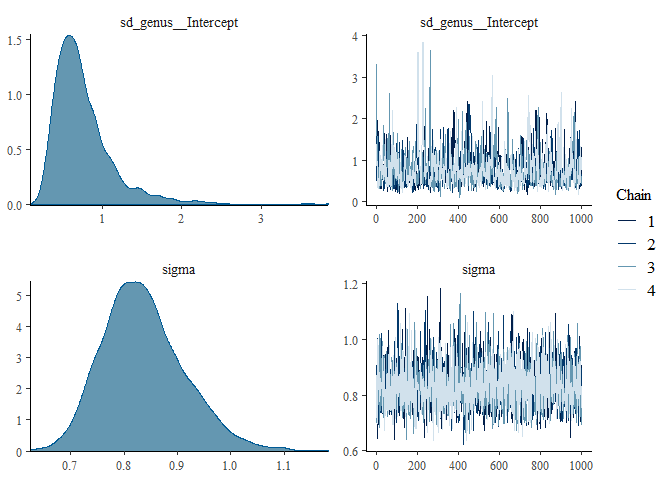
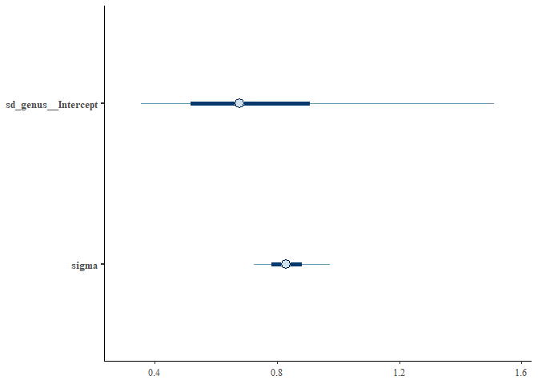

Load up your guys and standardize:

```r
d <- read.csv(file = "G:\\My Drive\\Philippine rodents\\Chrotomyini_brms\\04082022 Philippine Murids segmentation parameters and morphological data - TBA data total BoneJ (full).csv", header = T)

d <- d[d$tribe=="chroto",c(1:2, 4:22)]

d <- 
  d %>% 
  mutate(bvtv = as.numeric(bvtv))

d <- 
  d %>%
  mutate(mass_s = rethinking::standardize(log10(mass_g)),
         elev_s = rethinking::standardize(elev), 
         bvtv_s = rethinking::standardize(bvtv),
         tbth_s = rethinking::standardize(tbth),
         tbsp_s = rethinking::standardize(tbsp),
         conn_s = rethinking::standardize(conn),
         cond_s = rethinking::standardize(connd), 
         da_s = rethinking::standardize(da))

# remove C. gonzalesi and R. isarogensis
d <- 
  d %>% 
  filter(taxon!="Chrotomys_gonzalesi") %>% 
  filter(taxon!="Rhynchomys_isarogensis")

d <- 
  d %>%
  mutate(loco = factor(loco), 
         hab_simp = factor(hab_simp),
         genus = factor(genus))
```

Load in phylogeny: 
REMEMBER: A <- ape::vcv.phylo(phylo), add corr = T if your tree is NOT SCALED TO 1. 

```r
ch.tre <- read.nexus(file = "G:\\My Drive\\Philippine rodents\\Chrotomys\\analysis\\SMS_PRUNED_and_COLLAPSED_03292022_OTUsrenamed_Rowsey_PhBgMCC_LzChrotomyini.nex")

ch <- ape::vcv.phylo(ch.tre, corr = T)

d <- 
  d %>% 
  mutate(phylo = taxon)
```

In the "genusasloco" file, I used genus (loc proxy) as a global/fixed effect:
~genus + (1|species) : population level effect 

What if I do it as a group level effect/random effect?
~(1|genus) + (1|species)

Let's try that and see how it affects the results. 


```r
# Load up a previous model for comparison: Genus only with no phylogeny or anything.
ch.24 <- 
  brm(data = d, 
      family = gaussian,
      bvtv_s ~ 0 + genus,
      prior = c(prior(normal(0, 1), class = b),
                prior(exponential(1), class = sigma)),
      iter = 2000, warmup = 1000, chains = 4, cores = 4,
      seed = 5,
      file = "G:\\My Drive\\Philippine rodents\\Chrotomyini_brms\\fits\\ch.24")
print(ch.24)
```

```
##  Family: gaussian 
##   Links: mu = identity; sigma = identity 
## Formula: bvtv_s ~ 0 + genus 
##    Data: d (Number of observations: 67) 
##   Draws: 4 chains, each with iter = 2000; warmup = 1000; thin = 1;
##          total post-warmup draws = 4000
## 
## Population-Level Effects: 
##                   Estimate Est.Error l-95% CI u-95% CI Rhat Bulk_ESS Tail_ESS
## genusApomys           0.18      0.19    -0.21     0.56 1.00     5779     2647
## genusArchboldomys    -0.82      0.32    -1.43    -0.19 1.00     6098     3360
## genusChrotomys        0.69      0.19     0.33     1.06 1.00     6144     2987
## genusRhynchomys      -0.20      0.34    -0.85     0.45 1.00     5480     2936
## genusSoricomys       -0.63      0.19    -1.01    -0.25 1.00     5510     2876
## 
## Family Specific Parameters: 
##       Estimate Est.Error l-95% CI u-95% CI Rhat Bulk_ESS Tail_ESS
## sigma     0.84      0.08     0.70     1.00 1.00     5015     2956
## 
## Draws were sampled using sampling(NUTS). For each parameter, Bulk_ESS
## and Tail_ESS are effective sample size measures, and Rhat is the potential
## scale reduction factor on split chains (at convergence, Rhat = 1).
```

```r
# Comparison model: genus only but as a group-level effect. 
ch.30 <- 
  brm(data = d, 
      family = gaussian,
      bvtv_s ~ 0 + (1|genus), 
      prior = c(#prior(normal(0, 1), class = b),
                prior(exponential(1), class = sigma)),
      iter = 2000, warmup = 1000, chains = 4, cores = 4,
      seed = 5,
      file = "G:\\My Drive\\Philippine rodents\\Chrotomyini_brms\\fits\\ch.30")
print(ch.30)
```

```
##  Family: gaussian 
##   Links: mu = identity; sigma = identity 
## Formula: bvtv_s ~ 0 + (1 | genus) 
##    Data: d (Number of observations: 67) 
##   Draws: 4 chains, each with iter = 2000; warmup = 1000; thin = 1;
##          total post-warmup draws = 4000
## 
## Group-Level Effects: 
## ~genus (Number of levels: 5) 
##               Estimate Est.Error l-95% CI u-95% CI Rhat Bulk_ESS Tail_ESS
## sd(Intercept)     0.77      0.40     0.31     1.81 1.00      662      987
## 
## Family Specific Parameters: 
##       Estimate Est.Error l-95% CI u-95% CI Rhat Bulk_ESS Tail_ESS
## sigma     0.84      0.08     0.71     1.00 1.00     2810     2457
## 
## Draws were sampled using sampling(NUTS). For each parameter, Bulk_ESS
## and Tail_ESS are effective sample size measures, and Rhat is the potential
## scale reduction factor on split chains (at convergence, Rhat = 1).
```

```r
plot(ch.30)
```

<!-- -->

```r
mcmc_plot(ch.30)
```

<!-- -->

So this doesn't give you estimates for every genus. To be honest I'm not sure what exactly this is telling me other than the amount of error attributable to genus. I should try to find out exactly what this notation means. 
