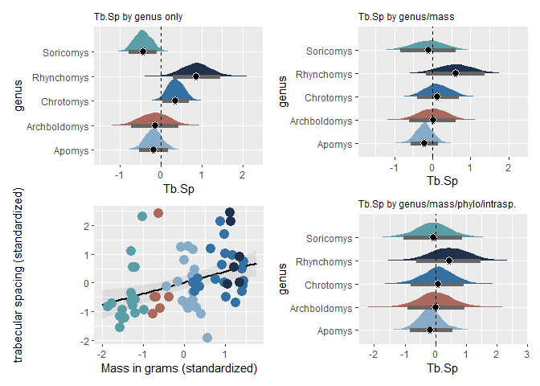

Load up Chrotomyini trabecular bone architecture (TBA) data and standardize variables:

```r
d <- read.csv(file = "G:\\My Drive\\Philippine rodents\\chrotomyini\\04082022 Philippine Murids segmentation parameters and morphological data - TBA data total BoneJ (full).csv", header = T)

d <- d[d$tribe=="chroto",c(1:2, 4:22)]

d <- 
  d %>% 
  mutate(bvtv = as.numeric(bvtv))

d <- 
  d %>%
  mutate(mass_s = rethinking::standardize(log10(mass_g)),
         elev_s = rethinking::standardize(elev), 
         bvtv_s = rethinking::standardize(bvtv),
         tbth_s = rethinking::standardize(tbth),
         tbsp_s = rethinking::standardize(tbsp),
         conn_s = rethinking::standardize(conn),
         cond_s = rethinking::standardize(connd), 
         da_s = rethinking::standardize(da))

# remove C. gonzalesi and R. isarogensis, singletons:
d <- 
  d %>% 
  filter(taxon!="Chrotomys_gonzalesi") %>% 
  filter(taxon!="Rhynchomys_isarogensis")

# Make categorical vars into factors
d <- 
  d %>%
  mutate(loco = factor(loco), 
         hab_simp = factor(hab_simp),
         genus = factor(genus))

# Specify colors for plots:
cols = c("#86acca","#ab685b", "#3370a3", "#1f314c","#5a9fa8")
```

Load in phylogeny: 
REMEMBER: A <- ape::vcv.phylo(phylo), add corr = T if your tree is NOT SCALED TO 1. 

```r
ch.tre <- read.nexus(file = "G:\\My Drive\\Philippine rodents\\Chrotomys\\analysis\\SMS_PRUNED_and_COLLAPSED_03292022_OTUsrenamed_Rowsey_PhBgMCC_LzChrotomyini.nex")

ch <- ape::vcv.phylo(ch.tre, corr = T)

d <- 
  d %>% 
  mutate(phylo = taxon)
```

#######################################################################
#### Comparisons of several models for each trabecular bone metric ####
#######################################################################

I'm going to put together and compare a few different models for each trabecular bone metric, with a few combinations of potential model components. This is for the purpose of not only comparing fit (i.e., how good each model is at predicting out-of-sample), but also to understand how the addition of predictors changes the models' estimates. I'll also include some assessments of the influence of individual specimens on the model fit.

######################################################################################
#### Bone Volume Fraction (BV.TV), and some general methodological considerations ####
######################################################################################

For comparison: a model that doesn't include genus as a predictor:


```r
# BV.TV by mass
ch.36 <- 
  brm(data = d, 
      family = gaussian,
      bvtv_s ~ 1+mass_s,
      prior = c(prior(normal(0, 1), class = b),
                prior(exponential(1), class = sigma)),
      iter = 2000, warmup = 1000, chains = 4, cores = 4,
      seed = 5,
      file = "G:\\My Drive\\Philippine rodents\\chrotomyini\\fits\\ch.36")
print(ch.36)
```

```
##  Family: gaussian 
##   Links: mu = identity; sigma = identity 
## Formula: bvtv_s ~ 1 + mass_s 
##    Data: d (Number of observations: 67) 
##   Draws: 4 chains, each with iter = 2000; warmup = 1000; thin = 1;
##          total post-warmup draws = 4000
## 
## Population-Level Effects: 
##           Estimate Est.Error l-95% CI u-95% CI Rhat Bulk_ESS Tail_ESS
## Intercept    -0.02      0.10    -0.22     0.18 1.00     3283     2968
## mass_s        0.56      0.10     0.36     0.76 1.00     3677     2967
## 
## Family Specific Parameters: 
##       Estimate Est.Error l-95% CI u-95% CI Rhat Bulk_ESS Tail_ESS
## sigma     0.83      0.08     0.70     0.99 1.00     4107     2968
## 
## Draws were sampled using sampling(NUTS). For each parameter, Bulk_ESS
## and Tail_ESS are effective sample size measures, and Rhat is the potential
## scale reduction factor on split chains (at convergence, Rhat = 1).
```

A scatterplot of the above model, with genera color-coded (the same color code to be used for the remainder of this document):

```r
range(d$mass_s)
```

```
## [1] -1.866104  1.451091
```

```r
nd <- tibble(mass_s = seq(from = -2, to = 1.75, length.out = 67))

fitted(ch.36,
       newdata = nd) %>% 
  data.frame() %>% 
  bind_cols(nd) %>% 
  
  # plot
  ggplot(aes(x = mass_s)) +
  geom_smooth(aes(y = Estimate, ymin = Q2.5, ymax = Q97.5),
              stat = "identity",
              alpha = 1/5, size = 1, color = "black") +
  geom_point(data = d, aes(y = bvtv_s, color = genus), size = 4)+
  scale_color_manual(values = cols)+
  xlim(min(nd), max(nd))+
  labs(x = "Mass in grams (standardized)",
       y = "bone volume fraction (standardized)") 
```

<!-- -->

From this plot, you can really see that genus is closely linked to body mass. You can also see that there is definitely some correlation between mass and BV.TV but the relationship has a lot of error. You can also detect this from the model parameters: mass_s (the influence of mass, a.k.a slope, listed under "Population-level effects") = 0.56, with CIs 0.36-0.76, and sigma = 0.83. 

Now a series of models that estimate a separate intercept (= estimate of mean BV.TV) for each genus, which here is a proxy for substrate use. I printed each model for quick inspection, and at the end of all the models, there is a plot including all four of them.


```r
# By genus only
ch.24 <- 
  brm(data = d, 
      family = gaussian,
      bvtv_s ~ 0 + genus,
      prior = c(prior(normal(0, 1), class = b),
                prior(exponential(1), class = sigma)),
      iter = 2000, warmup = 1000, chains = 4, cores = 4,
      file = "G:\\My Drive\\Philippine rodents\\chrotomyini\\fits\\ch.24")
print(ch.24)
```

```
##  Family: gaussian 
##   Links: mu = identity; sigma = identity 
## Formula: bvtv_s ~ 0 + genus 
##    Data: d (Number of observations: 67) 
##   Draws: 4 chains, each with iter = 2000; warmup = 1000; thin = 1;
##          total post-warmup draws = 4000
## 
## Population-Level Effects: 
##                   Estimate Est.Error l-95% CI u-95% CI Rhat Bulk_ESS Tail_ESS
## genusApomys           0.18      0.19    -0.21     0.56 1.00     5779     2647
## genusArchboldomys    -0.82      0.32    -1.43    -0.19 1.00     6098     3360
## genusChrotomys        0.69      0.19     0.33     1.06 1.00     6144     2987
## genusRhynchomys      -0.20      0.34    -0.85     0.45 1.00     5480     2936
## genusSoricomys       -0.63      0.19    -1.01    -0.25 1.00     5510     2876
## 
## Family Specific Parameters: 
##       Estimate Est.Error l-95% CI u-95% CI Rhat Bulk_ESS Tail_ESS
## sigma     0.84      0.08     0.70     1.00 1.00     5015     2956
## 
## Draws were sampled using sampling(NUTS). For each parameter, Bulk_ESS
## and Tail_ESS are effective sample size measures, and Rhat is the potential
## scale reduction factor on split chains (at convergence, Rhat = 1).
```


```r
# By genus and mass
ch.25 <- 
  brm(data = d, 
      family = gaussian,
      bvtv_s ~ 0 + genus + mass_s,
      prior = c(prior(normal(0, 1), class = b),
                prior(exponential(1), class = sigma)),
      iter = 2000, warmup = 1000, chains = 4, cores = 4,
      file = "G:\\My Drive\\Philippine rodents\\chrotomyini\\fits\\ch.25")
print(ch.25)
```

```
##  Family: gaussian 
##   Links: mu = identity; sigma = identity 
## Formula: bvtv_s ~ 0 + genus + mass_s 
##    Data: d (Number of observations: 67) 
##   Draws: 4 chains, each with iter = 2000; warmup = 1000; thin = 1;
##          total post-warmup draws = 4000
## 
## Population-Level Effects: 
##                   Estimate Est.Error l-95% CI u-95% CI Rhat Bulk_ESS Tail_ESS
## genusApomys           0.06      0.17    -0.28     0.42 1.00     3220     2224
## genusArchboldomys    -0.26      0.33    -0.90     0.37 1.00     2355     2392
## genusChrotomys       -0.22      0.30    -0.78     0.38 1.00     1679     2052
## genusRhynchomys      -1.32      0.42    -2.10    -0.50 1.00     1809     2618
## genusSoricomys        0.70      0.40    -0.10     1.45 1.00     1512     2107
## mass_s                1.00      0.27     0.46     1.52 1.00     1389     1970
## 
## Family Specific Parameters: 
##       Estimate Est.Error l-95% CI u-95% CI Rhat Bulk_ESS Tail_ESS
## sigma     0.74      0.07     0.62     0.90 1.00     3381     2588
## 
## Draws were sampled using sampling(NUTS). For each parameter, Bulk_ESS
## and Tail_ESS are effective sample size measures, and Rhat is the potential
## scale reduction factor on split chains (at convergence, Rhat = 1).
```


```r
# By genus and phylogeny/intraspecific variance, no mass
ch.44 <- 
  brm(data = d, 
      family = gaussian,
      bvtv_s ~ 0 + genus + (1|gr(phylo, cov = ch)) + (1|taxon),
      control = list(adapt_delta = 0.89), #inserted to decrease the number of divergent transitions here
      prior = c(
        prior(normal(0, 1), class = b, coef = genusApomys),
        prior(normal(0, 1), class = b, coef = genusArchboldomys),
        prior(normal(0, 1), class = b, coef = genusChrotomys),
        prior(normal(0, 1), class = b, coef = genusRhynchomys),
        prior(normal(0, 1), class = b, coef = genusSoricomys),
        prior(normal(0, 1), class = sd),
        prior(exponential(1), class = sigma)
        ),
      data2 = list(ch = ch),
      iter = 2000, warmup = 1000, chains = 4, cores = 4,
      file = "G:\\My Drive\\Philippine rodents\\chrotomyini\\fits\\ch.44")
print(ch.44)
```

```
##  Family: gaussian 
##   Links: mu = identity; sigma = identity 
## Formula: bvtv_s ~ 0 + genus + (1 | gr(phylo, cov = ch)) + (1 | taxon) 
##    Data: d (Number of observations: 67) 
##   Draws: 4 chains, each with iter = 2000; warmup = 1000; thin = 1;
##          total post-warmup draws = 4000
## 
## Group-Level Effects: 
## ~phylo (Number of levels: 11) 
##               Estimate Est.Error l-95% CI u-95% CI Rhat Bulk_ESS Tail_ESS
## sd(Intercept)     0.62      0.36     0.04     1.37 1.00     1133     1770
## 
## ~taxon (Number of levels: 11) 
##               Estimate Est.Error l-95% CI u-95% CI Rhat Bulk_ESS Tail_ESS
## sd(Intercept)     0.40      0.27     0.01     1.00 1.00     1019     1542
## 
## Population-Level Effects: 
##                   Estimate Est.Error l-95% CI u-95% CI Rhat Bulk_ESS Tail_ESS
## genusApomys           0.13      0.54    -1.00     1.18 1.00     3425     2716
## genusArchboldomys    -0.55      0.65    -1.78     0.77 1.00     4065     3026
## genusChrotomys        0.56      0.55    -0.59     1.64 1.00     3648     2616
## genusRhynchomys      -0.13      0.65    -1.41     1.15 1.00     4472     2900
## genusSoricomys       -0.48      0.55    -1.52     0.63 1.00     3431     2942
## 
## Family Specific Parameters: 
##       Estimate Est.Error l-95% CI u-95% CI Rhat Bulk_ESS Tail_ESS
## sigma     0.70      0.07     0.58     0.85 1.00     5518     3021
## 
## Draws were sampled using sampling(NUTS). For each parameter, Bulk_ESS
## and Tail_ESS are effective sample size measures, and Rhat is the potential
## scale reduction factor on split chains (at convergence, Rhat = 1).
```


```r
# By genus, mass, and phylogeny/intraspecific variance
ch.26 <-
  brm(data = d, 
      family = gaussian,
      bvtv_s ~ 0 + genus + mass_s + (1|gr(phylo, cov = ch)) + (1|taxon),
      control = list(adapt_delta = 0.85), #inserted to decrease the number of divergent transitions here
      prior = c(
        prior(normal(0, 1), class = b, coef = genusApomys),
        prior(normal(0, 1), class = b, coef = genusArchboldomys),
        prior(normal(0, 1), class = b, coef = genusChrotomys),
        prior(normal(0, 1), class = b, coef = genusRhynchomys),
        prior(normal(0, 1), class = b, coef = genusSoricomys),
        prior(normal(0, 1), class = b, coef = mass_s),
        prior(normal(0, 1), class = sd),
        prior(exponential(1), class = sigma)
        ),
      data2 = list(ch = ch),
      iter = 2000, warmup = 1000, chains = 4, cores = 4,
      file = "G:\\My Drive\\Philippine rodents\\chrotomyini\\fits\\ch.26")
print(ch.26)
```

```
##  Family: gaussian 
##   Links: mu = identity; sigma = identity 
## Formula: bvtv_s ~ 0 + genus + mass_s + (1 | gr(phylo, cov = ch)) + (1 | taxon) 
##    Data: d (Number of observations: 67) 
##   Draws: 4 chains, each with iter = 2000; warmup = 1000; thin = 1;
##          total post-warmup draws = 4000
## 
## Group-Level Effects: 
## ~phylo (Number of levels: 11) 
##               Estimate Est.Error l-95% CI u-95% CI Rhat Bulk_ESS Tail_ESS
## sd(Intercept)     0.50      0.32     0.03     1.19 1.00     1273     2007
## 
## ~taxon (Number of levels: 11) 
##               Estimate Est.Error l-95% CI u-95% CI Rhat Bulk_ESS Tail_ESS
## sd(Intercept)     0.36      0.24     0.02     0.91 1.00     1039     1655
## 
## Population-Level Effects: 
##                   Estimate Est.Error l-95% CI u-95% CI Rhat Bulk_ESS Tail_ESS
## genusApomys           0.07      0.48    -0.92     1.04 1.00     3331     2470
## genusArchboldomys    -0.27      0.61    -1.44     0.98 1.00     3997     2763
## genusChrotomys       -0.02      0.55    -1.12     1.07 1.00     3260     2484
## genusRhynchomys      -0.78      0.65    -2.00     0.54 1.00     3363     2894
## genusSoricomys        0.35      0.61    -0.88     1.57 1.00     3543     2774
## mass_s                0.78      0.31     0.16     1.41 1.00     3657     3065
## 
## Family Specific Parameters: 
##       Estimate Est.Error l-95% CI u-95% CI Rhat Bulk_ESS Tail_ESS
## sigma     0.67      0.07     0.56     0.82 1.00     4037     2400
## 
## Draws were sampled using sampling(NUTS). For each parameter, Bulk_ESS
## and Tail_ESS are effective sample size measures, and Rhat is the potential
## scale reduction factor on split chains (at convergence, Rhat = 1).
```

A four-part plot including all of the models:


```r
ch.24_halfeye <- ch.24 %>%
  gather_draws(b_genusApomys,b_genusArchboldomys, b_genusChrotomys, b_genusRhynchomys, b_genusSoricomys) %>%
  mutate(.variable = str_replace_all(.variable, "b_genus", "")) %>%
  ggplot(aes(y = .variable, x = .value)) +
  stat_halfeye(aes(fill = .variable), 
               point_fill = "#000000", 
               shape = 21, 
               point_size = 3, 
               point_color = "#FFFFFF",
               interval_size = 10,
               interval_color = "grey40",
               .width = .89) +
  scale_fill_manual(values = cols)+
  geom_vline(xintercept = 0, linetype = "dashed")+
  theme(legend.position = "none", 
        plot.title = element_text(size = 9))+
  labs(x = "BV.TV", y = "genus")+
  ggtitle(label = "BV.TV by genus only")

ch.25_halfeye <- ch.25 %>%
  gather_draws(b_genusApomys,b_genusArchboldomys, b_genusChrotomys, b_genusRhynchomys, b_genusSoricomys) %>%
  mutate(.variable = str_replace_all(.variable, "b_genus", "")) %>%
  ggplot(aes(y = .variable, x = .value)) +
  stat_halfeye(aes(fill = .variable), 
               point_fill = "#000000", 
               shape = 21, 
               point_size = 3, 
               point_color = "#FFFFFF",
               interval_size = 10,
               interval_color = "grey40",
               .width = .89) +
  scale_fill_manual(values = cols)+
  geom_vline(xintercept = 0, linetype = "dashed")+
  ggtitle(label = "BV.TV by genus/mass")+
  labs(x = "BV.TV", y = "genus")+
  theme(legend.position = "none", 
        plot.title = element_text(size = 9))

ch.44_halfeye <- ch.44 %>%
  gather_draws(b_genusApomys,b_genusArchboldomys, b_genusChrotomys, b_genusRhynchomys, b_genusSoricomys) %>%
  mutate(.variable = str_replace_all(.variable, "b_genus", "")) %>%
  ggplot(aes(y = .variable, x = .value)) +
  stat_halfeye(aes(fill = .variable), 
               point_fill = "#000000", 
               shape = 21, 
               point_size = 3, 
               point_color = "#FFFFFF",
               interval_size = 10,
               interval_color = "grey40",
               .width = .89) +
  scale_fill_manual(values = cols)+
  geom_vline(xintercept = 0, linetype = "dashed")+
  ggtitle(label = "BVTV by genus/phylo/intrasp")+
  labs(x = "BV.TV", y = "genus")+
  theme(legend.position = "none", 
        plot.title = element_text(size = 9))

ch.26_halfeye <- ch.26 %>%
  gather_draws(b_genusApomys,b_genusArchboldomys, b_genusChrotomys, b_genusRhynchomys, b_genusSoricomys) %>%
  mutate(.variable = str_replace_all(.variable, "b_genus", "")) %>%
  ggplot(aes(y = .variable, x = .value)) +
  stat_halfeye(aes(fill = .variable), 
               point_fill = "#000000", 
               shape = 21, 
               point_size = 3, 
               point_color = "#FFFFFF",
               interval_size = 10,
               interval_color = "grey40",
               .width = .89) +
  scale_fill_manual(values = cols)+
  geom_vline(xintercept = 0, linetype = "dashed")+
  ggtitle(label = "BV.TV by genus/mass/phylo/intrasp.")+
  labs(x = "BV.TV", y = "genus")+
  theme(legend.position = "none", 
        plot.title = element_text(size = 9))

ch.24_halfeye/ch.44_halfeye|ch.25_halfeye/ch.26_halfeye
```

<!-- -->

Takeaways from this set of plots:

1) Accounting for mass in estimation of BV.TV makes the relative estimates of BV.TV across genera change pretty dramatically. For its body size, Soricomys has relatively high BV.TV, and Rhynchomys has low BV.TV for its body size. Chrotomys, Archboldomys, and Apomys have estimated BV.TV values that are pretty close to the mean (represented by the vertical dotted line). One way to tell the significance of the differences between genera is to subtract the posterior probability distributions from one another.The difference between distributions is "significant" if the distribution of differences between them does not overlap 0. I'm not really a fan of statistical significance but it's good to have some definition of that I guess.

Here are the difference distributions between pairs of genera for the model including only genus and mass as predictors (upper right in the preceding plot):

```r
ch.25 %>%
  gather_draws(b_genusApomys,b_genusArchboldomys, b_genusChrotomys, b_genusRhynchomys, b_genusSoricomys) %>%
  compare_levels(.value, by = .variable) %>%
  mutate(.variable = str_replace_all(.variable, "b_genus", "")) %>%
  ungroup() %>%
  mutate(loco = reorder(.variable, .value)) %>%
  ggplot(aes(y = .variable, x = .value)) +
  stat_halfeye() +
  geom_vline(xintercept = 0, linetype = "dashed") +
  ggtitle(label = "Between-genus BV.TV difference distributions")+
  labs(x = "difference", y = "comparison")
```

<!-- -->

From this comparison, it looks like Rhynchomys has significantly lower bone volume fraction than pretty much everything it is compared to, with the possible exception of Archboldomys (6th row down) - the distribution of the Rhynchomys-Archboldomys difference overlaps 0 slightly. It also appears that Soricomys has significantly higher BV.TV than Archboldomys.

This brings me to my second takeaway from the 4-part plot. 

2) The genus/mass model doesn't include the effects of phylogenetic correlation or intraspecific variance. When we estimate BV.TV (with genus and mass as predictors) with a phylogenetic multilevel model, and consider intraspecific variance as well (lower right in the 4-part plot above), the difference distributions look like this:


```r
ch.26 %>%
  gather_draws(b_genusApomys,b_genusArchboldomys, b_genusChrotomys, b_genusRhynchomys, b_genusSoricomys) %>%
  compare_levels(.value, by = .variable) %>%
  mutate(.variable = str_replace_all(.variable, "b_genus", "")) %>%
  ungroup() %>%
  mutate(loco = reorder(.variable, .value)) %>%
  ggplot(aes(y = .variable, x = .value)) +
  stat_halfeye() +
  geom_vline(xintercept = 0, linetype = "dashed") +
  ggtitle(label = "Between-genus BV.TV difference distributions")+
  labs(x = "difference", y = "comparison")
```

<!-- -->

The relative location of each difference distribution hasn't changed dramatically (e.g., note location of Rhynchomys comparisons relative to the mean), but the probability density is much more spread out. This is telling us that, because our specimens share some features as a result of phylogenetic structure, the model is less sure that there are significant differences between genera that are related specifically to their generic properties and not to phylogenetic correlation.

So how strong is the influence of phylogeny on BV.TV? The model outputs a value that is called "sd_phylo__Intercept", which, as I understand it, is an estimate of the amount of variance in the data that is related to phylogenetic correlation structure. We can use that to calculate the more familiar lambda, a.k.a. phylogenetic signal. 

(A reminder for me of what phylogenetic signal is: it is an intra-class correlation coefficient (ICC), which tells you how much things that are in groups together resemble each other, quantitatively speaking. 0 means that the individuals don't show any similarity that can be attributed to their relatedness (no phylogenetic structure). 1 Means that the trait you're looking at evolves exactly as expected under Brownian Motion evolution - that is, the phylogenetic structure underlying the data set explains ALL of the variation you see among the individual measurements. This is different from considering intraspecific variation as a potential source of covariance. Including the (1|taxon) term accounts for group-level similarity that is related to taxon (species) ONLY, irrespective of broader phylogenetic structure (it does not refer to the phylogenetic covariance matrix in its calculations). I feel like the more times I try and explain this to myself, the better I will understand it. I've always found PCM concepts somewhat opaque and I'm really trying to be clear about them so that I can mayyybe more precisely explain what my results mean. Thanks for sticking with me.)

Here's a calculation of lambda for ch.26, the model that includes genus, mass, phylogeny, and intraspecific variance:

```r
hyp <- "sd_phylo__Intercept^2 / (sd_phylo__Intercept^2 + sd_taxon__Intercept^2 + sigma^2) = 0"
h.bvtv <- hypothesis(ch.26, hyp, class = NULL)
h.bvtv
```

```
## Hypothesis Tests for class :
##                 Hypothesis Estimate Est.Error CI.Lower CI.Upper Evid.Ratio
## 1 (sd_phylo__Interc... = 0     0.29      0.23        0     0.74         NA
##   Post.Prob Star
## 1        NA    *
## ---
## 'CI': 90%-CI for one-sided and 95%-CI for two-sided hypotheses.
## '*': For one-sided hypotheses, the posterior probability exceeds 95%;
## for two-sided hypotheses, the value tested against lies outside the 95%-CI.
## Posterior probabilities of point hypotheses assume equal prior probabilities.
```

The estimate of lambda here is 0.29. I would say that's medium-low? But why should we trust a point estimate here (especially when the upper 95% CI is 0.74)? We can look at lambda as a probability distribution instead. This will show us where the majority of the probability density actually falls.


```r
ph.bvtv.pl <- ggplot() +
  geom_density(aes(x = h.bvtv$samples$H1), fill = "red", alpha = 0.5) +
  theme_bw() +
  xlim(0,1) +
  labs(y = "density", x = "lambda: bone volume fraction")
ph.bvtv.pl
```

<!-- -->

I had never thought of lambda as a distribution before this and I think it makes these results both easier and more difficult to understand. From this density plot, we can tell that there's a density peak around, say, 0.03. I would call that a low value for lambda. HOWEVER - just because that is a local peak does not mean that it represents the majority of the probability density. There is a huge amount of probability density (area under the curve) between lambda = 0.125 and ~0.56. So it makes sense that the point estimate of lambda is in the middle-ish of the values between the peak (~0.03) and the point where the density drops off (~0.56).

What the hell does this mean about the actual influence of phylogeny on BV.TV? I'm still trying to figure that out. Phylogenetic structure in these data clearly explains some of the variation in BV.TV across genera - which, yeah, of course it does, you're using genus as a proxy for substrate-use groups (e.g., Chrotomys = varying degrees of digging, Rhynchomys = bipedal hopping, etc). But after accounting for mass and group-level effects (phylo/intraspecific var) in our model, there are still differences between genera. They aren't necessarily "significant", according to the difference distributions shown above, but there are definitely signals that could be related to organismal ecology.

Ok departing from the discussion of the plots above: I'm gonna do some model comparison to see which model is best at predicting out-of-sample (which is the "best fit" for the data). I'm going to use two methods: the Widely Applicable Information Criterion (WAIC) and Leave-One-Out cross-validation (LOO).


```r
ch.36 <-  add_criterion(ch.36, c("waic", "loo")) # mass only
ch.24 <-  add_criterion(ch.24, c("waic", "loo")) # genus only 
ch.25 <-  add_criterion(ch.25, c("waic", "loo")) # genus and mass
ch.44 <-  add_criterion(ch.44, c("waic", "loo")) # genus and phylogeny
ch.26 <-  add_criterion(ch.26, c("waic", "loo")) # genus mass phylogeny

loo(ch.36) # mass only : 0 Pareto K > 0.5
```

```
## 
## Computed from 4000 by 67 log-likelihood matrix
## 
##          Estimate  SE
## elpd_loo    -83.9 4.9
## p_loo         2.7 0.5
## looic       167.9 9.8
## ------
## Monte Carlo SE of elpd_loo is 0.0.
## 
## All Pareto k estimates are good (k < 0.5).
## See help('pareto-k-diagnostic') for details.
```

```r
loo(ch.24) # genus only : 0 Pareto K > 0.5
```

```
## 
## Computed from 4000 by 67 log-likelihood matrix
## 
##          Estimate  SE
## elpd_loo    -85.2 4.8
## p_loo         4.6 0.7
## looic       170.4 9.6
## ------
## Monte Carlo SE of elpd_loo is 0.0.
## 
## All Pareto k estimates are good (k < 0.5).
## See help('pareto-k-diagnostic') for details.
```

```r
loo(ch.25) # genus and mass : 0 Pareto K > 0.5
```

```
## 
## Computed from 4000 by 67 log-likelihood matrix
## 
##          Estimate   SE
## elpd_loo    -78.0  5.3
## p_loo         5.6  0.9
## looic       155.9 10.7
## ------
## Monte Carlo SE of elpd_loo is 0.1.
## 
## All Pareto k estimates are good (k < 0.5).
## See help('pareto-k-diagnostic') for details.
```

```r
loo(ch.44) # genus and phylogeny : 1 Pareto K > 0.5
```

```
## 
## Computed from 4000 by 67 log-likelihood matrix
## 
##          Estimate   SE
## elpd_loo    -76.8  6.4
## p_loo        10.5  2.0
## looic       153.6 12.9
## ------
## Monte Carlo SE of elpd_loo is 0.1.
## 
## Pareto k diagnostic values:
##                          Count Pct.    Min. n_eff
## (-Inf, 0.5]   (good)     66    98.5%   431       
##  (0.5, 0.7]   (ok)        1     1.5%   1970      
##    (0.7, 1]   (bad)       0     0.0%   <NA>      
##    (1, Inf)   (very bad)  0     0.0%   <NA>      
## 
## All Pareto k estimates are ok (k < 0.7).
## See help('pareto-k-diagnostic') for details.
```

```r
loo(ch.26) # genus mass phylogeny : 1 Pareto K > 0.5
```

```
## 
## Computed from 4000 by 67 log-likelihood matrix
## 
##          Estimate   SE
## elpd_loo    -74.6  6.6
## p_loo        10.8  2.0
## looic       149.1 13.3
## ------
## Monte Carlo SE of elpd_loo is 0.1.
## 
## Pareto k diagnostic values:
##                          Count Pct.    Min. n_eff
## (-Inf, 0.5]   (good)     66    98.5%   1034      
##  (0.5, 0.7]   (ok)        1     1.5%   310       
##    (0.7, 1]   (bad)       0     0.0%   <NA>      
##    (1, Inf)   (very bad)  0     0.0%   <NA>      
## 
## All Pareto k estimates are ok (k < 0.7).
## See help('pareto-k-diagnostic') for details.
```

This analysis (LOO) can tell you, among other things, if there are specimens that are having a strong effect on the model fit. It does this by leaving one specimen out at a time (hence the name) and seeing how well the model can predict the value for that left-out specimen when it is not a part of the model. Specimens that are highly influential have a high Pareto K value. In two of the models here (ch.44 and ch.26, the phylogenetic models), one specimen has a relatively high Pareto K. Let's see if it's the same specimen in both.


```r
tibble(k   = ch.44$criteria$loo$diagnostics$pareto_k,
       row = 1:67,
       specimen = paste(d$specno[row], d$taxon[row])) %>% 
  arrange(desc(k)) # 190968 Soricomys leonardocoi, K = 0.59
```

```
## # A tibble: 67 x 3
##        k   row specimen                    
##    <dbl> <int> <chr>                       
##  1 0.591    60 190968 Soricomys_leonardocoi
##  2 0.468    19 193523 Archboldomys_maximus 
##  3 0.425    14 216435 Apomys_sierrae       
##  4 0.417    62 188313 Soricomys_montanus   
##  5 0.417    22 193526 Archboldomys_maximus 
##  6 0.414    16 216462 Apomys_sierrae       
##  7 0.413    51 167307 Soricomys_kalinga    
##  8 0.410    26 221833 Chrotomys_mindorensis
##  9 0.375    52 167309 Soricomys_kalinga    
## 10 0.367    38 188348 Chrotomys_whiteheadi 
## # ... with 57 more rows
```

```r
tibble(k   = ch.26$criteria$loo$diagnostics$pareto_k,
       row = 1:67,
       specimen = paste(d$specno[row], d$taxon[row])) %>% 
  arrange(desc(k)) # 216462 Apomys sierrae, K = 0.69
```

```
## # A tibble: 67 x 3
##        k   row specimen                    
##    <dbl> <int> <chr>                       
##  1 0.693    16 216462 Apomys_sierrae       
##  2 0.495    19 193523 Archboldomys_maximus 
##  3 0.423    62 188313 Soricomys_montanus   
##  4 0.418    26 221833 Chrotomys_mindorensis
##  5 0.417     3 218312 Apomys_banahao       
##  6 0.416    22 193526 Archboldomys_maximus 
##  7 0.409    43 193744 Chrotomys_whiteheadi 
##  8 0.406    60 190968 Soricomys_leonardocoi
##  9 0.364    14 216435 Apomys_sierrae       
## 10 0.357    20 193524 Archboldomys_maximus 
## # ... with 57 more rows
```

Why are these specimens potentially having such a strong effect?

1) FMNH 216462, Apomys sierrae: This animal has an anomalously low bone volume fraction compared to all other individuals in its species (17% bone versus all other specimens 29-37% bone). It has the shortest head and body length at 135 mm, compared to ~140-150 for all other specimens. It is also unusual in that it only has five lumbar vertebrae rather than 6. I still analyzed the third lumbar position for it, but it may represent a veeery slightly different functional position in the lumbar column. However - looking at the specimen just now in Dragonfly, all the vertebrae kind of look like that. So It might just be a weirdo.

2) FMNH 190968, Soricomys leonardocoi: This animal also has anomalously low bone volume fraction for its species (14% bone as opposed to all others 19-22% bone). However, this is in an analysis (ch.44) that does not account for body mass. 190968 weighs 35 grams, and the average mass of the species is 32 grams, so it's slightly heavier than average and has a lower BV.TV. In the phylogenetic model that has mass as a predictor (ch.26), its Pareto K is below the "good" threshold of 0.5 (K = 0.41) - it doesn't have a super strong effect on that model fit. So incorporating mass apparently allows the model to not be surprised about this specimen's BV.TV. I'm not sure I have an adequate explanation for how that is happening.

Should I remove these guys, at least the Apomys? I don't know if that's necessary. It seems like it represents true variation in the population, and I'm loath do get rid of it because of that. I could try using a Student distribution for the posterior probability distribution, which would result in a model that is less surprised by outliers, but I haven't decided if I think the problem is extreme enough for that to be necessary.

Now I'm going to compare across models to see which is the best at predicting BV.TV, and by how much. This won't give any information about the causality of the variables involved, but it can tell how big of a difference the inclusion or exclusion of a variable makes in the predictive accuracy of the model.


```r
bvtv_comp <- loo_compare(ch.36, ch.24, ch.25, ch.44, ch.26, criterion = "waic")

# Convert to WAIC differences among models, including standard error term.
cbind(waic_diff = bvtv_comp[, 1] * -2,
      se        = bvtv_comp[, 2] * 2)
```

```
##       waic_diff       se
## ch.26  0.000000 0.000000
## ch.44  4.577944 3.682324
## ch.25  7.343953 6.397010
## ch.36 19.396496 9.877691
## ch.24 21.905571 9.678130
```

```r
bvtv_comp[, 7:8] %>% 
  data.frame() %>% 
  rownames_to_column("model_name") %>% 
  mutate(model_name = fct_reorder(model_name, waic, .desc = T)) %>% 
  ggplot(aes(x = waic, y = model_name, 
             xmin = waic - se_waic, 
             xmax = waic + se_waic)) +
  geom_pointrange(shape = 21) +
  labs(title = "WAIC comparison across BV.TV estimation models",
       x = "WAIC", y = "model") +
  theme(axis.ticks.y = element_blank())
```

<!-- -->

So in this comparison, the WAIC (= Widely Applicable Information Criterion) indicates that ch.26, the phylogenetic model (+ intraspecific variance) that includes genus and mass, is the best predictive model, but not by much - its standard error (horizontal line on the plot) overlaps that of ch.44 (phylo only) and ch.25 (genus and mass). 

Based on what I know about trabecular bone morphology, and what I've seen so far re: correlation of body mass with TBA metrics, it doesn't make sense to exclude mass from the model. Body mass has an effect on skeletal structure to varying degrees, depending on the metric of interest. so even though the phylogenetic model that does not include mass as a predictor (ch.44) doesn't perform that much worse than the model including mass (ch.26), I'm not going to extensively consider models that don't take mass into account. I will, however, compare across metrics to see the difference in the influence of mass on the TBA metrics that I'm examining. This is part of the overall goal of the study: to figure out a little more about what the various trabecular bone metrics are being influenced by/are associated with, in addition to the hypothesized biomechanical function of trabecular bone variation.

I think I'll keep doing comparisons with the no-phylogeny type models for now (ch.25 and ch.36, above) because I think that comparison is relevant to understanding HOW phylogenetic structure affects results. I know people always are saying, don't include both phylogenetic and non-phylogenetic analyses in your results, but I think it's useful. Thoughts on this point would be appreciated. 

So, I'm going to try and explain some of my thoughts about what these results mean biomechanically and ecologically. But first I need to look at the other trabecular bone metrics here. 

######################################
#### Trabecular Thickness (Tb.Th) ####
######################################

A model without genus, mass as the only predictor:


```r
# Tb.Th by mass
ch.40 <- 
  brm(data = d, 
      family = gaussian,
      tbth_s ~ 1+mass_s,
      prior = c(prior(normal(0, 1), class = b),
                prior(exponential(1), class = sigma)),
      iter = 2000, warmup = 1000, chains = 4, cores = 4,
      file = "G:\\My Drive\\Philippine rodents\\chrotomyini\\fits\\ch.40")
print(ch.40)
```

```
##  Family: gaussian 
##   Links: mu = identity; sigma = identity 
## Formula: tbth_s ~ 1 + mass_s 
##    Data: d (Number of observations: 67) 
##   Draws: 4 chains, each with iter = 2000; warmup = 1000; thin = 1;
##          total post-warmup draws = 4000
## 
## Population-Level Effects: 
##           Estimate Est.Error l-95% CI u-95% CI Rhat Bulk_ESS Tail_ESS
## Intercept    -0.01      0.05    -0.10     0.08 1.00     3830     2767
## mass_s        0.93      0.04     0.84     1.01 1.00     4168     2809
## 
## Family Specific Parameters: 
##       Estimate Est.Error l-95% CI u-95% CI Rhat Bulk_ESS Tail_ESS
## sigma     0.37      0.03     0.31     0.44 1.00     3707     2787
## 
## Draws were sampled using sampling(NUTS). For each parameter, Bulk_ESS
## and Tail_ESS are effective sample size measures, and Rhat is the potential
## scale reduction factor on split chains (at convergence, Rhat = 1).
```

A scatterplot of the above model, with genera color-coded:

```r
ch.40.pl <- fitted(ch.40,
       newdata = nd) %>% 
  data.frame() %>% 
  bind_cols(nd) %>% 
  
  # plot
  ggplot(aes(x = mass_s)) +
  geom_smooth(aes(y = Estimate, ymin = Q2.5, ymax = Q97.5),
              stat = "identity",
              alpha = 1/5, size = 1, color = "black") +
  geom_point(data = d, aes(y = tbth_s, color = genus), size = 4)+
  scale_color_manual(values = cols)+
  labs(x = "Mass in grams (standardized)",
       y = "trabecular thickness (standardized)") 
ch.40.pl
```

<!-- -->


Daaang look at that correlation! It's not all that unexpected based on what I've seen in the literature - Tb.Th is VERY closely associated with mass, such that it is almost entirely explained by it. Note the mass_s value in the model: 0.93, with sigma = 0.37. mass_s in the BV.TV model was 0.56, with sigma = 0.83. The relationship with Tb.Th is much stronger. It's possible that there is essentially no information other than body size information in this metric! Let's look closer.


```r
# By genus only
ch.50 <- 
  brm(data = d, 
      family = gaussian,
      tbth_s ~ 0 + genus,
      prior = c(prior(normal(0, 1), class = b),
                prior(exponential(1), class = sigma)),
      iter = 2000, warmup = 1000, chains = 4, cores = 4,
      file = "G:\\My Drive\\Philippine rodents\\chrotomyini\\fits\\ch.50")
print(ch.50)
```

```
##  Family: gaussian 
##   Links: mu = identity; sigma = identity 
## Formula: tbth_s ~ 0 + genus 
##    Data: d (Number of observations: 67) 
##   Draws: 4 chains, each with iter = 2000; warmup = 1000; thin = 1;
##          total post-warmup draws = 4000
## 
## Population-Level Effects: 
##                   Estimate Est.Error l-95% CI u-95% CI Rhat Bulk_ESS Tail_ESS
## genusApomys           0.02      0.12    -0.22     0.25 1.00     5777     2753
## genusArchboldomys    -0.79      0.20    -1.18    -0.38 1.00     5610     2896
## genusChrotomys        1.01      0.11     0.78     1.22 1.00     5427     2858
## genusRhynchomys       0.75      0.20     0.37     1.14 1.00     4999     3067
## genusSoricomys       -1.16      0.12    -1.39    -0.91 1.00     5335     3059
## 
## Family Specific Parameters: 
##       Estimate Est.Error l-95% CI u-95% CI Rhat Bulk_ESS Tail_ESS
## sigma     0.49      0.05     0.41     0.59 1.00     4411     3210
## 
## Draws were sampled using sampling(NUTS). For each parameter, Bulk_ESS
## and Tail_ESS are effective sample size measures, and Rhat is the potential
## scale reduction factor on split chains (at convergence, Rhat = 1).
```


```r
# By genus and mass
ch.51 <- 
  brm(data = d, 
      family = gaussian,
      tbth_s ~ 0 + genus + mass_s,
      prior = c(prior(normal(0, 1), class = b),
                prior(exponential(1), class = sigma)),
      iter = 2000, warmup = 1000, chains = 4, cores = 4,
      file = "G:\\My Drive\\Philippine rodents\\chrotomyini\\fits\\ch.51")
print(ch.51)
```

```
##  Family: gaussian 
##   Links: mu = identity; sigma = identity 
## Formula: tbth_s ~ 0 + genus + mass_s 
##    Data: d (Number of observations: 67) 
##   Draws: 4 chains, each with iter = 2000; warmup = 1000; thin = 1;
##          total post-warmup draws = 4000
## 
## Population-Level Effects: 
##                   Estimate Est.Error l-95% CI u-95% CI Rhat Bulk_ESS Tail_ESS
## genusApomys          -0.12      0.08    -0.28     0.03 1.00     3396     2855
## genusArchboldomys    -0.07      0.16    -0.39     0.24 1.00     2016     2182
## genusChrotomys       -0.10      0.15    -0.39     0.20 1.00     1210     1966
## genusRhynchomys      -0.64      0.21    -1.04    -0.23 1.00     1370     2205
## genusSoricomys        0.46      0.20     0.06     0.85 1.00     1188     1893
## mass_s                1.19      0.14     0.91     1.46 1.00     1121     1722
## 
## Family Specific Parameters: 
##       Estimate Est.Error l-95% CI u-95% CI Rhat Bulk_ESS Tail_ESS
## sigma     0.33      0.03     0.28     0.40 1.00     2932     2529
## 
## Draws were sampled using sampling(NUTS). For each parameter, Bulk_ESS
## and Tail_ESS are effective sample size measures, and Rhat is the potential
## scale reduction factor on split chains (at convergence, Rhat = 1).
```


```r
# By genus, mass, and phylogeny/intraspecific variance
ch.27 <-
  brm(data = d, 
      family = gaussian,
      tbth_s ~ 0 + genus + mass_s + (1|gr(phylo, cov = ch)) + (1|taxon),
      control = list(adapt_delta = 0.98), #inserted to decrease the number of divergent transitions here
      prior = c(
        prior(normal(0, 1), class = b, coef = genusApomys),
        prior(normal(0, 1), class = b, coef = genusArchboldomys),
        prior(normal(0, 1), class = b, coef = genusChrotomys),
        prior(normal(0, 1), class = b, coef = genusRhynchomys),
        prior(normal(0, 1), class = b, coef = genusSoricomys),
        prior(normal(0, 1), class = b, coef = mass_s),
        prior(normal(0, 1), class = sd),
        prior(exponential(1), class = sigma)
        ),
      data2 = list(ch = ch),
      iter = 2000, warmup = 1000, chains = 4, cores = 4,
      file = "G:\\My Drive\\Philippine rodents\\chrotomyini\\fits\\ch.27")
print(ch.27)
```

```
##  Family: gaussian 
##   Links: mu = identity; sigma = identity 
## Formula: tbth_s ~ 0 + genus + mass_s + (1 | gr(phylo, cov = ch)) + (1 | taxon) 
##    Data: d (Number of observations: 67) 
##   Draws: 4 chains, each with iter = 2000; warmup = 1000; thin = 1;
##          total post-warmup draws = 4000
## 
## Group-Level Effects: 
## ~phylo (Number of levels: 11) 
##               Estimate Est.Error l-95% CI u-95% CI Rhat Bulk_ESS Tail_ESS
## sd(Intercept)     0.34      0.21     0.02     0.84 1.00     1149     1668
## 
## ~taxon (Number of levels: 11) 
##               Estimate Est.Error l-95% CI u-95% CI Rhat Bulk_ESS Tail_ESS
## sd(Intercept)     0.21      0.14     0.01     0.55 1.00     1121     1738
## 
## Population-Level Effects: 
##                   Estimate Est.Error l-95% CI u-95% CI Rhat Bulk_ESS Tail_ESS
## genusApomys          -0.09      0.35    -0.81     0.65 1.00     2781     2444
## genusArchboldomys    -0.19      0.43    -1.07     0.64 1.00     3964     2764
## genusChrotomys        0.12      0.36    -0.60     0.83 1.00     3035     2325
## genusRhynchomys      -0.27      0.45    -1.13     0.68 1.00     3218     2694
## genusSoricomys        0.10      0.41    -0.73     0.89 1.00     3026     2737
## mass_s                0.93      0.16     0.61     1.24 1.00     3301     2569
## 
## Family Specific Parameters: 
##       Estimate Est.Error l-95% CI u-95% CI Rhat Bulk_ESS Tail_ESS
## sigma     0.28      0.03     0.23     0.34 1.00     4174     2920
## 
## Draws were sampled using sampling(NUTS). For each parameter, Bulk_ESS
## and Tail_ESS are effective sample size measures, and Rhat is the potential
## scale reduction factor on split chains (at convergence, Rhat = 1).
```

A four part plot like the one I did for BV.TV, but instead of the phylogenetic model with no mass, I reproduced the model with mass only (no genus):

```r
ch.50_halfeye <- ch.50 %>%
  gather_draws(b_genusApomys,b_genusArchboldomys, b_genusChrotomys, b_genusRhynchomys, b_genusSoricomys) %>%
  mutate(.variable = str_replace_all(.variable, "b_genus", "")) %>%
  ggplot(aes(y = .variable, x = .value)) +
  stat_halfeye(aes(fill = .variable), 
               point_fill = "#000000", 
               shape = 21, 
               point_size = 3, 
               point_color = "#FFFFFF",
               interval_size = 10,
               interval_color = "grey40",
               .width = .89) +
  scale_fill_manual(values = cols)+
  geom_vline(xintercept = 0, linetype = "dashed")+
  theme(legend.position = "none", 
        plot.title = element_text(size = 9))+
  labs(x = "Tb.Th", y = "genus")+
  ggtitle(label = "Tb.Th by genus only")

ch.51_halfeye <- ch.51 %>%
  gather_draws(b_genusApomys,b_genusArchboldomys, b_genusChrotomys, b_genusRhynchomys, b_genusSoricomys) %>%
  mutate(.variable = str_replace_all(.variable, "b_genus", "")) %>%
  ggplot(aes(y = .variable, x = .value)) +
  stat_halfeye(aes(fill = .variable), 
               point_fill = "#000000", 
               shape = 21, 
               point_size = 3, 
               point_color = "#FFFFFF",
               interval_size = 10,
               interval_color = "grey40",
               .width = .89) +
  scale_fill_manual(values = cols)+
  geom_vline(xintercept = 0, linetype = "dashed")+
  ggtitle(label = "Tb.Th by genus/mass")+
  labs(x = "Tb.Th", y = "genus")+
  theme(legend.position = "none", 
        plot.title = element_text(size = 9))

ch.27_halfeye <- ch.27 %>%
  gather_draws(b_genusApomys,b_genusArchboldomys, b_genusChrotomys, b_genusRhynchomys, b_genusSoricomys) %>%
  mutate(.variable = str_replace_all(.variable, "b_genus", "")) %>% 
  ggplot(aes(y = .variable, x = .value)) +
  stat_halfeye(aes(fill = .variable), 
               point_fill = "#000000", 
               shape = 21, 
               point_size = 3, 
               point_color = "#FFFFFF",
               interval_size = 10,
               interval_color = "grey40",
               .width = .89) +
  scale_fill_manual(values = cols)+
  geom_vline(xintercept = 0, linetype = "dashed")+
  ggtitle(label = "Tb.Th by genus/mass/phylo/intrasp.")+
  labs(x = "Tb.Th", y = "genus")+
  theme(legend.position = "none", 
        plot.title = element_text(size = 9))

ch.40.pl.nokey <- ch.40.pl +
  theme(legend.position = "none")
ch.50_halfeye/ch.40.pl.nokey|ch.51_halfeye/ch.27_halfeye
```

<!-- -->

From this set of plots, I think we can say that Tb.Th variance is almost totally explained by body mass and phylogenetic covariance structure. The change in estimated difference among genera between the genus/mass model and the phylogenetic model is dramatic. Here's comparison plots. I truncated the genus names so that the plots are a little easier to fit next to each other (they just have the "omys" part removed):

```r
diff.tbth.ch.51 <- ch.51 %>%
  gather_draws(b_genusApomys,b_genusArchboldomys, b_genusChrotomys, b_genusRhynchomys, b_genusSoricomys) %>%
  compare_levels(.value, by = .variable) %>%
  mutate(.variable = str_replace_all(.variable, "b_genus", "")) %>% 
  mutate(.variable = str_replace_all(.variable, "omys", "")) %>% 
  ungroup() %>%
  mutate(loco = reorder(.variable, .value)) %>%
  ggplot(aes(y = .variable, x = .value)) +
  stat_halfeye() +
  geom_vline(xintercept = 0, linetype = "dashed") +
  ggtitle(label = "Tb.Th difference, genus+mass")+
  labs(x = "difference", y = "comparison")+
  theme(plot.title = element_text(size = 9))+
  scale_x_continuous(limits = c(-3, 3))

diff.tbth.ch.27 <- ch.27 %>%
  gather_draws(b_genusApomys,b_genusArchboldomys, b_genusChrotomys, b_genusRhynchomys, b_genusSoricomys) %>%
  compare_levels(.value, by = .variable) %>%
  mutate(.variable = str_replace_all(.variable, "b_genus", "")) %>% 
  mutate(.variable = str_replace_all(.variable, "omys", "")) %>% 
  ungroup() %>%
  mutate(loco = reorder(.variable, .value)) %>%
  ggplot(aes(y = .variable, x = .value)) +
  stat_halfeye() +
  geom_vline(xintercept = 0, linetype = "dashed") +
  ggtitle(label = "Tb.Th difference, genus+mass+phylo")+
  labs(x = "difference", y = "comparison")+
  theme(plot.title = element_text(size = 9))+
  scale_x_continuous(limits = c(-3, 3))

diff.tbth.ch.51|diff.tbth.ch.27
```

```
## Warning: Removed 8 rows containing missing values (stat_slabinterval).
```

<!-- -->

Also - note the width of the distributions in the plot on the right (I made the scales the same so you can see the difference).

In light of this dramatic difference, let's look at lambda for this one:

```r
hyp <- "sd_phylo__Intercept^2 / (sd_phylo__Intercept^2 + sd_taxon__Intercept^2 + sigma^2) = 0"
h.tbth <- hypothesis(ch.27, hyp, class = NULL)
h.tbth
```

```
## Hypothesis Tests for class :
##                 Hypothesis Estimate Est.Error CI.Lower CI.Upper Evid.Ratio
## 1 (sd_phylo__Interc... = 0     0.43      0.27        0     0.87         NA
##   Post.Prob Star
## 1        NA    *
## ---
## 'CI': 90%-CI for one-sided and 95%-CI for two-sided hypotheses.
## '*': For one-sided hypotheses, the posterior probability exceeds 95%;
## for two-sided hypotheses, the value tested against lies outside the 95%-CI.
## Posterior probabilities of point hypotheses assume equal prior probabilities.
```

Oooookay so the estimate of lambda is 0.43, with an upper CI of 0.87. The plot:

```r
ph.tbth.pl <- ggplot() +
  geom_density(aes(x = h.tbth$samples$H1), fill = "orange", alpha = 0.5) +
  theme_bw() +
  xlim(0,1) +
  labs(y = "density", x = "lambda: trabecular thickness")
ph.tbth.pl
```

<!-- -->

I would say in this one that most of the probability density is towards the higher end of the range, suggesting that there's a pretty big influence of phylogeny on this particular metric. Compare with the one for BV.TV:

```r
ph.bvtv.pl/ph.tbth.pl
```

<!-- -->

So on the whole, there's likely to be more of a phylogenetic signal in Tb.Th than BV.TV. There is that peak on the far left (at around 0.03), similar in location to the one in the BV.TV lambda, but the peak is lower and so represents a smaller proportion of the total probaility density.

Model comparison and check for outliers:

```r
ch.40 <- add_criterion(ch.40, c("loo", "waic"))
ch.50 <- add_criterion(ch.50, c("loo", "waic"))
ch.51 <- add_criterion(ch.51, c("loo", "waic"))
ch.27 <- add_criterion(ch.27, c("loo", "waic"))

loo(ch.40) # mass only : 0 Pareto K > 0.5
```

```
## 
## Computed from 4000 by 67 log-likelihood matrix
## 
##          Estimate   SE
## elpd_loo    -29.6  5.4
## p_loo         2.8  0.6
## looic        59.1 10.8
## ------
## Monte Carlo SE of elpd_loo is 0.0.
## 
## All Pareto k estimates are good (k < 0.5).
## See help('pareto-k-diagnostic') for details.
```

```r
loo(ch.50) # genus only : 0 Pareto K > 0.5
```

```
## 
## Computed from 4000 by 67 log-likelihood matrix
## 
##          Estimate   SE
## elpd_loo    -49.9  8.0
## p_loo         5.6  1.3
## looic        99.9 16.0
## ------
## Monte Carlo SE of elpd_loo is 0.1.
## 
## All Pareto k estimates are good (k < 0.5).
## See help('pareto-k-diagnostic') for details.
```

```r
loo(ch.51) # mass and genus : 1 Pareto K > 0.5
```

```
## 
## Computed from 4000 by 67 log-likelihood matrix
## 
##          Estimate   SE
## elpd_loo    -24.1  5.2
## p_loo         7.0  1.3
## looic        48.3 10.4
## ------
## Monte Carlo SE of elpd_loo is 0.1.
## 
## Pareto k diagnostic values:
##                          Count Pct.    Min. n_eff
## (-Inf, 0.5]   (good)     66    98.5%   608       
##  (0.5, 0.7]   (ok)        1     1.5%   741       
##    (0.7, 1]   (bad)       0     0.0%   <NA>      
##    (1, Inf)   (very bad)  0     0.0%   <NA>      
## 
## All Pareto k estimates are ok (k < 0.7).
## See help('pareto-k-diagnostic') for details.
```

```r
loo(ch.27) # mass genus and phylo: 1 Pareto K > 0.5
```

```
## 
## Computed from 4000 by 67 log-likelihood matrix
## 
##          Estimate   SE
## elpd_loo    -16.3  5.7
## p_loo        11.2  1.8
## looic        32.6 11.4
## ------
## Monte Carlo SE of elpd_loo is 0.1.
## 
## Pareto k diagnostic values:
##                          Count Pct.    Min. n_eff
## (-Inf, 0.5]   (good)     66    98.5%   710       
##  (0.5, 0.7]   (ok)        1     1.5%   983       
##    (0.7, 1]   (bad)       0     0.0%   <NA>      
##    (1, Inf)   (very bad)  0     0.0%   <NA>      
## 
## All Pareto k estimates are ok (k < 0.7).
## See help('pareto-k-diagnostic') for details.
```

Once again the models with multiple predictors (ch.51 and ch.27) have 1 specimen each with excessive influence. Who are they?

```r
tibble(k   = ch.51$criteria$loo$diagnostics$pareto_k,
       row = 1:67,
       specimen = paste(d$specno[row], d$taxon[row])) %>% 
  arrange(desc(k)) # 193526 Archboldomys maximus, K = 0.52
```

```
## # A tibble: 67 x 3
##        k   row specimen                   
##    <dbl> <int> <chr>                      
##  1 0.516    22 193526 Archboldomys_maximus
##  2 0.436    46 189834 Rhynchomys_labo     
##  3 0.379    37 198736 Chrotomys_silaceus  
##  4 0.369    44 189832 Rhynchomys_labo     
##  5 0.354    35 193731 Chrotomys_silaceus  
##  6 0.314    49 189839 Rhynchomys_labo     
##  7 0.311    24 214320 Archboldomys_maximus
##  8 0.308    34 193726 Chrotomys_silaceus  
##  9 0.301    20 193524 Archboldomys_maximus
## 10 0.300    14 216435 Apomys_sierrae      
## # ... with 57 more rows
```

```r
tibble(k   = ch.27$criteria$loo$diagnostics$pareto_k,
       row = 1:67,
       specimen = paste(d$specno[row], d$taxon[row])) %>% 
  arrange(desc(k)) # 216435 Apomys sierrae, K = 0.52
```

```
## # A tibble: 67 x 3
##        k   row specimen                    
##    <dbl> <int> <chr>                       
##  1 0.516    14 216435 Apomys_sierrae       
##  2 0.494     9 236310 Apomys_datae         
##  3 0.488    46 189834 Rhynchomys_labo      
##  4 0.479    32 193720 Chrotomys_silaceus   
##  5 0.463    43 193744 Chrotomys_whiteheadi 
##  6 0.458    22 193526 Archboldomys_maximus 
##  7 0.390     4 218313 Apomys_banahao       
##  8 0.374    31 193708 Chrotomys_silaceus   
##  9 0.338    26 221833 Chrotomys_mindorensis
## 10 0.332    18 216464 Apomys_sierrae       
## # ... with 57 more rows
```

Ok so. Since the cutoff for being considered "ok" in these is 0.50, and both of them have K = 0.52ish, I think they are probably not doing anything crazy to the model. Certainly nothing as dramatic as the Apomys sierrae specimen was doing to the BV.TV model (for which K = 0.69).

Compare models directly:

```r
tbth_comp <- loo_compare(ch.40, ch.50, ch.51, ch.27, criterion = "waic") 

# Convert to WAIC differences among models, including standard error term.
cbind(waic_diff = tbth_comp[, 1] * -2,
      se        = tbth_comp[, 2] * 2)
```

```
##       waic_diff       se
## ch.27   0.00000  0.00000
## ch.51  16.18253  7.05953
## ch.40  27.29115 11.13251
## ch.50  67.88670 16.17353
```

```r
tbth_comp[, 7:8] %>% 
  data.frame() %>% 
  rownames_to_column("model_name") %>% 
  mutate(model_name = fct_reorder(model_name, waic, .desc = T)) %>% 
  ggplot(aes(x = waic, y = model_name, 
             xmin = waic - se_waic, 
             xmax = waic + se_waic)) +
  geom_pointrange(shape = 21) +
  labs(title = "WAIC comparison across Tb.Th estimation models",
       x = "WAIC", y = "model") +
  theme(axis.ticks.y = element_blank())
```

<!-- -->

So: genus only (ch.50) performed the worst; mass only (ch.40) and genus+mass (ch.51) performed ok but not as well as the phylogenetic model (there is plenty of overlap in the WAIC standard error among them though). The phylogenetic model (+ intraspecific variance) with genus and mass as predictors will be the best at predicting out-of-sample. This is the same ranking of models that we found in BV.TV.

What does that mean? Does it mean anything? Think about it.

Conclusion from this section: Tb.Th is maybe not giving any information about organismal ecology (substrate use) here. Instead, most of the variance is related to phylogenetic covariance structure, intraspecific variance, and body mass. 

####################################
#### Trabecular Spacing (Tb.Sp) ####
####################################

A model without genus, mass as the only predictor:

```r
# Tb.Sp by mass
ch.52 <- 
  brm(data = d, 
      family = gaussian,
      tbsp_s ~ 1+mass_s,
      prior = c(prior(normal(0, 1), class = b),
                prior(exponential(1), class = sigma)),
      iter = 2000, warmup = 1000, chains = 4, cores = 4,
      file = "G:\\My Drive\\Philippine rodents\\chrotomyini\\fits\\ch.52")
print(ch.52)
```

```
##  Family: gaussian 
##   Links: mu = identity; sigma = identity 
## Formula: tbsp_s ~ 1 + mass_s 
##    Data: d (Number of observations: 67) 
##   Draws: 4 chains, each with iter = 2000; warmup = 1000; thin = 1;
##          total post-warmup draws = 4000
## 
## Population-Level Effects: 
##           Estimate Est.Error l-95% CI u-95% CI Rhat Bulk_ESS Tail_ESS
## Intercept     0.01      0.11    -0.21     0.23 1.00     4658     2689
## mass_s        0.38      0.11     0.16     0.61 1.00     4347     2686
## 
## Family Specific Parameters: 
##       Estimate Est.Error l-95% CI u-95% CI Rhat Bulk_ESS Tail_ESS
## sigma     0.95      0.08     0.80     1.13 1.00     4339     2840
## 
## Draws were sampled using sampling(NUTS). For each parameter, Bulk_ESS
## and Tail_ESS are effective sample size measures, and Rhat is the potential
## scale reduction factor on split chains (at convergence, Rhat = 1).
```

Ha ha, sigma = 0.95. Guess what this plot is gonna look like... not a line, that's for sure.
Plot:

```r
ch.52.pl <- fitted(ch.52,
       newdata = nd) %>% 
  data.frame() %>% 
  bind_cols(nd) %>% 
  
  # plot
  ggplot(aes(x = mass_s)) +
  geom_smooth(aes(y = Estimate, ymin = Q2.5, ymax = Q97.5),
              stat = "identity",
              alpha = 1/5, size = 1, color = "black") +
  geom_point(data = d, aes(y = tbsp_s, color = genus), size = 4)+
  scale_color_manual(values = cols)+
  labs(x = "Mass in grams (standardized)",
       y = "trabecular spacing (standardized)") 
ch.52.pl
```

<!-- -->

Right off the bat we can tell that there is a lot more variance in Tb.Sp than in either of the other metrics we've looked at so far - but there still seems to be some correlation with size. I'm pretty sure that the Archboldomys and Soricomys way up at the top there have caused trouble in previous sets of analyses - they have portions of the vertebral centrum that are basically empty, which means that the "spacing" in that portion of the structure is the same size as the entire inner diameter of the centrum. The Apomys way down at the bottom is a known weirdo also (maybe a really old individual). These three will probably have lots of influence in these models. We'll get to that below.


```r
# By genus only
ch.53 <- 
  brm(data = d, 
      family = gaussian,
      tbsp_s ~ 0 + genus,
      prior = c(prior(normal(0, 1), class = b),
                prior(exponential(1), class = sigma)),
      iter = 2000, warmup = 1000, chains = 4, cores = 4,
      file = "G:\\My Drive\\Philippine rodents\\chrotomyini\\fits\\ch.53")
print(ch.53)
```

```
##  Family: gaussian 
##   Links: mu = identity; sigma = identity 
## Formula: tbsp_s ~ 0 + genus 
##    Data: d (Number of observations: 67) 
##   Draws: 4 chains, each with iter = 2000; warmup = 1000; thin = 1;
##          total post-warmup draws = 4000
## 
## Population-Level Effects: 
##                   Estimate Est.Error l-95% CI u-95% CI Rhat Bulk_ESS Tail_ESS
## genusApomys          -0.18      0.22    -0.63     0.26 1.00     6040     2777
## genusArchboldomys    -0.15      0.37    -0.86     0.56 1.00     6304     3009
## genusChrotomys        0.36      0.21    -0.04     0.77 1.00     4726     3062
## genusRhynchomys       0.87      0.37     0.14     1.61 1.00     5363     2955
## genusSoricomys       -0.44      0.22    -0.85    -0.01 1.00     5985     2878
## 
## Family Specific Parameters: 
##       Estimate Est.Error l-95% CI u-95% CI Rhat Bulk_ESS Tail_ESS
## sigma     0.95      0.09     0.79     1.13 1.00     4968     3142
## 
## Draws were sampled using sampling(NUTS). For each parameter, Bulk_ESS
## and Tail_ESS are effective sample size measures, and Rhat is the potential
## scale reduction factor on split chains (at convergence, Rhat = 1).
```


```r
# By genus and mass
ch.54 <- 
  brm(data = d, 
      family = gaussian,
      tbsp_s ~ 0 + genus + mass_s,
      prior = c(prior(normal(0, 1), class = b),
                prior(exponential(1), class = sigma)),
      iter = 2000, warmup = 1000, chains = 4, cores = 4,
      file = "G:\\My Drive\\Philippine rodents\\chrotomyini\\fits\\ch.54")
print(ch.54)
```

```
##  Family: gaussian 
##   Links: mu = identity; sigma = identity 
## Formula: tbsp_s ~ 0 + genus + mass_s 
##    Data: d (Number of observations: 67) 
##   Draws: 4 chains, each with iter = 2000; warmup = 1000; thin = 1;
##          total post-warmup draws = 4000
## 
## Population-Level Effects: 
##                   Estimate Est.Error l-95% CI u-95% CI Rhat Bulk_ESS Tail_ESS
## genusApomys          -0.22      0.22    -0.67     0.21 1.00     3358     2279
## genusArchboldomys     0.00      0.39    -0.77     0.75 1.00     2813     2222
## genusChrotomys        0.14      0.34    -0.51     0.82 1.00     1976     2501
## genusRhynchomys       0.60      0.48    -0.35     1.54 1.00     2305     2675
## genusSoricomys       -0.12      0.45    -1.02     0.75 1.00     1981     2479
## mass_s                0.25      0.30    -0.35     0.83 1.00     1756     2036
## 
## Family Specific Parameters: 
##       Estimate Est.Error l-95% CI u-95% CI Rhat Bulk_ESS Tail_ESS
## sigma     0.95      0.09     0.80     1.13 1.00     2949     2310
## 
## Draws were sampled using sampling(NUTS). For each parameter, Bulk_ESS
## and Tail_ESS are effective sample size measures, and Rhat is the potential
## scale reduction factor on split chains (at convergence, Rhat = 1).
```


```r
# By genus, mass, and phylogeny/intraspecific variance
ch.29 <-
  brm(data = d, 
      family = gaussian,
      tbsp_s ~ 0 + genus + mass_s + (1|gr(phylo, cov = ch)) + (1|taxon),
      control = list(adapt_delta = 0.98), #inserted to decrease the number of divergent transitions here
      prior = c(
        prior(normal(0, 1), class = b, coef = genusApomys),
        prior(normal(0, 1), class = b, coef = genusArchboldomys),
        prior(normal(0, 1), class = b, coef = genusChrotomys),
        prior(normal(0, 1), class = b, coef = genusRhynchomys),
        prior(normal(0, 1), class = b, coef = genusSoricomys),
        prior(normal(0, 1), class = b, coef = mass_s),
        prior(normal(0, 1), class = sd),
        prior(exponential(1), class = sigma)
        ),
      data2 = list(ch = ch),
      iter = 2000, warmup = 1000, chains = 4, cores = 4,
      file = "G:\\My Drive\\Philippine rodents\\chrotomyini\\fits\\ch.29")

print(ch.29)
```

```
##  Family: gaussian 
##   Links: mu = identity; sigma = identity 
## Formula: tbsp_s ~ 0 + genus + mass_s + (1 | gr(phylo, cov = ch)) + (1 | taxon) 
##    Data: d (Number of observations: 67) 
##   Draws: 4 chains, each with iter = 2000; warmup = 1000; thin = 1;
##          total post-warmup draws = 4000
## 
## Group-Level Effects: 
## ~phylo (Number of levels: 11) 
##               Estimate Est.Error l-95% CI u-95% CI Rhat Bulk_ESS Tail_ESS
## sd(Intercept)     0.40      0.30     0.01     1.11 1.00     1483     1883
## 
## ~taxon (Number of levels: 11) 
##               Estimate Est.Error l-95% CI u-95% CI Rhat Bulk_ESS Tail_ESS
## sd(Intercept)     0.33      0.23     0.01     0.89 1.00     1317     1919
## 
## Population-Level Effects: 
##                   Estimate Est.Error l-95% CI u-95% CI Rhat Bulk_ESS Tail_ESS
## genusApomys          -0.18      0.44    -1.04     0.76 1.00     3202     2639
## genusArchboldomys     0.01      0.57    -1.13     1.14 1.00     3800     2759
## genusChrotomys        0.08      0.53    -1.01     1.09 1.00     2862     2420
## genusRhynchomys       0.44      0.66    -0.92     1.70 1.00     3420     2801
## genusSoricomys       -0.08      0.59    -1.29     1.09 1.00     3180     2935
## mass_s                0.28      0.34    -0.40     0.93 1.00     3085     2674
## 
## Family Specific Parameters: 
##       Estimate Est.Error l-95% CI u-95% CI Rhat Bulk_ESS Tail_ESS
## sigma     0.91      0.09     0.76     1.11 1.00     4414     2601
## 
## Draws were sampled using sampling(NUTS). For each parameter, Bulk_ESS
## and Tail_ESS are effective sample size measures, and Rhat is the potential
## scale reduction factor on split chains (at convergence, Rhat = 1).
```

Four part plot:

```r
ch.53_halfeye <- ch.53 %>%
  gather_draws(b_genusApomys,b_genusArchboldomys, b_genusChrotomys, b_genusRhynchomys, b_genusSoricomys) %>%
  mutate(.variable = str_replace_all(.variable, "b_genus", "")) %>%
  ggplot(aes(y = .variable, x = .value)) +
  stat_halfeye(aes(fill = .variable), 
               point_fill = "#000000", 
               shape = 21, 
               point_size = 3, 
               point_color = "#FFFFFF",
               interval_size = 10,
               interval_color = "grey40",
               .width = .89) +
  scale_fill_manual(values = cols)+
  geom_vline(xintercept = 0, linetype = "dashed")+
  theme(legend.position = "none", 
        plot.title = element_text(size = 9))+
  labs(x = "Tb.Sp", y = "genus")+
  ggtitle(label = "Tb.Sp by genus only")

ch.54_halfeye <- ch.54 %>%
  gather_draws(b_genusApomys,b_genusArchboldomys, b_genusChrotomys, b_genusRhynchomys, b_genusSoricomys) %>%
  mutate(.variable = str_replace_all(.variable, "b_genus", "")) %>%
  ggplot(aes(y = .variable, x = .value)) +
  stat_halfeye(aes(fill = .variable), 
               point_fill = "#000000", 
               shape = 21, 
               point_size = 3, 
               point_color = "#FFFFFF",
               interval_size = 10,
               interval_color = "grey40",
               .width = .89) +
  scale_fill_manual(values = cols)+
  geom_vline(xintercept = 0, linetype = "dashed")+
  ggtitle(label = "Tb.Sp by genus/mass")+
  labs(x = "Tb.Sp", y = "genus")+
  theme(legend.position = "none", 
        plot.title = element_text(size = 9))

ch.29_halfeye <- ch.27 %>%
  gather_draws(b_genusApomys,b_genusArchboldomys, b_genusChrotomys, b_genusRhynchomys, b_genusSoricomys) %>%
  mutate(.variable = str_replace_all(.variable, "b_genus", "")) %>% 
  ggplot(aes(y = .variable, x = .value)) +
  stat_halfeye(aes(fill = .variable), 
               point_fill = "#000000", 
               shape = 21, 
               point_size = 3, 
               point_color = "#FFFFFF",
               interval_size = 10,
               interval_color = "grey40",
               .width = .89) +
  scale_fill_manual(values = cols)+
  geom_vline(xintercept = 0, linetype = "dashed")+
  ggtitle(label = "Tb.Sp by genus/mass/phylo/intrasp.")+
  labs(x = "Tb.Sp", y = "genus")+
  theme(legend.position = "none", 
        plot.title = element_text(size = 9))

ch.52.pl.nokey <- ch.52.pl +
  theme(legend.position = "none")
ch.53_halfeye/ch.52.pl.nokey|ch.54_halfeye/ch.29_halfeye
```

<!-- -->
