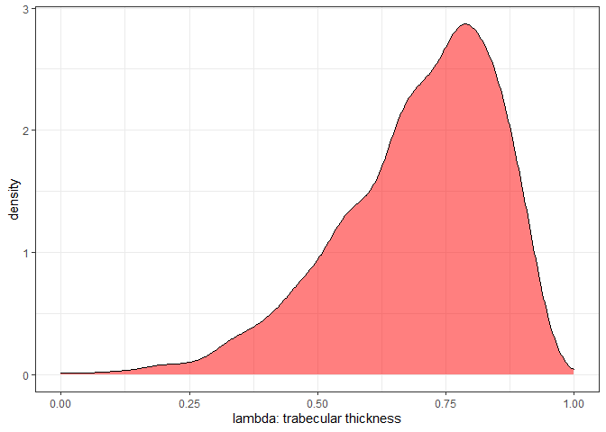

NEW ANALYSES using Student dist priors. My distributions need to be less easily surprised because TBA is pretty variable. 


Load up Chrotomyini trabecular bone architecture (TBA) data and standardize variables:

```r
d <- read.csv(file = "G:\\My Drive\\Philippine rodents\\chrotomyini\\05062022 Philippine Murids segmentation parameters and morphological data - TBA data total BoneJ (full).csv", header = T)

d <- d[d$tribe=="chroto",c(1:2, 4:23)]

d <- 
  d %>% 
  mutate(bvtv = as.numeric(bvtv))

d <- 
  d %>%
  mutate(mass_s = rethinking::standardize(log10(mass_g)),
         elev_s = rethinking::standardize(elev), 
         bvtv_s = rethinking::standardize(bvtv),
         tbth_s = rethinking::standardize(tbth),
         tbsp_s = rethinking::standardize(tbsp),
         conn_s = rethinking::standardize(conn),
         cond_s = rethinking::standardize(m_connd),
         cond_s2 = rethinking::standardize(connd), 
         da_s = rethinking::standardize(da))

# remove C. gonzalesi and R. isarogensis, singletons:
d <- 
  d %>% 
  filter(taxon!="Chrotomys_gonzalesi") %>% 
  filter(taxon!="Rhynchomys_isarogensis")

# Make categorical vars into factors
d <- 
  d %>%
  mutate(loco = factor(loco), 
         hab_simp = factor(hab_simp),
         genus = factor(genus))

# Specify colors for plots:
cols = c("#86acca","#ab685b", "#3370a3", "#1f314c","#5a9fa8")
```

Load in phylogeny: 
REMEMBER: A <- ape::vcv.phylo(phylo), add corr = T if your tree is NOT SCALED TO 1. 

```r
ch.tre <- read.nexus(file = "G:\\My Drive\\Philippine rodents\\Chrotomys\\analysis\\SMS_PRUNED_and_COLLAPSED_03292022_OTUsrenamed_Rowsey_PhBgMCC_LzChrotomyini.nex")

ch <- ape::vcv.phylo(ch.tre, corr = T)

d <- 
  d %>% 
  mutate(phylo = taxon)
```

#######################################################################
#### Comparisons of several models for each trabecular bone metric ####
#######################################################################

Same analyses as before, but this time with Student's dist priors. For reference:
https://solomonkurz.netlify.app/post/2019-02-02-robust-linear-regression-with-student-s-t-distribution/
https://solomonkurz.netlify.app/post/2019-02-10-bayesian-robust-correlations-with-brms-and-why-you-should-love-student-s-t/

######################################
#### Bone Volume Fraction (BV.TV) ####
######################################


```r
# BV.TV by mass
ch.70 <- 
  brm(data = d, 
      family = student,
      bvtv_s ~ 1+mass_s,
      prior = c(prior(normal(0, 1), class = b),
                prior(gamma(2, 0.1), class = nu),
                prior(exponential(1), class = sigma)),
      iter = 2000, warmup = 1000, chains = 4, cores = 4,
      seed = 5,
      file = "G:\\My Drive\\Philippine rodents\\chrotomyini\\fits\\ch.70")
print(ch.70)
```

```
##  Family: student 
##   Links: mu = identity; sigma = identity; nu = identity 
## Formula: bvtv_s ~ 1 + mass_s 
##    Data: d (Number of observations: 67) 
##   Draws: 4 chains, each with iter = 2000; warmup = 1000; thin = 1;
##          total post-warmup draws = 4000
## 
## Population-Level Effects: 
##           Estimate Est.Error l-95% CI u-95% CI Rhat Bulk_ESS Tail_ESS
## Intercept    -0.03      0.10    -0.23     0.19 1.00     4399     3019
## mass_s        0.55      0.11     0.34     0.76 1.00     3955     2435
## 
## Family Specific Parameters: 
##       Estimate Est.Error l-95% CI u-95% CI Rhat Bulk_ESS Tail_ESS
## sigma     0.80      0.08     0.67     0.97 1.00     4291     2986
## nu       25.90     14.48     6.94    62.97 1.00     4444     2757
## 
## Draws were sampled using sampling(NUTS). For each parameter, Bulk_ESS
## and Tail_ESS are effective sample size measures, and Rhat is the potential
## scale reduction factor on split chains (at convergence, Rhat = 1).
```

A scatterplot of thTe above model, with genera color-coded (the same color code to be used for the remainder of this document):

```r
range(d$mass_s)
```

```
## [1] -1.866104  1.451091
```

```r
nd <- tibble(mass_s = seq(from = -2, to = 1.75, length.out = 67))

fitted(ch.70,
       newdata = nd) %>% 
  data.frame() %>% 
  bind_cols(nd) %>% 
  
  # plot
  ggplot(aes(x = mass_s)) +
  geom_smooth(aes(y = Estimate, ymin = Q2.5, ymax = Q97.5),
              stat = "identity",
              alpha = 1/5, size = 1, color = "black") +
  geom_point(data = d, aes(y = bvtv_s, color = genus), size = 4)+
  scale_color_manual(values = cols)+
  xlim(min(nd), max(nd))+
  labs(x = "Mass in grams (standardized)",
       y = "bone volume fraction (standardized)") 
```

<!-- -->

Testing across metrics:


```r
# By genus only
ch.71 <- 
  brm(data = d, 
      family = student,
      bvtv_s ~ 0 + genus,
      prior = c(prior(normal(0, 1), class = b),
                prior(gamma(2, 0.1), class = nu),
                prior(exponential(1), class = sigma)),
      iter = 2000, warmup = 1000, chains = 4, cores = 4,
      file = "G:\\My Drive\\Philippine rodents\\chrotomyini\\fits\\ch.71")
print(ch.71)
```

```
##  Family: student 
##   Links: mu = identity; sigma = identity; nu = identity 
## Formula: bvtv_s ~ 0 + genus 
##    Data: d (Number of observations: 67) 
##   Draws: 4 chains, each with iter = 2000; warmup = 1000; thin = 1;
##          total post-warmup draws = 4000
## 
## Population-Level Effects: 
##                   Estimate Est.Error l-95% CI u-95% CI Rhat Bulk_ESS Tail_ESS
## genusApomys           0.17      0.20    -0.23     0.55 1.00     6709     2898
## genusArchboldomys    -0.81      0.32    -1.44    -0.18 1.00     6269     2844
## genusChrotomys        0.67      0.20     0.28     1.06 1.00     6094     2773
## genusRhynchomys      -0.21      0.32    -0.83     0.41 1.00     6533     2746
## genusSoricomys       -0.62      0.19    -1.00    -0.25 1.00     6524     2828
## 
## Family Specific Parameters: 
##       Estimate Est.Error l-95% CI u-95% CI Rhat Bulk_ESS Tail_ESS
## sigma     0.80      0.08     0.66     0.98 1.00     5172     3253
## nu       25.20     14.42     6.49    61.25 1.00     5318     2992
## 
## Draws were sampled using sampling(NUTS). For each parameter, Bulk_ESS
## and Tail_ESS are effective sample size measures, and Rhat is the potential
## scale reduction factor on split chains (at convergence, Rhat = 1).
```


```r
# By genus and mass
ch.72 <- 
  brm(data = d, 
      family = student,
      bvtv_s ~ 0 + genus + mass_s,
      prior = c(prior(normal(0, 1), class = b),
                prior(gamma(2, 0.1), class = nu),
                prior(exponential(1), class = sigma)),
      iter = 2000, warmup = 1000, chains = 4, cores = 4,
      file = "G:\\My Drive\\Philippine rodents\\chrotomyini\\fits\\ch.72")
print(ch.72)
```

```
##  Family: student 
##   Links: mu = identity; sigma = identity; nu = identity 
## Formula: bvtv_s ~ 0 + genus + mass_s 
##    Data: d (Number of observations: 67) 
##   Draws: 4 chains, each with iter = 2000; warmup = 1000; thin = 1;
##          total post-warmup draws = 4000
## 
## Population-Level Effects: 
##                   Estimate Est.Error l-95% CI u-95% CI Rhat Bulk_ESS Tail_ESS
## genusApomys           0.06      0.18    -0.28     0.41 1.00     4182     2646
## genusArchboldomys    -0.26      0.33    -0.91     0.40 1.00     2631     2719
## genusChrotomys       -0.25      0.29    -0.80     0.34 1.00     1566     2198
## genusRhynchomys      -1.34      0.41    -2.14    -0.52 1.00     1773     2337
## genusSoricomys        0.74      0.39    -0.06     1.50 1.00     1386     2086
## mass_s                1.02      0.26     0.48     1.51 1.00     1333     1784
## 
## Family Specific Parameters: 
##       Estimate Est.Error l-95% CI u-95% CI Rhat Bulk_ESS Tail_ESS
## sigma     0.71      0.07     0.57     0.87 1.00     2346     2466
## nu       23.82     14.22     6.23    60.65 1.00     3074     2489
## 
## Draws were sampled using sampling(NUTS). For each parameter, Bulk_ESS
## and Tail_ESS are effective sample size measures, and Rhat is the potential
## scale reduction factor on split chains (at convergence, Rhat = 1).
```


```r
# By genus, mass, and phylogeny

ch.74.1 <-
  brm(data = d, 
      family = student,
      bvtv_s ~ 0 + genus + mass_s + (1|gr(phylo, cov = ch)),
      control = list(adapt_delta = 0.85), #inserted to decrease the number of divergent transitions here
      prior = c(
        prior(gamma(2, 0.1), class = nu),
        prior(normal(0, 1), class = b, coef = genusApomys),
        prior(normal(0, 1), class = b, coef = genusArchboldomys),
        prior(normal(0, 1), class = b, coef = genusChrotomys),
        prior(normal(0, 1), class = b, coef = genusRhynchomys),
        prior(normal(0, 1), class = b, coef = genusSoricomys),
        prior(normal(0, 1), class = b, coef = mass_s),
        prior(normal(0, 1), class = sd),
        prior(exponential(1), class = sigma)
        ),
      data2 = list(ch = ch),
      iter = 2000, warmup = 1000, chains = 4, cores = 4,
      file = "G:\\My Drive\\Philippine rodents\\chrotomyini\\fits\\ch.74.1")
print(ch.74.1)
```

```
##  Family: student 
##   Links: mu = identity; sigma = identity; nu = identity 
## Formula: bvtv_s ~ 0 + genus + mass_s + (1 | gr(phylo, cov = ch)) 
##    Data: d (Number of observations: 67) 
##   Draws: 4 chains, each with iter = 2000; warmup = 1000; thin = 1;
##          total post-warmup draws = 4000
## 
## Group-Level Effects: 
## ~phylo (Number of levels: 11) 
##               Estimate Est.Error l-95% CI u-95% CI Rhat Bulk_ESS Tail_ESS
## sd(Intercept)     0.74      0.26     0.28     1.34 1.00     1535     1758
## 
## Population-Level Effects: 
##                   Estimate Est.Error l-95% CI u-95% CI Rhat Bulk_ESS Tail_ESS
## genusApomys           0.11      0.53    -0.95     1.21 1.00     2441     2327
## genusArchboldomys    -0.23      0.62    -1.45     1.02 1.00     3232     2863
## genusChrotomys       -0.09      0.59    -1.24     1.06 1.00     2173     2454
## genusRhynchomys      -0.77      0.67    -2.04     0.61 1.00     2675     2961
## genusSoricomys        0.38      0.65    -0.91     1.63 1.00     2593     2643
## mass_s                0.81      0.29     0.23     1.37 1.00     2856     2777
## 
## Family Specific Parameters: 
##       Estimate Est.Error l-95% CI u-95% CI Rhat Bulk_ESS Tail_ESS
## sigma     0.62      0.08     0.46     0.78 1.00     2370     1643
## nu       19.44     13.33     3.76    53.78 1.00     2861     1710
## 
## Draws were sampled using sampling(NUTS). For each parameter, Bulk_ESS
## and Tail_ESS are effective sample size measures, and Rhat is the potential
## scale reduction factor on split chains (at convergence, Rhat = 1).
```

```r
#By species, for funsies
ch.74.3 <-
  brm(data = d, 
      family = student,
      bvtv_s ~ 0 + taxon + mass_s + (1|gr(phylo, cov = ch)),
      control = list(adapt_delta = 0.85), #inserted to decrease the number of divergent transitions here
      prior = c(
        prior(gamma(2, 0.1), class = nu),
        prior(normal(0, 1), class = b),
        prior(normal(0, 1), class = sd),
        prior(exponential(1), class = sigma)
        ),
      data2 = list(ch = ch),
      iter = 2000, warmup = 1000, chains = 4, cores = 4,
      file = "G:\\My Drive\\Philippine rodents\\chrotomyini\\fits\\ch.74.3")
print(ch.74.3)
```

```
## Warning: There were 2 divergent transitions after warmup. Increasing adapt_delta
## above 0.85 may help. See http://mc-stan.org/misc/warnings.html#divergent-
## transitions-after-warmup
```

```
##  Family: student 
##   Links: mu = identity; sigma = identity; nu = identity 
## Formula: bvtv_s ~ 0 + taxon + mass_s + (1 | gr(phylo, cov = ch)) 
##    Data: d (Number of observations: 67) 
##   Draws: 4 chains, each with iter = 2000; warmup = 1000; thin = 1;
##          total post-warmup draws = 4000
## 
## Group-Level Effects: 
## ~phylo (Number of levels: 11) 
##               Estimate Est.Error l-95% CI u-95% CI Rhat Bulk_ESS Tail_ESS
## sd(Intercept)     0.32      0.26     0.01     0.98 1.00      948     1706
## 
## Population-Level Effects: 
##                            Estimate Est.Error l-95% CI u-95% CI Rhat Bulk_ESS
## taxonApomys_banahao            0.20      0.39    -0.60     0.98 1.00     2138
## taxonApomys_datae             -0.34      0.39    -1.13     0.41 1.00     2598
## taxonApomys_sierrae            0.45      0.41    -0.38     1.26 1.00     2853
## taxonArchboldomys_maximus     -0.41      0.42    -1.19     0.44 1.00     2646
## taxonChrotomys_mindorensis     0.41      0.47    -0.51     1.33 1.00     1716
## taxonChrotomys_silaceus       -0.60      0.37    -1.33     0.20 1.00     2532
## taxonChrotomys_whiteheadi      0.50      0.45    -0.41     1.36 1.00     1907
## taxonRhynchomys_labo          -0.87      0.48    -1.77     0.14 1.00     2273
## taxonSoricomys_kalinga         0.54      0.46    -0.35     1.46 1.00     1902
## taxonSoricomys_leonardocoi    -0.23      0.44    -1.10     0.61 1.00     1934
## taxonSoricomys_montanus        0.32      0.50    -0.70     1.28 1.00     2114
## mass_s                         0.66      0.25     0.16     1.13 1.00     1729
##                            Tail_ESS
## taxonApomys_banahao            1865
## taxonApomys_datae              2440
## taxonApomys_sierrae            2152
## taxonArchboldomys_maximus      1652
## taxonChrotomys_mindorensis     1688
## taxonChrotomys_silaceus        2383
## taxonChrotomys_whiteheadi      1791
## taxonRhynchomys_labo           2206
## taxonSoricomys_kalinga         2384
## taxonSoricomys_leonardocoi     2361
## taxonSoricomys_montanus        2399
## mass_s                         2302
## 
## Family Specific Parameters: 
##       Estimate Est.Error l-95% CI u-95% CI Rhat Bulk_ESS Tail_ESS
## sigma     0.61      0.08     0.45     0.77 1.00     2748     2188
## nu       18.46     13.39     3.44    52.07 1.00     3607     1994
## 
## Draws were sampled using sampling(NUTS). For each parameter, Bulk_ESS
## and Tail_ESS are effective sample size measures, and Rhat is the potential
## scale reduction factor on split chains (at convergence, Rhat = 1).
```

A four-part plot including all of the models:


```r
ch.71_halfeye <- ch.71 %>%
  gather_draws(b_genusApomys,b_genusArchboldomys, b_genusChrotomys, b_genusRhynchomys, b_genusSoricomys) %>%
  mutate(.variable = str_replace_all(.variable, "b_genus", "")) %>%
  ggplot(aes(y = .variable, x = .value)) +
  stat_halfeye(aes(fill = .variable), 
               point_fill = "#000000", 
               shape = 21, 
               point_size = 3, 
               point_color = "#FFFFFF",
               interval_size = 10,
               interval_color = "grey40",
               .width = .89) +
  scale_fill_manual(values = cols)+
  geom_vline(xintercept = 0, linetype = "dashed")+
  theme(legend.position = "none", 
        plot.title = element_text(size = 9))+
  labs(x = "BV.TV", y = "genus")+
  ggtitle(label = "BV.TV by genus only")

ch.72_halfeye <- ch.72 %>%
  gather_draws(b_genusApomys,b_genusArchboldomys, b_genusChrotomys, b_genusRhynchomys, b_genusSoricomys) %>%
  mutate(.variable = str_replace_all(.variable, "b_genus", "")) %>%
  ggplot(aes(y = .variable, x = .value)) +
  stat_halfeye(aes(fill = .variable), 
               point_fill = "#000000", 
               shape = 21, 
               point_size = 3, 
               point_color = "#FFFFFF",
               interval_size = 10,
               interval_color = "grey40",
               .width = .89) +
  scale_fill_manual(values = cols)+
  geom_vline(xintercept = 0, linetype = "dashed")+
  ggtitle(label = "BV.TV by genus/mass")+
  labs(x = "BV.TV", y = "genus")+
  theme(legend.position = "none", 
        plot.title = element_text(size = 9))

ch.74.1_halfeye <- ch.74.1 %>%
  gather_draws(b_genusApomys,b_genusArchboldomys, b_genusChrotomys, b_genusRhynchomys, b_genusSoricomys) %>%
  mutate(.variable = str_replace_all(.variable, "b_genus", "")) %>%
  ggplot(aes(y = .variable, x = .value)) +
  stat_halfeye(aes(fill = .variable), 
               point_fill = "#000000", 
               shape = 21, 
               point_size = 3, 
               point_color = "#FFFFFF",
               interval_size = 10,
               interval_color = "grey40",
               .width = .89) +
  scale_fill_manual(values = cols)+
  geom_vline(xintercept = 0, linetype = "dashed")+
  ggtitle(label = "BV.TV by genus/mass/phylo")+
  labs(x = "BV.TV", y = "genus")+
  theme(legend.position = "none", 
        plot.title = element_text(size = 9))

ch.71_halfeye|ch.72_halfeye|ch.74.1_halfeye
```

<!-- -->

Here are the difference distributions between pairs of genera for the model including only genus, mass, and phylo as predictors:

```r
ch.74.1 %>%
  gather_draws(b_genusApomys,b_genusArchboldomys, b_genusChrotomys, b_genusRhynchomys, b_genusSoricomys) %>%
  compare_levels(.value, by = .variable) %>%
  mutate(.variable = str_replace_all(.variable, "b_genus", "")) %>%
  ungroup() %>%
  mutate(loco = reorder(.variable, .value)) %>%
  ggplot(aes(y = .variable, x = .value)) +
  stat_halfeye() +
  geom_vline(xintercept = 0, linetype = "dashed") +
  ggtitle(label = "Between-genus BV.TV difference distributions")+
  labs(x = "difference", y = "comparison")
```

<!-- -->


```r
hyp <- "sd_phylo__Intercept^2 / (sd_phylo__Intercept^2 + sigma^2) = 0"
h.bvtv <- hypothesis(ch.74.1, hyp, class = NULL)
h.bvtv
```

```
## Hypothesis Tests for class :
##                 Hypothesis Estimate Est.Error CI.Lower CI.Upper Evid.Ratio
## 1 (sd_phylo__Interc... = 0     0.56      0.18     0.14     0.85         NA
##   Post.Prob Star
## 1        NA    *
## ---
## 'CI': 90%-CI for one-sided and 95%-CI for two-sided hypotheses.
## '*': For one-sided hypotheses, the posterior probability exceeds 95%;
## for two-sided hypotheses, the value tested against lies outside the 95%-CI.
## Posterior probabilities of point hypotheses assume equal prior probabilities.
```

Lambda = 0.56

```r
ph.bvtv.pl <- ggplot() +
  geom_density(aes(x = h.bvtv$samples$H1), fill = "red", alpha = 0.5) +
  theme_bw() +
  xlim(0,1) +
  labs(y = "density", x = "lambda: bone volume fraction")
ph.bvtv.pl
```

<!-- -->


```r
ch.71 <-  add_criterion(ch.71, c("waic", "loo")) # mass only
ch.72 <-  add_criterion(ch.72, c("waic", "loo")) # genus only 
ch.74.1 <-  add_criterion(ch.74.1, c("waic", "loo")) # genus mass phylogeny

loo(ch.71) # genus only : 0 Pareto K > 0.5
```

```
## 
## Computed from 4000 by 67 log-likelihood matrix
## 
##          Estimate   SE
## elpd_loo    -85.9  5.0
## p_loo         4.9  0.6
## looic       171.9 10.0
## ------
## Monte Carlo SE of elpd_loo is 0.0.
## 
## All Pareto k estimates are good (k < 0.5).
## See help('pareto-k-diagnostic') for details.
```

```r
loo(ch.72) # genus and mass : 0 Pareto K > 0.5
```

```
## 
## Computed from 4000 by 67 log-likelihood matrix
## 
##          Estimate   SE
## elpd_loo    -78.3  5.4
## p_loo         5.7  0.8
## looic       156.6 10.8
## ------
## Monte Carlo SE of elpd_loo is 0.0.
## 
## All Pareto k estimates are good (k < 0.5).
## See help('pareto-k-diagnostic') for details.
```

```r
loo(ch.74.1) # genus mass phylogeny : 0 Pareto K > 0.5
```

```
## 
## Computed from 4000 by 67 log-likelihood matrix
## 
##          Estimate   SE
## elpd_loo    -73.8  6.8
## p_loo        10.8  1.7
## looic       147.5 13.6
## ------
## Monte Carlo SE of elpd_loo is 0.1.
## 
## Pareto k diagnostic values:
##                          Count Pct.    Min. n_eff
## (-Inf, 0.5]   (good)     66    98.5%   1350      
##  (0.5, 0.7]   (ok)        1     1.5%   429       
##    (0.7, 1]   (bad)       0     0.0%   <NA>      
##    (1, Inf)   (very bad)  0     0.0%   <NA>      
## 
## All Pareto k estimates are ok (k < 0.7).
## See help('pareto-k-diagnostic') for details.
```


######################################
#### Trabecular Thickness (Tb.Th) ####
######################################

A model without genus, mass as the only predictor:


```r
# Tb.Th by mass
ch.81 <- 
  brm(data = d, 
      family = student,
      tbth_s ~ 1+mass_s,
      prior = c(prior(normal(0, 1), class = b),
                prior(gamma(2, 0.1), class = nu),
                prior(exponential(1), class = sigma)),
      iter = 2000, warmup = 1000, chains = 4, cores = 4,
      file = "G:\\My Drive\\Philippine rodents\\chrotomyini\\fits\\ch.81")
print(ch.81)
```

```
##  Family: student 
##   Links: mu = identity; sigma = identity; nu = identity 
## Formula: tbth_s ~ 1 + mass_s 
##    Data: d (Number of observations: 67) 
##   Draws: 4 chains, each with iter = 2000; warmup = 1000; thin = 1;
##          total post-warmup draws = 4000
## 
## Population-Level Effects: 
##           Estimate Est.Error l-95% CI u-95% CI Rhat Bulk_ESS Tail_ESS
## Intercept    -0.01      0.05    -0.10     0.08 1.00     4392     2969
## mass_s        0.92      0.05     0.83     1.01 1.00     4115     3040
## 
## Family Specific Parameters: 
##       Estimate Est.Error l-95% CI u-95% CI Rhat Bulk_ESS Tail_ESS
## sigma     0.35      0.04     0.29     0.43 1.00     3560     2852
## nu       24.04     14.53     5.73    60.45 1.00     3899     2834
## 
## Draws were sampled using sampling(NUTS). For each parameter, Bulk_ESS
## and Tail_ESS are effective sample size measures, and Rhat is the potential
## scale reduction factor on split chains (at convergence, Rhat = 1).
```

A scatterplot of the above model, with genera color-coded:

```r
ch.81.pl <- fitted(ch.81,
       newdata = nd) %>% 
  data.frame() %>% 
  bind_cols(nd) %>% 
  
  # plot
  ggplot(aes(x = mass_s)) +
  geom_smooth(aes(y = Estimate, ymin = Q2.5, ymax = Q97.5),
              stat = "identity",
              alpha = 1/5, size = 1, color = "black") +
  geom_point(data = d, aes(y = tbth_s, color = genus), size = 4)+
  scale_color_manual(values = cols)+
  labs(x = "Mass in grams (standardized)",
       y = "trabecular thickness (standardized)") 
ch.81.pl
```

<!-- -->


```r
# By genus only
ch.82 <- 
  brm(data = d, 
      family = student,
      tbth_s ~ 0 + genus,
      prior = c(prior(normal(0, 1), class = b),
                prior(gamma(2, 0.1), class = nu),
                prior(exponential(1), class = sigma)),
      iter = 2000, warmup = 1000, chains = 4, cores = 4,
      file = "G:\\My Drive\\Philippine rodents\\chrotomyini\\fits\\ch.82")
print(ch.82)
```

```
##  Family: student 
##   Links: mu = identity; sigma = identity; nu = identity 
## Formula: tbth_s ~ 0 + genus 
##    Data: d (Number of observations: 67) 
##   Draws: 4 chains, each with iter = 2000; warmup = 1000; thin = 1;
##          total post-warmup draws = 4000
## 
## Population-Level Effects: 
##                   Estimate Est.Error l-95% CI u-95% CI Rhat Bulk_ESS Tail_ESS
## genusApomys           0.02      0.09    -0.15     0.20 1.00     3345     2339
## genusArchboldomys    -0.86      0.15    -1.15    -0.53 1.00     3682     2547
## genusChrotomys        1.11      0.13     0.86     1.36 1.00     3206     2941
## genusRhynchomys       0.75      0.15     0.46     1.05 1.00     3453     2283
## genusSoricomys       -1.17      0.08    -1.34    -1.01 1.00     3240     2424
## 
## Family Specific Parameters: 
##       Estimate Est.Error l-95% CI u-95% CI Rhat Bulk_ESS Tail_ESS
## sigma     0.34      0.08     0.20     0.50 1.00     1696     2316
## nu        6.42      7.34     1.45    28.68 1.00     1726     2341
## 
## Draws were sampled using sampling(NUTS). For each parameter, Bulk_ESS
## and Tail_ESS are effective sample size measures, and Rhat is the potential
## scale reduction factor on split chains (at convergence, Rhat = 1).
```


```r
# By genus and mass
ch.83 <- 
  brm(data = d, 
      family = student,
      tbth_s ~ 0 + genus + mass_s,
      prior = c(prior(normal(0, 1), class = b),
                prior(gamma(2, 0.1), class = nu),
                prior(exponential(1), class = sigma)),
      iter = 2000, warmup = 1000, chains = 4, cores = 4,
      file = "G:\\My Drive\\Philippine rodents\\chrotomyini\\fits\\ch.83")
print(ch.83)
```

```
##  Family: student 
##   Links: mu = identity; sigma = identity; nu = identity 
## Formula: tbth_s ~ 0 + genus + mass_s 
##    Data: d (Number of observations: 67) 
##   Draws: 4 chains, each with iter = 2000; warmup = 1000; thin = 1;
##          total post-warmup draws = 4000
## 
## Population-Level Effects: 
##                   Estimate Est.Error l-95% CI u-95% CI Rhat Bulk_ESS Tail_ESS
## genusApomys          -0.11      0.08    -0.27     0.04 1.00     2687     2516
## genusArchboldomys    -0.09      0.16    -0.42     0.23 1.00     2223     2750
## genusChrotomys       -0.08      0.16    -0.39     0.24 1.00     1448     2134
## genusRhynchomys      -0.62      0.22    -1.06    -0.19 1.00     1495     2283
## genusSoricomys        0.43      0.21     0.02     0.87 1.00     1300     1969
## mass_s                1.18      0.15     0.89     1.46 1.00     1194     1813
## 
## Family Specific Parameters: 
##       Estimate Est.Error l-95% CI u-95% CI Rhat Bulk_ESS Tail_ESS
## sigma     0.32      0.03     0.26     0.38 1.00     3359     2645
## nu       24.45     14.06     6.09    59.68 1.00     3410     2412
## 
## Draws were sampled using sampling(NUTS). For each parameter, Bulk_ESS
## and Tail_ESS are effective sample size measures, and Rhat is the potential
## scale reduction factor on split chains (at convergence, Rhat = 1).
```


```r
# By genus, mass, and phylogeny

ch.84 <-
  brm(data = d, 
      family = student,
      tbth_s ~ 0 + genus + mass_s + (1|gr(phylo, cov = ch)),
      control = list(adapt_delta = 0.85), #inserted to decrease the number of divergent transitions here
      prior = c(
        prior(gamma(2, 0.1), class = nu),
        prior(normal(0, 1), class = b, coef = genusApomys),
        prior(normal(0, 1), class = b, coef = genusArchboldomys),
        prior(normal(0, 1), class = b, coef = genusChrotomys),
        prior(normal(0, 1), class = b, coef = genusRhynchomys),
        prior(normal(0, 1), class = b, coef = genusSoricomys),
        prior(normal(0, 1), class = b, coef = mass_s),
        prior(normal(0, 1), class = sd),
        prior(exponential(1), class = sigma)
        ),
      data2 = list(ch = ch),
      iter = 2000, warmup = 1000, chains = 4, cores = 4,
      file = "G:\\My Drive\\Philippine rodents\\chrotomyini\\fits\\ch.84")
print(ch.84)
```

```
##  Family: student 
##   Links: mu = identity; sigma = identity; nu = identity 
## Formula: tbth_s ~ 0 + genus + mass_s + (1 | gr(phylo, cov = ch)) 
##    Data: d (Number of observations: 67) 
##   Draws: 4 chains, each with iter = 2000; warmup = 1000; thin = 1;
##          total post-warmup draws = 4000
## 
## Group-Level Effects: 
## ~phylo (Number of levels: 11) 
##               Estimate Est.Error l-95% CI u-95% CI Rhat Bulk_ESS Tail_ESS
## sd(Intercept)     0.46      0.17     0.20     0.88 1.00     1199     2070
## 
## Population-Level Effects: 
##                   Estimate Est.Error l-95% CI u-95% CI Rhat Bulk_ESS Tail_ESS
## genusApomys          -0.08      0.37    -0.84     0.66 1.00     2689     2395
## genusArchboldomys    -0.22      0.45    -1.14     0.68 1.00     2951     2494
## genusChrotomys        0.06      0.39    -0.71     0.87 1.00     2617     2311
## genusRhynchomys      -0.30      0.45    -1.18     0.65 1.00     2968     2227
## genusSoricomys        0.12      0.45    -0.78     0.98 1.00     2614     2050
## mass_s                0.95      0.16     0.62     1.27 1.00     3121     2746
## 
## Family Specific Parameters: 
##       Estimate Est.Error l-95% CI u-95% CI Rhat Bulk_ESS Tail_ESS
## sigma     0.27      0.03     0.22     0.33 1.00     3509     3014
## nu       22.81     13.86     5.56    56.91 1.00     4083     2520
## 
## Draws were sampled using sampling(NUTS). For each parameter, Bulk_ESS
## and Tail_ESS are effective sample size measures, and Rhat is the potential
## scale reduction factor on split chains (at convergence, Rhat = 1).
```

A four-part plot including all of the models:


```r
ch.82_halfeye <- ch.82 %>%
  gather_draws(b_genusApomys,b_genusArchboldomys, b_genusChrotomys, b_genusRhynchomys, b_genusSoricomys) %>%
  mutate(.variable = str_replace_all(.variable, "b_genus", "")) %>%
  ggplot(aes(y = .variable, x = .value)) +
  stat_halfeye(aes(fill = .variable), 
               point_fill = "#000000", 
               shape = 21, 
               point_size = 3, 
               point_color = "#FFFFFF",
               interval_size = 10,
               interval_color = "grey40",
               .width = .89) +
  scale_fill_manual(values = cols)+
  geom_vline(xintercept = 0, linetype = "dashed")+
  theme(legend.position = "none", 
        plot.title = element_text(size = 9))+
  labs(x = "Tb.Th", y = "genus")+
  ggtitle(label = "Tb.Th by genus only")

ch.83_halfeye <- ch.83 %>%
  gather_draws(b_genusApomys,b_genusArchboldomys, b_genusChrotomys, b_genusRhynchomys, b_genusSoricomys) %>%
  mutate(.variable = str_replace_all(.variable, "b_genus", "")) %>%
  ggplot(aes(y = .variable, x = .value)) +
  stat_halfeye(aes(fill = .variable), 
               point_fill = "#000000", 
               shape = 21, 
               point_size = 3, 
               point_color = "#FFFFFF",
               interval_size = 10,
               interval_color = "grey40",
               .width = .89) +
  scale_fill_manual(values = cols)+
  geom_vline(xintercept = 0, linetype = "dashed")+
  ggtitle(label = "Tb.Th by genus/mass")+
  labs(x = "Tb.Th", y = "genus")+
  theme(legend.position = "none", 
        plot.title = element_text(size = 9))

ch.84_halfeye <- ch.84 %>%
  gather_draws(b_genusApomys,b_genusArchboldomys, b_genusChrotomys, b_genusRhynchomys, b_genusSoricomys) %>%
  mutate(.variable = str_replace_all(.variable, "b_genus", "")) %>%
  ggplot(aes(y = .variable, x = .value)) +
  stat_halfeye(aes(fill = .variable), 
               point_fill = "#000000", 
               shape = 21, 
               point_size = 3, 
               point_color = "#FFFFFF",
               interval_size = 10,
               interval_color = "grey40",
               .width = .89) +
  scale_fill_manual(values = cols)+
  geom_vline(xintercept = 0, linetype = "dashed")+
  ggtitle(label = "Tb.Th by genus/mass/phylo")+
  labs(x = "Tb.Th", y = "genus")+
  theme(legend.position = "none", 
        plot.title = element_text(size = 9))

ch.82_halfeye|ch.83_halfeye|ch.84_halfeye
```

<!-- -->


```r
hyp <- "sd_phylo__Intercept^2 / (sd_phylo__Intercept^2 + sigma^2) = 0"
h.tbth <- hypothesis(ch.84, hyp, class = NULL)
h.tbth
```

```
## Hypothesis Tests for class :
##                 Hypothesis Estimate Est.Error CI.Lower CI.Upper Evid.Ratio
## 1 (sd_phylo__Interc... = 0      0.7      0.16     0.33     0.92         NA
##   Post.Prob Star
## 1        NA    *
## ---
## 'CI': 90%-CI for one-sided and 95%-CI for two-sided hypotheses.
## '*': For one-sided hypotheses, the posterior probability exceeds 95%;
## for two-sided hypotheses, the value tested against lies outside the 95%-CI.
## Posterior probabilities of point hypotheses assume equal prior probabilities.
```

Lambda = 0.7

```r
ph.bvtv.pl <- ggplot() +
  geom_density(aes(x = h.tbth$samples$H1), fill = "red", alpha = 0.5) +
  theme_bw() +
  xlim(0,1) +
  labs(y = "density", x = "lambda: trabecular thickness")
ph.bvtv.pl
```

<!-- -->


#####################################
#### Trabecular Separation Tb.Sp ####
#####################################

A model without genus, mass as the only predictor:


```r
# Tb.Th by mass
ch.85<- 
  brm(data = d, 
      family = student,
      tbsp_s ~ 1+mass_s,
      prior = c(prior(normal(0, 1), class = b),
                prior(gamma(2, 0.1), class = nu),
                prior(exponential(1), class = sigma)),
      iter = 2000, warmup = 1000, chains = 4, cores = 4,
      file = "G:\\My Drive\\Philippine rodents\\chrotomyini\\fits\\ch.85")
print(ch.85)
```

```
##  Family: student 
##   Links: mu = identity; sigma = identity; nu = identity 
## Formula: tbsp_s ~ 1 + mass_s 
##    Data: d (Number of observations: 67) 
##   Draws: 4 chains, each with iter = 2000; warmup = 1000; thin = 1;
##          total post-warmup draws = 4000
## 
## Population-Level Effects: 
##           Estimate Est.Error l-95% CI u-95% CI Rhat Bulk_ESS Tail_ESS
## Intercept    -0.06      0.12    -0.30     0.19 1.00     3138     2860
## mass_s        0.41      0.11     0.20     0.62 1.00     3184     2553
## 
## Family Specific Parameters: 
##       Estimate Est.Error l-95% CI u-95% CI Rhat Bulk_ESS Tail_ESS
## sigma     0.84      0.11     0.60     1.05 1.00     2339     2177
## nu       15.89     12.61     2.73    48.20 1.00     2393     2235
## 
## Draws were sampled using sampling(NUTS). For each parameter, Bulk_ESS
## and Tail_ESS are effective sample size measures, and Rhat is the potential
## scale reduction factor on split chains (at convergence, Rhat = 1).
```

A scatterplot of the above model, with genera color-coded:

```r
ch.85.pl <- fitted(ch.85,
       newdata = nd) %>% 
  data.frame() %>% 
  bind_cols(nd) %>% 
  
  # plot
  ggplot(aes(x = mass_s)) +
  geom_smooth(aes(y = Estimate, ymin = Q2.5, ymax = Q97.5),
              stat = "identity",
              alpha = 1/5, size = 1, color = "black") +
  geom_point(data = d, aes(y = tbsp_s, color = genus), size = 4)+
  scale_color_manual(values = cols)+
  labs(x = "Mass in grams (standardized)",
       y = "trabecular separation (standardized)") 
ch.85.pl
```

<!-- -->


```r
# By genus only
ch.86 <- 
  brm(data = d, 
      family = student,
      tbsp_s ~ 0 + genus,
      prior = c(prior(normal(0, 1), class = b),
                prior(gamma(2, 0.1), class = nu),
                prior(exponential(1), class = sigma)),
      iter = 2000, warmup = 1000, chains = 4, cores = 4,
      file = "G:\\My Drive\\Philippine rodents\\chrotomyini\\fits\\ch.86")
print(ch.86)
```

```
##  Family: student 
##   Links: mu = identity; sigma = identity; nu = identity 
## Formula: tbsp_s ~ 0 + genus 
##    Data: d (Number of observations: 67) 
##   Draws: 4 chains, each with iter = 2000; warmup = 1000; thin = 1;
##          total post-warmup draws = 4000
## 
## Population-Level Effects: 
##                   Estimate Est.Error l-95% CI u-95% CI Rhat Bulk_ESS Tail_ESS
## genusApomys          -0.21      0.21    -0.62     0.21 1.00     4417     2821
## genusArchboldomys    -0.34      0.36    -1.03     0.39 1.00     4208     2328
## genusChrotomys        0.33      0.20    -0.05     0.74 1.00     4798     2705
## genusRhynchomys       0.81      0.37     0.08     1.51 1.00     5486     3069
## genusSoricomys       -0.56      0.22    -0.98    -0.13 1.00     3888     3013
## 
## Family Specific Parameters: 
##       Estimate Est.Error l-95% CI u-95% CI Rhat Bulk_ESS Tail_ESS
## sigma     0.83      0.12     0.59     1.05 1.00     2560     1913
## nu       16.51     12.75     2.68    51.05 1.00     2475     2080
## 
## Draws were sampled using sampling(NUTS). For each parameter, Bulk_ESS
## and Tail_ESS are effective sample size measures, and Rhat is the potential
## scale reduction factor on split chains (at convergence, Rhat = 1).
```


```r
# By genus and mass
ch.87 <- 
  brm(data = d, 
      family = student,
      tbsp_s ~ 0 + genus + mass_s,
      prior = c(prior(normal(0, 1), class = b),
                prior(gamma(2, 0.1), class = nu),
                prior(exponential(1), class = sigma)),
      iter = 2000, warmup = 1000, chains = 4, cores = 4,
      file = "G:\\My Drive\\Philippine rodents\\chrotomyini\\fits\\ch.87")
print(ch.87)
```

```
##  Family: student 
##   Links: mu = identity; sigma = identity; nu = identity 
## Formula: tbsp_s ~ 0 + genus + mass_s 
##    Data: d (Number of observations: 67) 
##   Draws: 4 chains, each with iter = 2000; warmup = 1000; thin = 1;
##          total post-warmup draws = 4000
## 
## Population-Level Effects: 
##                   Estimate Est.Error l-95% CI u-95% CI Rhat Bulk_ESS Tail_ESS
## genusApomys          -0.23      0.22    -0.66     0.21 1.00     3016     2231
## genusArchboldomys    -0.20      0.39    -0.95     0.57 1.00     2628     2836
## genusChrotomys        0.12      0.32    -0.50     0.74 1.00     1828     2407
## genusRhynchomys       0.57      0.46    -0.34     1.46 1.00     2334     2843
## genusSoricomys       -0.23      0.43    -1.05     0.60 1.00     1721     2669
## mass_s                0.23      0.28    -0.30     0.77 1.00     1575     2561
## 
## Family Specific Parameters: 
##       Estimate Est.Error l-95% CI u-95% CI Rhat Bulk_ESS Tail_ESS
## sigma     0.85      0.11     0.62     1.06 1.00     1866     1663
## nu       17.31     12.78     3.11    51.06 1.00     2057     1557
## 
## Draws were sampled using sampling(NUTS). For each parameter, Bulk_ESS
## and Tail_ESS are effective sample size measures, and Rhat is the potential
## scale reduction factor on split chains (at convergence, Rhat = 1).
```


```r
# By genus, mass, and phylogeny

ch.88 <-
  brm(data = d, 
      family = student,
      tbsp_s ~ 0 + genus + mass_s + (1|gr(phylo, cov = ch)),
      control = list(adapt_delta = 0.85), #inserted to decrease the number of divergent transitions here
      prior = c(
        prior(gamma(2, 0.1), class = nu),
        prior(normal(0, 1), class = b, coef = genusApomys),
        prior(normal(0, 1), class = b, coef = genusArchboldomys),
        prior(normal(0, 1), class = b, coef = genusChrotomys),
        prior(normal(0, 1), class = b, coef = genusRhynchomys),
        prior(normal(0, 1), class = b, coef = genusSoricomys),
        prior(normal(0, 1), class = b, coef = mass_s),
        prior(normal(0, 1), class = sd),
        prior(exponential(1), class = sigma)
        ),
      data2 = list(ch = ch),
      iter = 2000, warmup = 1000, chains = 4, cores = 4,
      file = "G:\\My Drive\\Philippine rodents\\chrotomyini\\fits\\ch.88")
print(ch.88)
```

```
##  Family: student 
##   Links: mu = identity; sigma = identity; nu = identity 
## Formula: tbsp_s ~ 0 + genus + mass_s + (1 | gr(phylo, cov = ch)) 
##    Data: d (Number of observations: 67) 
##   Draws: 4 chains, each with iter = 2000; warmup = 1000; thin = 1;
##          total post-warmup draws = 4000
## 
## Group-Level Effects: 
## ~phylo (Number of levels: 11) 
##               Estimate Est.Error l-95% CI u-95% CI Rhat Bulk_ESS Tail_ESS
## sd(Intercept)     0.49      0.30     0.03     1.14 1.00     1067     1326
## 
## Population-Level Effects: 
##                   Estimate Est.Error l-95% CI u-95% CI Rhat Bulk_ESS Tail_ESS
## genusApomys          -0.19      0.44    -1.06     0.77 1.00     2528     1835
## genusArchboldomys    -0.18      0.56    -1.26     0.98 1.00     3153     2483
## genusChrotomys        0.10      0.52    -0.91     1.10 1.00     2661     2612
## genusRhynchomys       0.45      0.62    -0.80     1.64 1.00     2616     2567
## genusSoricomys       -0.17      0.57    -1.27     0.98 1.00     2854     2976
## mass_s                0.27      0.31    -0.34     0.89 1.00     2719     2817
## 
## Family Specific Parameters: 
##       Estimate Est.Error l-95% CI u-95% CI Rhat Bulk_ESS Tail_ESS
## sigma     0.81      0.12     0.57     1.03 1.00     2361     2256
## nu       16.28     12.41     2.82    48.34 1.00     3081     2466
## 
## Draws were sampled using sampling(NUTS). For each parameter, Bulk_ESS
## and Tail_ESS are effective sample size measures, and Rhat is the potential
## scale reduction factor on split chains (at convergence, Rhat = 1).
```

A four-part plot including all of the models:


```r
ch.86_halfeye <- ch.86 %>%
  gather_draws(b_genusApomys,b_genusArchboldomys, b_genusChrotomys, b_genusRhynchomys, b_genusSoricomys) %>%
  mutate(.variable = str_replace_all(.variable, "b_genus", "")) %>%
  ggplot(aes(y = .variable, x = .value)) +
  stat_halfeye(aes(fill = .variable), 
               point_fill = "#000000", 
               shape = 21, 
               point_size = 3, 
               point_color = "#FFFFFF",
               interval_size = 10,
               interval_color = "grey40",
               .width = .89) +
  scale_fill_manual(values = cols)+
  geom_vline(xintercept = 0, linetype = "dashed")+
  theme(legend.position = "none", 
        plot.title = element_text(size = 9))+
  labs(x = "Tb.Sp", y = "genus")+
  ggtitle(label = "Tb.Sp by genus only")

ch.87_halfeye <- ch.87 %>%
  gather_draws(b_genusApomys,b_genusArchboldomys, b_genusChrotomys, b_genusRhynchomys, b_genusSoricomys) %>%
  mutate(.variable = str_replace_all(.variable, "b_genus", "")) %>%
  ggplot(aes(y = .variable, x = .value)) +
  stat_halfeye(aes(fill = .variable), 
               point_fill = "#000000", 
               shape = 21, 
               point_size = 3, 
               point_color = "#FFFFFF",
               interval_size = 10,
               interval_color = "grey40",
               .width = .89) +
  scale_fill_manual(values = cols)+
  geom_vline(xintercept = 0, linetype = "dashed")+
  ggtitle(label = "Tb.Sp by genus/mass")+
  labs(x = "Tb.Sp", y = "genus")+
  theme(legend.position = "none", 
        plot.title = element_text(size = 9))

ch.88_halfeye <- ch.88 %>%
  gather_draws(b_genusApomys,b_genusArchboldomys, b_genusChrotomys, b_genusRhynchomys, b_genusSoricomys) %>%
  mutate(.variable = str_replace_all(.variable, "b_genus", "")) %>%
  ggplot(aes(y = .variable, x = .value)) +
  stat_halfeye(aes(fill = .variable), 
               point_fill = "#000000", 
               shape = 21, 
               point_size = 3, 
               point_color = "#FFFFFF",
               interval_size = 10,
               interval_color = "grey40",
               .width = .89) +
  scale_fill_manual(values = cols)+
  geom_vline(xintercept = 0, linetype = "dashed")+
  ggtitle(label = "Tb.Sp by genus/mass/phylo")+
  labs(x = "Tb.Sp", y = "genus")+
  theme(legend.position = "none", 
        plot.title = element_text(size = 9))

ch.86_halfeye|ch.87_halfeye|ch.88_halfeye
```

<!-- -->


```r
hyp <- "sd_phylo__Intercept^2 / (sd_phylo__Intercept^2 + sigma^2) = 0"
h.tbsp <- hypothesis(ch.88, hyp, class = NULL)
h.tbsp
```

```
## Hypothesis Tests for class :
##                 Hypothesis Estimate Est.Error CI.Lower CI.Upper Evid.Ratio
## 1 (sd_phylo__Interc... = 0     0.27      0.21        0     0.72         NA
##   Post.Prob Star
## 1        NA    *
## ---
## 'CI': 90%-CI for one-sided and 95%-CI for two-sided hypotheses.
## '*': For one-sided hypotheses, the posterior probability exceeds 95%;
## for two-sided hypotheses, the value tested against lies outside the 95%-CI.
## Posterior probabilities of point hypotheses assume equal prior probabilities.
```

Lambda = 0.27

```r
ph.tbsp.pl <- ggplot() +
  geom_density(aes(x = h.tbsp$samples$H1), fill = "red", alpha = 0.5) +
  theme_bw() +
  xlim(0,1) +
  labs(y = "density", x = "lambda: trabecular separation")
ph.tbsp.pl
```

<!-- -->


#####################################
#### Connectivity density Conn.D ####
#####################################

A model without genus, mass as the only predictor:


```r
# Conn.D by mass
ch.89<- 
  brm(data = d, 
      family = student,
      cond_s ~ 1+mass_s,
      prior = c(prior(normal(0, 1), class = b),
                prior(gamma(2, 0.1), class = nu),
                prior(exponential(1), class = sigma)),
      iter = 2000, warmup = 1000, chains = 4, cores = 4,
      file = "G:\\My Drive\\Philippine rodents\\chrotomyini\\fits\\ch.89")
print(ch.89)
```

```
##  Family: student 
##   Links: mu = identity; sigma = identity; nu = identity 
## Formula: cond_s ~ 1 + mass_s 
##    Data: d (Number of observations: 67) 
##   Draws: 4 chains, each with iter = 2000; warmup = 1000; thin = 1;
##          total post-warmup draws = 4000
## 
## Population-Level Effects: 
##           Estimate Est.Error l-95% CI u-95% CI Rhat Bulk_ESS Tail_ESS
## Intercept    -0.04      0.08    -0.21     0.13 1.00     3400     2606
## mass_s       -0.69      0.08    -0.85    -0.53 1.00     3177     2511
## 
## Family Specific Parameters: 
##       Estimate Est.Error l-95% CI u-95% CI Rhat Bulk_ESS Tail_ESS
## sigma     0.60      0.10     0.40     0.80 1.00     1940     2085
## nu       10.16      9.41     2.04    36.95 1.00     2022     2545
## 
## Draws were sampled using sampling(NUTS). For each parameter, Bulk_ESS
## and Tail_ESS are effective sample size measures, and Rhat is the potential
## scale reduction factor on split chains (at convergence, Rhat = 1).
```

A scatterplot of the above model, with genera color-coded:

```r
ch.89.pl <- fitted(ch.89,
       newdata = nd) %>% 
  data.frame() %>% 
  bind_cols(nd) %>% 
  
  # plot
  ggplot(aes(x = mass_s)) +
  geom_smooth(aes(y = Estimate, ymin = Q2.5, ymax = Q97.5),
              stat = "identity",
              alpha = 1/5, size = 1, color = "black") +
  geom_point(data = d, aes(y = cond_s, color = genus), size = 4)+
  scale_color_manual(values = cols)+
  labs(x = "Mass in grams (standardized)",
       y = "connectivity density (standardized)") 
ch.89.pl
```

<!-- -->


```r
# By genus only
ch.90 <- 
  brm(data = d, 
      family = student,
      cond_s ~ 0 + genus,
      prior = c(prior(normal(0, 1), class = b),
                prior(gamma(2, 0.1), class = nu),
                prior(exponential(1), class = sigma)),
      iter = 2000, warmup = 1000, chains = 4, cores = 4,
      file = "G:\\My Drive\\Philippine rodents\\chrotomyini\\fits\\ch.90")
print(ch.90)
```

```
##  Family: student 
##   Links: mu = identity; sigma = identity; nu = identity 
## Formula: cond_s ~ 0 + genus 
##    Data: d (Number of observations: 67) 
##   Draws: 4 chains, each with iter = 2000; warmup = 1000; thin = 1;
##          total post-warmup draws = 4000
## 
## Population-Level Effects: 
##                   Estimate Est.Error l-95% CI u-95% CI Rhat Bulk_ESS Tail_ESS
## genusApomys          -0.28      0.17    -0.59     0.07 1.00     4397     2745
## genusArchboldomys     0.10      0.30    -0.48     0.69 1.00     4479     2850
## genusChrotomys       -0.70      0.16    -1.00    -0.37 1.00     3251     3067
## genusRhynchomys      -0.55      0.26    -1.04    -0.04 1.00     4605     2831
## genusSoricomys        1.03      0.18     0.67     1.37 1.00     4055     2571
## 
## Family Specific Parameters: 
##       Estimate Est.Error l-95% CI u-95% CI Rhat Bulk_ESS Tail_ESS
## sigma     0.63      0.11     0.41     0.84 1.00     1772     2307
## nu       10.87     10.28     1.92    40.76 1.00     1896     2402
## 
## Draws were sampled using sampling(NUTS). For each parameter, Bulk_ESS
## and Tail_ESS are effective sample size measures, and Rhat is the potential
## scale reduction factor on split chains (at convergence, Rhat = 1).
```


```r
# By genus and mass
ch.91 <- 
  brm(data = d, 
      family = student,
      cond_s ~ 0 + genus + mass_s,
      prior = c(prior(normal(0, 1), class = b),
                prior(gamma(2, 0.1), class = nu),
                prior(exponential(1), class = sigma)),
      iter = 2000, warmup = 1000, chains = 4, cores = 4,
      file = "G:\\My Drive\\Philippine rodents\\chrotomyini\\fits\\ch.91")
print(ch.91)
```

```
##  Family: student 
##   Links: mu = identity; sigma = identity; nu = identity 
## Formula: cond_s ~ 0 + genus + mass_s 
##    Data: d (Number of observations: 67) 
##   Draws: 4 chains, each with iter = 2000; warmup = 1000; thin = 1;
##          total post-warmup draws = 4000
## 
## Population-Level Effects: 
##                   Estimate Est.Error l-95% CI u-95% CI Rhat Bulk_ESS Tail_ESS
## genusApomys          -0.23      0.15    -0.52     0.08 1.00     3220     2546
## genusArchboldomys    -0.32      0.32    -0.96     0.33 1.00     2439     2450
## genusChrotomys        0.01      0.29    -0.55     0.58 1.00     1578     1973
## genusRhynchomys       0.26      0.37    -0.46     1.02 1.00     1820     2110
## genusSoricomys        0.06      0.38    -0.70     0.79 1.00     1535     2128
## mass_s               -0.73      0.25    -1.24    -0.24 1.00     1463     1806
## 
## Family Specific Parameters: 
##       Estimate Est.Error l-95% CI u-95% CI Rhat Bulk_ESS Tail_ESS
## sigma     0.56      0.11     0.37     0.77 1.00     1927     1984
## nu        7.64      7.26     1.80    29.21 1.00     2202     2043
## 
## Draws were sampled using sampling(NUTS). For each parameter, Bulk_ESS
## and Tail_ESS are effective sample size measures, and Rhat is the potential
## scale reduction factor on split chains (at convergence, Rhat = 1).
```


```r
# By genus, mass, and phylogeny

ch.92 <-
  brm(data = d, 
      family = student,
      cond_s ~ 0 + genus + mass_s + (1|gr(phylo, cov = ch)),
      control = list(adapt_delta = 0.85), #inserted to decrease the number of divergent transitions here
      prior = c(
        prior(gamma(2, 0.1), class = nu),
        prior(normal(0, 1), class = b, coef = genusApomys),
        prior(normal(0, 1), class = b, coef = genusArchboldomys),
        prior(normal(0, 1), class = b, coef = genusChrotomys),
        prior(normal(0, 1), class = b, coef = genusRhynchomys),
        prior(normal(0, 1), class = b, coef = genusSoricomys),
        prior(normal(0, 1), class = b, coef = mass_s),
        prior(normal(0, 1), class = sd),
        prior(exponential(1), class = sigma)
        ),
      data2 = list(ch = ch),
      iter = 2000, warmup = 1000, chains = 4, cores = 4,
      file = "G:\\My Drive\\Philippine rodents\\chrotomyini\\fits\\ch.92")
print(ch.92)
```

```
##  Family: student 
##   Links: mu = identity; sigma = identity; nu = identity 
## Formula: cond_s ~ 0 + genus + mass_s + (1 | gr(phylo, cov = ch)) 
##    Data: d (Number of observations: 67) 
##   Draws: 4 chains, each with iter = 2000; warmup = 1000; thin = 1;
##          total post-warmup draws = 4000
## 
## Group-Level Effects: 
## ~phylo (Number of levels: 11) 
##               Estimate Est.Error l-95% CI u-95% CI Rhat Bulk_ESS Tail_ESS
## sd(Intercept)     0.34      0.22     0.02     0.83 1.01     1230     1464
## 
## Population-Level Effects: 
##                   Estimate Est.Error l-95% CI u-95% CI Rhat Bulk_ESS Tail_ESS
## genusApomys          -0.22      0.34    -0.91     0.52 1.00     2290     1871
## genusArchboldomys    -0.28      0.44    -1.16     0.63 1.00     3112     2437
## genusChrotomys        0.04      0.41    -0.76     0.89 1.00     1903     2087
## genusRhynchomys       0.24      0.47    -0.69     1.16 1.00     2506     2631
## genusSoricomys        0.05      0.47    -0.86     0.97 1.00     2177     2477
## mass_s               -0.74      0.25    -1.23    -0.23 1.00     2167     2461
## 
## Family Specific Parameters: 
##       Estimate Est.Error l-95% CI u-95% CI Rhat Bulk_ESS Tail_ESS
## sigma     0.52      0.11     0.32     0.76 1.00     1999     2141
## nu        6.17      6.03     1.61    23.66 1.00     2588     2285
## 
## Draws were sampled using sampling(NUTS). For each parameter, Bulk_ESS
## and Tail_ESS are effective sample size measures, and Rhat is the potential
## scale reduction factor on split chains (at convergence, Rhat = 1).
```

A four-part plot including all of the models:


```r
ch.90_halfeye <- ch.90 %>%
  gather_draws(b_genusApomys,b_genusArchboldomys, b_genusChrotomys, b_genusRhynchomys, b_genusSoricomys) %>%
  mutate(.variable = str_replace_all(.variable, "b_genus", "")) %>%
  ggplot(aes(y = .variable, x = .value)) +
  stat_halfeye(aes(fill = .variable), 
               point_fill = "#000000", 
               shape = 21, 
               point_size = 3, 
               point_color = "#FFFFFF",
               interval_size = 10,
               interval_color = "grey40",
               .width = .89) +
  scale_fill_manual(values = cols)+
  geom_vline(xintercept = 0, linetype = "dashed")+
  theme(legend.position = "none", 
        plot.title = element_text(size = 9))+
  labs(x = "Conn.D", y = "genus")+
  ggtitle(label = "Conn.D by genus only")

ch.91_halfeye <- ch.91 %>%
  gather_draws(b_genusApomys,b_genusArchboldomys, b_genusChrotomys, b_genusRhynchomys, b_genusSoricomys) %>%
  mutate(.variable = str_replace_all(.variable, "b_genus", "")) %>%
  ggplot(aes(y = .variable, x = .value)) +
  stat_halfeye(aes(fill = .variable), 
               point_fill = "#000000", 
               shape = 21, 
               point_size = 3, 
               point_color = "#FFFFFF",
               interval_size = 10,
               interval_color = "grey40",
               .width = .89) +
  scale_fill_manual(values = cols)+
  geom_vline(xintercept = 0, linetype = "dashed")+
  ggtitle(label = "Conn.D by genus/mass")+
  labs(x = "Conn.D", y = "genus")+
  theme(legend.position = "none", 
        plot.title = element_text(size = 9))

ch.92_halfeye <- ch.92 %>%
  gather_draws(b_genusApomys,b_genusArchboldomys, b_genusChrotomys, b_genusRhynchomys, b_genusSoricomys) %>%
  mutate(.variable = str_replace_all(.variable, "b_genus", "")) %>%
  ggplot(aes(y = .variable, x = .value)) +
  stat_halfeye(aes(fill = .variable), 
               point_fill = "#000000", 
               shape = 21, 
               point_size = 3, 
               point_color = "#FFFFFF",
               interval_size = 10,
               interval_color = "grey40",
               .width = .89) +
  scale_fill_manual(values = cols)+
  geom_vline(xintercept = 0, linetype = "dashed")+
  ggtitle(label = "Conn.D by genus/mass/phylo")+
  labs(x = "Conn.D", y = "genus")+
  theme(legend.position = "none", 
        plot.title = element_text(size = 9))

ch.90_halfeye|ch.91_halfeye|ch.92_halfeye
```

<!-- -->


```r
hyp <- "sd_phylo__Intercept^2 / (sd_phylo__Intercept^2 + sigma^2) = 0"
h.cond <- hypothesis(ch.92, hyp, class = NULL)
h.cond
```

```
## Hypothesis Tests for class :
##                 Hypothesis Estimate Est.Error CI.Lower CI.Upper Evid.Ratio
## 1 (sd_phylo__Interc... = 0     0.31      0.23        0     0.78         NA
##   Post.Prob Star
## 1        NA    *
## ---
## 'CI': 90%-CI for one-sided and 95%-CI for two-sided hypotheses.
## '*': For one-sided hypotheses, the posterior probability exceeds 95%;
## for two-sided hypotheses, the value tested against lies outside the 95%-CI.
## Posterior probabilities of point hypotheses assume equal prior probabilities.
```

Lambda = 0.31

```r
ph.cond.pl <- ggplot() +
  geom_density(aes(x = h.cond$samples$H1), fill = "red", alpha = 0.5) +
  theme_bw() +
  xlim(0,1) +
  labs(y = "density", x = "lambda: connectivity density")
ph.cond.pl
```

<!-- -->

#### Phylogenetic signal in mass by itself:

```r
ch.93<- 
  brm(data = d, 
      family = student,
      mass_s ~0 +genus+(1|gr(phylo, cov = ch)),
      prior = c(
        prior(gamma(2, 0.1), class = nu),
        prior(normal(0, 1), class = b, coef = genusApomys),
        prior(normal(0, 1), class = b, coef = genusArchboldomys),
        prior(normal(0, 1), class = b, coef = genusChrotomys),
        prior(normal(0, 1), class = b, coef = genusRhynchomys),
        prior(normal(0, 1), class = b, coef = genusSoricomys),
        prior(normal(0, 1), class = sd),
        prior(exponential(1), class = sigma)
        ),
      data2 = list(ch = ch),
      file = "G:\\My Drive\\Philippine rodents\\chrotomyini\\fits\\ch.93")
print(ch.93)
```

```
##  Family: student 
##   Links: mu = identity; sigma = identity; nu = identity 
## Formula: mass_s ~ 0 + genus + (1 | gr(phylo, cov = ch)) 
##    Data: d (Number of observations: 67) 
##   Draws: 4 chains, each with iter = 2000; warmup = 1000; thin = 1;
##          total post-warmup draws = 4000
## 
## Group-Level Effects: 
## ~phylo (Number of levels: 11) 
##               Estimate Est.Error l-95% CI u-95% CI Rhat Bulk_ESS Tail_ESS
## sd(Intercept)     0.52      0.18     0.26     0.98 1.00     1240     1456
## 
## Population-Level Effects: 
##                   Estimate Est.Error l-95% CI u-95% CI Rhat Bulk_ESS Tail_ESS
## genusApomys           0.12      0.41    -0.73     0.91 1.00     1979     2084
## genusArchboldomys    -0.51      0.46    -1.42     0.43 1.00     2685     2550
## genusChrotomys        0.77      0.42    -0.11     1.58 1.00     2358     1973
## genusRhynchomys       0.97      0.46    -0.01     1.82 1.00     2111     2205
## genusSoricomys       -1.21      0.43    -2.04    -0.30 1.00     2157     2027
## 
## Family Specific Parameters: 
##       Estimate Est.Error l-95% CI u-95% CI Rhat Bulk_ESS Tail_ESS
## sigma     0.20      0.02     0.16     0.25 1.00     3394     2572
## nu       22.25     14.06     4.77    57.02 1.00     4469     2400
## 
## Draws were sampled using sampling(NUTS). For each parameter, Bulk_ESS
## and Tail_ESS are effective sample size measures, and Rhat is the potential
## scale reduction factor on split chains (at convergence, Rhat = 1).
```


```r
h.mass <- hypothesis(ch.93, hyp, class = NULL)
h.mass
```

```
## Hypothesis Tests for class :
##                 Hypothesis Estimate Est.Error CI.Lower CI.Upper Evid.Ratio
## 1 (sd_phylo__Interc... = 0     0.83       0.1     0.59     0.96         NA
##   Post.Prob Star
## 1        NA    *
## ---
## 'CI': 90%-CI for one-sided and 95%-CI for two-sided hypotheses.
## '*': For one-sided hypotheses, the posterior probability exceeds 95%;
## for two-sided hypotheses, the value tested against lies outside the 95%-CI.
## Posterior probabilities of point hypotheses assume equal prior probabilities.
```

Lambda = 0.83.


```r
ph.mass.pl <- ggplot() +
  geom_density(aes(x = h.mass$samples$H1), fill = "red", alpha = 0.5) +
  theme_bw() +
  xlim(0,1) +
  labs(y = "density", x = "lambda: mass")
ph.mass.pl
```

<!-- -->


```r
ch.94<- 
  brm(data = d, 
      family = student,
      bvtv_s ~0 +genus+(1|gr(phylo, cov = ch)),
      prior = c(
        prior(gamma(2, 0.1), class = nu),
        prior(normal(0, 1), class = b, coef = genusApomys),
        prior(normal(0, 1), class = b, coef = genusArchboldomys),
        prior(normal(0, 1), class = b, coef = genusChrotomys),
        prior(normal(0, 1), class = b, coef = genusRhynchomys),
        prior(normal(0, 1), class = b, coef = genusSoricomys),
        prior(normal(0, 1), class = sd),
        prior(exponential(1), class = sigma)
        ),
      data2 = list(ch = ch),
      file = "G:\\My Drive\\Philippine rodents\\chrotomyini\\fits\\ch.94")
print(ch.94)
```

```
##  Family: student 
##   Links: mu = identity; sigma = identity; nu = identity 
## Formula: bvtv_s ~ 0 + genus + (1 | gr(phylo, cov = ch)) 
##    Data: d (Number of observations: 67) 
##   Draws: 4 chains, each with iter = 2000; warmup = 1000; thin = 1;
##          total post-warmup draws = 4000
## 
## Group-Level Effects: 
## ~phylo (Number of levels: 11) 
##               Estimate Est.Error l-95% CI u-95% CI Rhat Bulk_ESS Tail_ESS
## sd(Intercept)     0.90      0.28     0.46     1.56 1.00     1807     2209
## 
## Population-Level Effects: 
##                   Estimate Est.Error l-95% CI u-95% CI Rhat Bulk_ESS Tail_ESS
## genusApomys           0.14      0.62    -1.12     1.35 1.00     2601     2323
## genusArchboldomys    -0.48      0.68    -1.78     0.91 1.00     2974     2626
## genusChrotomys        0.49      0.60    -0.71     1.65 1.00     2395     2418
## genusRhynchomys      -0.10      0.67    -1.41     1.25 1.00     3533     2916
## genusSoricomys       -0.44      0.63    -1.65     0.87 1.00     2816     2595
## 
## Family Specific Parameters: 
##       Estimate Est.Error l-95% CI u-95% CI Rhat Bulk_ESS Tail_ESS
## sigma     0.65      0.08     0.50     0.80 1.00     2741     2522
## nu       20.33     13.56     4.12    54.57 1.00     3632     2389
## 
## Draws were sampled using sampling(NUTS). For each parameter, Bulk_ESS
## and Tail_ESS are effective sample size measures, and Rhat is the potential
## scale reduction factor on split chains (at convergence, Rhat = 1).
```

```r
h.94 <- hypothesis(ch.94, hyp, class = NULL)
h.94
```

```
## Hypothesis Tests for class :
##                 Hypothesis Estimate Est.Error CI.Lower CI.Upper Evid.Ratio
## 1 (sd_phylo__Interc... = 0     0.63      0.15      0.3     0.87         NA
##   Post.Prob Star
## 1        NA    *
## ---
## 'CI': 90%-CI for one-sided and 95%-CI for two-sided hypotheses.
## '*': For one-sided hypotheses, the posterior probability exceeds 95%;
## for two-sided hypotheses, the value tested against lies outside the 95%-CI.
## Posterior probabilities of point hypotheses assume equal prior probabilities.
```

```r
ph.94.pl <- ggplot() +
  geom_density(aes(x = h.94$samples$H1), fill = "red", alpha = 0.5) +
  theme_bw() +
  xlim(0,1) +
  labs(y = "density", x = "lambda: bvtv")
ph.94.pl
```

<!-- -->


```r
ch.95<- 
  brm(data = d, 
      family = student,
      tbth_s ~0 +genus+(1|gr(phylo, cov = ch)),
      prior = c(
        prior(gamma(2, 0.1), class = nu),
        prior(normal(0, 1), class = b, coef = genusApomys),
        prior(normal(0, 1), class = b, coef = genusArchboldomys),
        prior(normal(0, 1), class = b, coef = genusChrotomys),
        prior(normal(0, 1), class = b, coef = genusRhynchomys),
        prior(normal(0, 1), class = b, coef = genusSoricomys),
        prior(normal(0, 1), class = sd),
        prior(exponential(1), class = sigma)
        ),
      data2 = list(ch = ch),
      file = "G:\\My Drive\\Philippine rodents\\chrotomyini\\fits\\ch.95")
print(ch.95)
```

```
##  Family: student 
##   Links: mu = identity; sigma = identity; nu = identity 
## Formula: tbth_s ~ 0 + genus + (1 | gr(phylo, cov = ch)) 
##    Data: d (Number of observations: 67) 
##   Draws: 4 chains, each with iter = 2000; warmup = 1000; thin = 1;
##          total post-warmup draws = 4000
## 
## Group-Level Effects: 
## ~phylo (Number of levels: 11) 
##               Estimate Est.Error l-95% CI u-95% CI Rhat Bulk_ESS Tail_ESS
## sd(Intercept)     0.79      0.23     0.43     1.34 1.00     1765     2224
## 
## Population-Level Effects: 
##                   Estimate Est.Error l-95% CI u-95% CI Rhat Bulk_ESS Tail_ESS
## genusApomys           0.03      0.56    -1.05     1.12 1.00     2203     2655
## genusArchboldomys    -0.56      0.63    -1.75     0.76 1.00     3066     2915
## genusChrotomys        0.72      0.55    -0.39     1.83 1.00     2777     2644
## genusRhynchomys       0.51      0.63    -0.77     1.76 1.00     3102     2540
## genusSoricomys       -0.93      0.57    -2.00     0.24 1.00     2469     2385
## 
## Family Specific Parameters: 
##       Estimate Est.Error l-95% CI u-95% CI Rhat Bulk_ESS Tail_ESS
## sigma     0.31      0.04     0.22     0.39 1.00     2527     1931
## nu       18.70     13.32     3.35    51.90 1.00     3114     1963
## 
## Draws were sampled using sampling(NUTS). For each parameter, Bulk_ESS
## and Tail_ESS are effective sample size measures, and Rhat is the potential
## scale reduction factor on split chains (at convergence, Rhat = 1).
```

```r
h.95 <- hypothesis(ch.95, hyp, class = NULL)
h.95
```

```
## Hypothesis Tests for class :
##                 Hypothesis Estimate Est.Error CI.Lower CI.Upper Evid.Ratio
## 1 (sd_phylo__Interc... = 0     0.84      0.08     0.63     0.96         NA
##   Post.Prob Star
## 1        NA    *
## ---
## 'CI': 90%-CI for one-sided and 95%-CI for two-sided hypotheses.
## '*': For one-sided hypotheses, the posterior probability exceeds 95%;
## for two-sided hypotheses, the value tested against lies outside the 95%-CI.
## Posterior probabilities of point hypotheses assume equal prior probabilities.
```

```r
ph.95.pl <- ggplot() +
  geom_density(aes(x = h.95$samples$H1), fill = "red", alpha = 0.5) +
  theme_bw() +
  xlim(0,1) +
  labs(y = "density", x = "lambda: tbth")
ph.95.pl
```

<!-- -->


```r
ch.96<- 
  brm(data = d, 
      family = student,
      tbsp_s ~0 +genus+(1|gr(phylo, cov = ch)),
      prior = c(
        prior(gamma(2, 0.1), class = nu),
        prior(normal(0, 1), class = b, coef = genusApomys),
        prior(normal(0, 1), class = b, coef = genusArchboldomys),
        prior(normal(0, 1), class = b, coef = genusChrotomys),
        prior(normal(0, 1), class = b, coef = genusRhynchomys),
        prior(normal(0, 1), class = b, coef = genusSoricomys),
        prior(normal(0, 1), class = sd),
        prior(exponential(1), class = sigma)
        ),
      data2 = list(ch = ch),
      file = "G:\\My Drive\\Philippine rodents\\chrotomyini\\fits\\ch.96")
print(ch.96)
```

```
## Warning: There were 4 divergent transitions after warmup. Increasing adapt_delta
## above 0.8 may help. See http://mc-stan.org/misc/warnings.html#divergent-
## transitions-after-warmup
```

```
##  Family: student 
##   Links: mu = identity; sigma = identity; nu = identity 
## Formula: tbsp_s ~ 0 + genus + (1 | gr(phylo, cov = ch)) 
##    Data: d (Number of observations: 67) 
##   Draws: 4 chains, each with iter = 2000; warmup = 1000; thin = 1;
##          total post-warmup draws = 4000
## 
## Group-Level Effects: 
## ~phylo (Number of levels: 11) 
##               Estimate Est.Error l-95% CI u-95% CI Rhat Bulk_ESS Tail_ESS
## sd(Intercept)     0.46      0.30     0.02     1.16 1.00      766      967
## 
## Population-Level Effects: 
##                   Estimate Est.Error l-95% CI u-95% CI Rhat Bulk_ESS Tail_ESS
## genusApomys          -0.17      0.44    -1.05     0.77 1.00     1477      714
## genusArchboldomys    -0.29      0.53    -1.30     0.84 1.00     2110     1219
## genusChrotomys        0.32      0.44    -0.60     1.23 1.01     1336      706
## genusRhynchomys       0.71      0.53    -0.38     1.74 1.00     1948      976
## genusSoricomys       -0.48      0.44    -1.30     0.52 1.00     1372      938
## 
## Family Specific Parameters: 
##       Estimate Est.Error l-95% CI u-95% CI Rhat Bulk_ESS Tail_ESS
## sigma     0.82      0.11     0.59     1.04 1.00     2179     1858
## nu       16.41     12.34     2.98    49.47 1.00     2559     2137
## 
## Draws were sampled using sampling(NUTS). For each parameter, Bulk_ESS
## and Tail_ESS are effective sample size measures, and Rhat is the potential
## scale reduction factor on split chains (at convergence, Rhat = 1).
```

```r
h.96 <- hypothesis(ch.96, hyp, class = NULL)
h.96
```

```
## Hypothesis Tests for class :
##                 Hypothesis Estimate Est.Error CI.Lower CI.Upper Evid.Ratio
## 1 (sd_phylo__Interc... = 0     0.25       0.2        0     0.69         NA
##   Post.Prob Star
## 1        NA    *
## ---
## 'CI': 90%-CI for one-sided and 95%-CI for two-sided hypotheses.
## '*': For one-sided hypotheses, the posterior probability exceeds 95%;
## for two-sided hypotheses, the value tested against lies outside the 95%-CI.
## Posterior probabilities of point hypotheses assume equal prior probabilities.
```

```r
ph.96.pl <- ggplot() +
  geom_density(aes(x = h.96$samples$H1), fill = "red", alpha = 0.5) +
  theme_bw() +
  xlim(0,1) +
  labs(y = "density", x = "lambda: tbsp")
ph.96.pl
```

<!-- -->


```r
ch.97<- 
  brm(data = d, 
      family = student,
      cond_s ~0 +genus+(1|gr(phylo, cov = ch)),
      prior = c(
        prior(gamma(2, 0.1), class = nu),
        prior(normal(0, 1), class = b, coef = genusApomys),
        prior(normal(0, 1), class = b, coef = genusArchboldomys),
        prior(normal(0, 1), class = b, coef = genusChrotomys),
        prior(normal(0, 1), class = b, coef = genusRhynchomys),
        prior(normal(0, 1), class = b, coef = genusSoricomys),
        prior(normal(0, 1), class = sd),
        prior(exponential(1), class = sigma)
        ),
      data2 = list(ch = ch),
      file = "G:\\My Drive\\Philippine rodents\\chrotomyini\\fits\\ch.97")
print(ch.97)
```

```
##  Family: student 
##   Links: mu = identity; sigma = identity; nu = identity 
## Formula: cond_s ~ 0 + genus + (1 | gr(phylo, cov = ch)) 
##    Data: d (Number of observations: 67) 
##   Draws: 4 chains, each with iter = 2000; warmup = 1000; thin = 1;
##          total post-warmup draws = 4000
## 
## Group-Level Effects: 
## ~phylo (Number of levels: 11) 
##               Estimate Est.Error l-95% CI u-95% CI Rhat Bulk_ESS Tail_ESS
## sd(Intercept)     0.43      0.24     0.04     0.96 1.00      918     1323
## 
## Population-Level Effects: 
##                   Estimate Est.Error l-95% CI u-95% CI Rhat Bulk_ESS Tail_ESS
## genusApomys          -0.25      0.40    -1.01     0.63 1.00     1530     1000
## genusArchboldomys     0.09      0.49    -0.90     1.09 1.00     2663     2207
## genusChrotomys       -0.61      0.40    -1.38     0.24 1.00     1711      802
## genusRhynchomys      -0.50      0.44    -1.38     0.40 1.00     2579     2194
## genusSoricomys        0.92      0.40     0.05     1.67 1.00     2111     1741
## 
## Family Specific Parameters: 
##       Estimate Est.Error l-95% CI u-95% CI Rhat Bulk_ESS Tail_ESS
## sigma     0.57      0.12     0.36     0.81 1.00     2009     3036
## nu        8.43      8.93     1.76    34.26 1.00     2741     3221
## 
## Draws were sampled using sampling(NUTS). For each parameter, Bulk_ESS
## and Tail_ESS are effective sample size measures, and Rhat is the potential
## scale reduction factor on split chains (at convergence, Rhat = 1).
```

```r
h.97 <- hypothesis(ch.97, hyp, class = NULL)
h.97
```

```
## Hypothesis Tests for class :
##                 Hypothesis Estimate Est.Error CI.Lower CI.Upper Evid.Ratio
## 1 (sd_phylo__Interc... = 0     0.36      0.23        0      0.8         NA
##   Post.Prob Star
## 1        NA    *
## ---
## 'CI': 90%-CI for one-sided and 95%-CI for two-sided hypotheses.
## '*': For one-sided hypotheses, the posterior probability exceeds 95%;
## for two-sided hypotheses, the value tested against lies outside the 95%-CI.
## Posterior probabilities of point hypotheses assume equal prior probabilities.
```

```r
ph.97.pl <- ggplot() +
  geom_density(aes(x = h.97$samples$H1), fill = "red", alpha = 0.5) +
  theme_bw() +
  xlim(0,1) +
  labs(y = "density", x = "lambda: conn.d")
ph.97.pl
```

<!-- -->

