Data load in, phylogeny, transformations:

```r
d <- read.csv(file = "G:\\My Drive\\Philippine rodents\\chrotomyini\\05062022 Philippine Murids segmentation parameters and morphological data - TBA data total BoneJ (full).csv", header = T)

d <- d[d$tribe=="chroto",c(1:2, 4:23)]

d <- 
  d %>% 
  mutate(bvtv = as.numeric(bvtv))

d <- 
  d %>%
  mutate(mass_s = rethinking::standardize(log10(mass_g)),
         elev_s = rethinking::standardize(elev), 
         bvtv_s = rethinking::standardize(bvtv),
         tbth_s = rethinking::standardize(tbth),
         tbsp_s = rethinking::standardize(tbsp),
         conn_s = rethinking::standardize(conn),
         cond_s = rethinking::standardize(m_connd),
         cond_s2 = rethinking::standardize(connd), 
         da_s = rethinking::standardize(da))

# remove C. gonzalesi and R. isarogensis, singletons:
d <- 
  d %>% 
  filter(taxon!="Chrotomys_gonzalesi") %>% 
  filter(taxon!="Rhynchomys_isarogensis")

# Make categorical vars into factors
d <- 
  d %>%
  mutate(loco = factor(loco), 
         hab_simp = factor(hab_simp),
         genus = factor(genus))

# Means version
dmean <- d %>%
  group_by(taxon) %>% 
  summarize(mass_g = mean(mass_g),
            bvtv = mean(bvtv),
            tbth = mean(tbth),
            tbsp = mean(tbsp),
            m_connd = mean(m_connd))

# All log10 version
dlog <- d %>% 
  mutate(masslog = log10(mass_g),
         bvtvlog = log10(bvtv),
         tbthlog = log10(tbth),
         tbsplog = log10(tbsp),
         condlog = log10(m_connd)
  )
  

# Specify colors for genus-level plots:
cols = c("#00bbcd","#e6b531", "#adde79", "#2a098b","#ea908d")
# Order: Apomys, Archboldomys, Chrotomys, Rhynchomys, Soricomys

#Colors for Species-level plots:
cols2 = c("#00bbcd","#00bbcd","#00bbcd","#e6b531", "#adde79","#adde79","#adde79", "#2a098b","#ea908d", "#ea908d", "#ea908d")
# Order: A. banahao, A. datae, A. sierrae, A. maximus, C, mindorensis, C. silaceus, C. whiteheadi, S. kalinga, S. leonardocoi, S. montanus, R. labo

#### Phylogeny
ch.tre <- read.nexus(file = "G:\\My Drive\\Philippine rodents\\Chrotomys\\analysis\\SMS_PRUNED_and_COLLAPSED_03292022_OTUsrenamed_Rowsey_PhBgMCC_LzChrotomyini.nex")

ch <- ape::vcv.phylo(ch.tre, corr = T)

d <- 
  d %>% 
  mutate(phylo = taxon)

dlog <- 
  dlog %>% 
  mutate(phylo = taxon)
```

I. Bayesian phylogenetic multilevel models.

```r
# BV.TV, species
chr.1 <-
  brm(data = d, 
      family = student,
      bvtv_s ~ 0 + taxon + mass_s + (1|gr(phylo, cov = ch)),
      control = list(adapt_delta = 0.95), #inserted to decrease the number of divergent transitions here
      prior = c(
        prior(gamma(2, 0.1), class = nu),
        prior(normal(0, 1), class = b),
        prior(normal(0, 1), class = sd),
        prior(exponential(1), class = sigma)
        ),
      data2 = list(ch = ch),
      iter = 2000, warmup = 1000, chains = 4, cores = 4,
      file = "G:\\My Drive\\Philippine rodents\\chrotomyini\\fits\\chr.1")
print(chr.1)
```

```
## Warning: There were 1 divergent transitions after warmup. Increasing adapt_delta
## above 0.95 may help. See http://mc-stan.org/misc/warnings.html#divergent-
## transitions-after-warmup
```

```
##  Family: student 
##   Links: mu = identity; sigma = identity; nu = identity 
## Formula: bvtv_s ~ 0 + taxon + mass_s + (1 | gr(phylo, cov = ch)) 
##    Data: d (Number of observations: 67) 
##   Draws: 4 chains, each with iter = 2000; warmup = 1000; thin = 1;
##          total post-warmup draws = 4000
## 
## Group-Level Effects: 
## ~phylo (Number of levels: 11) 
##               Estimate Est.Error l-95% CI u-95% CI Rhat Bulk_ESS Tail_ESS
## sd(Intercept)     0.34      0.29     0.01     1.08 1.00      839     1405
## 
## Population-Level Effects: 
##                            Estimate Est.Error l-95% CI u-95% CI Rhat Bulk_ESS
## taxonApomys_banahao            0.21      0.42    -0.67     1.07 1.00     2539
## taxonApomys_datae             -0.34      0.41    -1.20     0.49 1.00     2720
## taxonApomys_sierrae            0.43      0.44    -0.50     1.25 1.00     2422
## taxonArchboldomys_maximus     -0.41      0.44    -1.23     0.50 1.00     2879
## taxonChrotomys_mindorensis     0.41      0.48    -0.57     1.31 1.00     2127
## taxonChrotomys_silaceus       -0.60      0.40    -1.38     0.26 1.00     2706
## taxonChrotomys_whiteheadi      0.49      0.46    -0.44     1.34 1.00     2259
## taxonRhynchomys_labo          -0.87      0.49    -1.77     0.19 1.00     2188
## taxonSoricomys_kalinga         0.54      0.48    -0.45     1.46 1.00     1824
## taxonSoricomys_leonardocoi    -0.23      0.45    -1.14     0.66 1.00     2375
## taxonSoricomys_montanus        0.31      0.51    -0.67     1.29 1.00     1970
## mass_s                         0.66      0.26     0.14     1.19 1.00     1831
##                            Tail_ESS
## taxonApomys_banahao            1648
## taxonApomys_datae              1779
## taxonApomys_sierrae            1650
## taxonArchboldomys_maximus      1872
## taxonChrotomys_mindorensis     2360
## taxonChrotomys_silaceus        2364
## taxonChrotomys_whiteheadi      2398
## taxonRhynchomys_labo           2112
## taxonSoricomys_kalinga         1755
## taxonSoricomys_leonardocoi     2296
## taxonSoricomys_montanus        1889
## mass_s                         2158
## 
## Family Specific Parameters: 
##       Estimate Est.Error l-95% CI u-95% CI Rhat Bulk_ESS Tail_ESS
## sigma     0.60      0.08     0.44     0.77 1.00     2187     1643
## nu       18.35     13.49     3.25    52.07 1.00     2683     1998
## 
## Draws were sampled using sampling(NUTS). For each parameter, Bulk_ESS
## and Tail_ESS are effective sample size measures, and Rhat is the potential
## scale reduction factor on split chains (at convergence, Rhat = 1).
```

```r
# BV.TV, genus
chr.1.1 <-
  brm(data = d, 
      family = student,
      bvtv_s ~ 0 + genus + mass_s + (1|gr(phylo, cov = ch)),
      control = list(adapt_delta = 0.95), #inserted to decrease the number of divergent transitions here
      prior = c(
        prior(gamma(2, 0.1), class = nu),
        prior(normal(0, 1), class = b),
        prior(normal(0, 1), class = sd),
        prior(exponential(1), class = sigma)
        ),
      data2 = list(ch = ch),
      iter = 2000, warmup = 1000, chains = 4, cores = 4,
      file = "G:\\My Drive\\Philippine rodents\\chrotomyini\\fits\\chr.1.1")
print(chr.1.1)
```

```
##  Family: student 
##   Links: mu = identity; sigma = identity; nu = identity 
## Formula: bvtv_s ~ 0 + genus + mass_s + (1 | gr(phylo, cov = ch)) 
##    Data: d (Number of observations: 67) 
##   Draws: 4 chains, each with iter = 2000; warmup = 1000; thin = 1;
##          total post-warmup draws = 4000
## 
## Group-Level Effects: 
## ~phylo (Number of levels: 11) 
##               Estimate Est.Error l-95% CI u-95% CI Rhat Bulk_ESS Tail_ESS
## sd(Intercept)     0.73      0.26     0.26     1.31 1.00     1385     1044
## 
## Population-Level Effects: 
##                   Estimate Est.Error l-95% CI u-95% CI Rhat Bulk_ESS Tail_ESS
## genusApomys           0.09      0.54    -1.00     1.17 1.00     2709     2816
## genusArchboldomys    -0.24      0.60    -1.44     0.96 1.00     2974     2368
## genusChrotomys       -0.10      0.56    -1.18     1.05 1.00     2793     2453
## genusRhynchomys      -0.78      0.68    -2.06     0.63 1.00     3119     2891
## genusSoricomys        0.39      0.61    -0.83     1.54 1.00     2609     2802
## mass_s                0.81      0.29     0.25     1.35 1.00     2829     2794
## 
## Family Specific Parameters: 
##       Estimate Est.Error l-95% CI u-95% CI Rhat Bulk_ESS Tail_ESS
## sigma     0.61      0.08     0.45     0.78 1.00     2367     1923
## nu       19.53     14.00     3.27    55.59 1.00     3127     2241
## 
## Draws were sampled using sampling(NUTS). For each parameter, Bulk_ESS
## and Tail_ESS are effective sample size measures, and Rhat is the potential
## scale reduction factor on split chains (at convergence, Rhat = 1).
```

```r
chr.1.plot <- chr.1 %>%
  gather_draws(b_taxonApomys_banahao, b_taxonApomys_datae, b_taxonApomys_sierrae, b_taxonArchboldomys_maximus, b_taxonChrotomys_mindorensis, b_taxonChrotomys_silaceus, b_taxonChrotomys_whiteheadi, b_taxonRhynchomys_labo, b_taxonSoricomys_kalinga, b_taxonSoricomys_leonardocoi, b_taxonSoricomys_montanus) %>%
  mutate(.variable = str_replace_all(.variable, "b_taxon", "")) %>%
  ggplot(aes(y = .variable, x = .value)) +
  stat_halfeye(aes(fill = .variable), 
               point_fill = "#000000", 
               shape = 21, 
               point_size = 3, 
               point_color = "#FFFFFF",
               interval_size = 10,
               interval_color = "grey40",
               .width = .89) +
  scale_fill_manual(values = cols2)+
  geom_vline(xintercept = 0, linetype = "dashed")+
  theme(legend.position = "none", 
        plot.title = element_text(size = 9))+
  labs(x = "BV.TV", y = "species")+
  ggtitle(label = "BV.TV by species")

chr.1.1.plot <- chr.1.1 %>%
  gather_draws(b_genusApomys,b_genusArchboldomys, b_genusChrotomys, b_genusRhynchomys, b_genusSoricomys) %>%
  mutate(.variable = str_replace_all(.variable, "b_genus", "")) %>%
  ggplot(aes(y = .variable, x = .value)) +
  stat_halfeye(aes(fill = .variable), 
               point_fill = "#000000", 
               shape = 21, 
               point_size = 3, 
               point_color = "#FFFFFF",
               interval_size = 10,
               interval_color = "grey40",
               .width = .89) +
  scale_fill_manual(values = cols)+
  geom_vline(xintercept = 0, linetype = "dashed")+
  theme(legend.position = "none", 
        plot.title = element_text(size = 9))+
  labs(x = "BV.TV", y = "genus")+
  ggtitle(label = "BV.TV by genus")

chr.1.plot|chr.1.1.plot
```

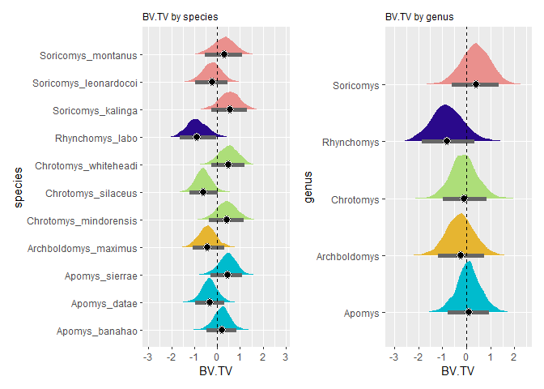<!-- -->


```r
# Tb.Th, species
chr.2 <-
  brm(data = d, 
      family = student,
      tbth_s ~ 0 + taxon + mass_s + (1|gr(phylo, cov = ch)),
      control = list(adapt_delta = 0.95), #inserted to decrease the number of divergent transitions here
      prior = c(
        prior(gamma(2, 0.1), class = nu),
        prior(normal(0, 1), class = b),
        prior(normal(0, 1), class = sd),
        prior(exponential(1), class = sigma)
        ),
      data2 = list(ch = ch),
      iter = 2000, warmup = 1000, chains = 4, cores = 4,
      file = "G:\\My Drive\\Philippine rodents\\chrotomyini\\fits\\chr.2")
print(chr.2)
```

```
## Warning: There were 3 divergent transitions after warmup. Increasing adapt_delta
## above 0.95 may help. See http://mc-stan.org/misc/warnings.html#divergent-
## transitions-after-warmup
```

```
##  Family: student 
##   Links: mu = identity; sigma = identity; nu = identity 
## Formula: tbth_s ~ 0 + taxon + mass_s + (1 | gr(phylo, cov = ch)) 
##    Data: d (Number of observations: 67) 
##   Draws: 4 chains, each with iter = 2000; warmup = 1000; thin = 1;
##          total post-warmup draws = 4000
## 
## Group-Level Effects: 
## ~phylo (Number of levels: 11) 
##               Estimate Est.Error l-95% CI u-95% CI Rhat Bulk_ESS Tail_ESS
## sd(Intercept)     0.28      0.24     0.01     0.88 1.01      893     1514
## 
## Population-Level Effects: 
##                            Estimate Est.Error l-95% CI u-95% CI Rhat Bulk_ESS
## taxonApomys_banahao            0.00      0.32    -0.67     0.71 1.00     2116
## taxonApomys_datae             -0.07      0.32    -0.73     0.64 1.00     2330
## taxonApomys_sierrae           -0.11      0.31    -0.73     0.59 1.00     2786
## taxonArchboldomys_maximus     -0.29      0.35    -1.01     0.47 1.00     2537
## taxonChrotomys_mindorensis     0.58      0.34    -0.14     1.22 1.00     2013
## taxonChrotomys_silaceus       -0.27      0.30    -0.91     0.39 1.00     2428
## taxonChrotomys_whiteheadi      0.28      0.32    -0.38     0.90 1.00     2055
## taxonRhynchomys_labo          -0.23      0.36    -0.94     0.50 1.00     2545
## taxonSoricomys_kalinga         0.12      0.35    -0.58     0.82 1.00     1936
## taxonSoricomys_leonardocoi    -0.10      0.33    -0.77     0.59 1.00     1659
## taxonSoricomys_montanus       -0.03      0.35    -0.72     0.67 1.00     1848
## mass_s                         0.86      0.16     0.55     1.17 1.00     2344
##                            Tail_ESS
## taxonApomys_banahao            1639
## taxonApomys_datae              1562
## taxonApomys_sierrae            1882
## taxonArchboldomys_maximus      1851
## taxonChrotomys_mindorensis     2138
## taxonChrotomys_silaceus        2390
## taxonChrotomys_whiteheadi      2035
## taxonRhynchomys_labo           2011
## taxonSoricomys_kalinga         1962
## taxonSoricomys_leonardocoi     1910
## taxonSoricomys_montanus        1685
## mass_s                         2588
## 
## Family Specific Parameters: 
##       Estimate Est.Error l-95% CI u-95% CI Rhat Bulk_ESS Tail_ESS
## sigma     0.27      0.03     0.21     0.33 1.00     3919     2750
## nu       22.34     14.20     5.05    57.86 1.00     4388     2586
## 
## Draws were sampled using sampling(NUTS). For each parameter, Bulk_ESS
## and Tail_ESS are effective sample size measures, and Rhat is the potential
## scale reduction factor on split chains (at convergence, Rhat = 1).
```

```r
# Tb.Th, genus
chr.2.1 <-
  brm(data = d, 
      family = student,
      tbth_s ~ 0 + genus + mass_s + (1|gr(phylo, cov = ch)),
      control = list(adapt_delta = 0.95), #inserted to decrease the number of divergent transitions here
      prior = c(
        prior(gamma(2, 0.1), class = nu),
        prior(normal(0, 1), class = b),
        prior(normal(0, 1), class = sd),
        prior(exponential(1), class = sigma)
        ),
      data2 = list(ch = ch),
      iter = 2000, warmup = 1000, chains = 4, cores = 4,
      file = "G:\\My Drive\\Philippine rodents\\chrotomyini\\fits\\chr.2.1")
print(chr.2.1)
```

```
##  Family: student 
##   Links: mu = identity; sigma = identity; nu = identity 
## Formula: tbth_s ~ 0 + genus + mass_s + (1 | gr(phylo, cov = ch)) 
##    Data: d (Number of observations: 67) 
##   Draws: 4 chains, each with iter = 2000; warmup = 1000; thin = 1;
##          total post-warmup draws = 4000
## 
## Group-Level Effects: 
## ~phylo (Number of levels: 11) 
##               Estimate Est.Error l-95% CI u-95% CI Rhat Bulk_ESS Tail_ESS
## sd(Intercept)     0.47      0.18     0.20     0.88 1.00     1419     1911
## 
## Population-Level Effects: 
##                   Estimate Est.Error l-95% CI u-95% CI Rhat Bulk_ESS Tail_ESS
## genusApomys          -0.07      0.37    -0.79     0.71 1.00     2098     2385
## genusArchboldomys    -0.19      0.45    -1.12     0.71 1.00     2780     2517
## genusChrotomys        0.05      0.41    -0.73     0.88 1.00     2514     2189
## genusRhynchomys      -0.31      0.47    -1.23     0.69 1.00     2457     2468
## genusSoricomys        0.11      0.43    -0.80     0.94 1.00     1905     1910
## mass_s                0.95      0.16     0.62     1.27 1.00     3207     2992
## 
## Family Specific Parameters: 
##       Estimate Est.Error l-95% CI u-95% CI Rhat Bulk_ESS Tail_ESS
## sigma     0.27      0.03     0.22     0.33 1.00     3432     2719
## nu       23.17     13.56     5.72    57.82 1.00     4764     2691
## 
## Draws were sampled using sampling(NUTS). For each parameter, Bulk_ESS
## and Tail_ESS are effective sample size measures, and Rhat is the potential
## scale reduction factor on split chains (at convergence, Rhat = 1).
```

```r
chr.2.plot <- chr.2 %>%
  gather_draws(b_taxonApomys_banahao, b_taxonApomys_datae, b_taxonApomys_sierrae, b_taxonArchboldomys_maximus, b_taxonChrotomys_mindorensis, b_taxonChrotomys_silaceus, b_taxonChrotomys_whiteheadi, b_taxonRhynchomys_labo, b_taxonSoricomys_kalinga, b_taxonSoricomys_leonardocoi, b_taxonSoricomys_montanus) %>%
  mutate(.variable = str_replace_all(.variable, "b_taxon", "")) %>%
  ggplot(aes(y = .variable, x = .value)) +
  stat_halfeye(aes(fill = .variable), 
               point_fill = "#000000", 
               shape = 21, 
               point_size = 3, 
               point_color = "#FFFFFF",
               interval_size = 10,
               interval_color = "grey40",
               .width = .89) +
  scale_fill_manual(values = cols2)+
  geom_vline(xintercept = 0, linetype = "dashed")+
  theme(legend.position = "none", 
        plot.title = element_text(size = 9))+
  labs(x = "Tb.Th", y = "species")+
  ggtitle(label = "Tb.Th by species")

chr.2.1.plot <- chr.2.1 %>%
  gather_draws(b_genusApomys,b_genusArchboldomys, b_genusChrotomys, b_genusRhynchomys, b_genusSoricomys) %>%
  mutate(.variable = str_replace_all(.variable, "b_genus", "")) %>%
  ggplot(aes(y = .variable, x = .value)) +
  stat_halfeye(aes(fill = .variable), 
               point_fill = "#000000", 
               shape = 21, 
               point_size = 3, 
               point_color = "#FFFFFF",
               interval_size = 10,
               interval_color = "grey40",
               .width = .89) +
  scale_fill_manual(values = cols)+
  geom_vline(xintercept = 0, linetype = "dashed")+
  theme(legend.position = "none", 
        plot.title = element_text(size = 9))+
  labs(x = "Tb.Th", y = "genus")+
  ggtitle(label = "Tb.Th by genus")

chr.2.plot|chr.2.1.plot
```

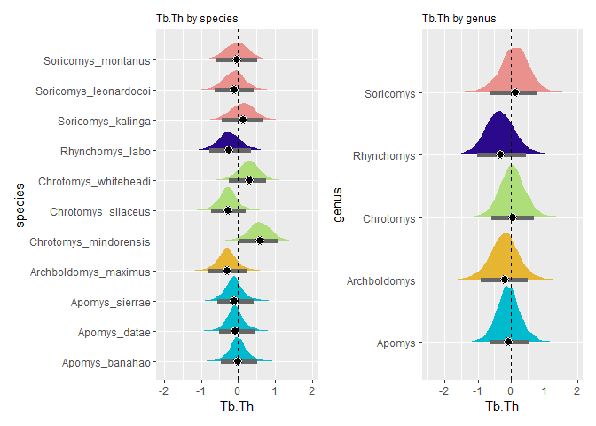<!-- -->


```r
# Tb.Sp, species
chr.3 <-
  brm(data = d, 
      family = student,
      tbsp_s ~ 0 + taxon + mass_s + (1|gr(phylo, cov = ch)),
      control = list(adapt_delta = 0.95), #inserted to decrease the number of divergent transitions here
      prior = c(
        prior(gamma(2, 0.1), class = nu),
        prior(normal(0, 1), class = b),
        prior(normal(0, 1), class = sd),
        prior(exponential(1), class = sigma)
        ),
      data2 = list(ch = ch),
      iter = 2000, warmup = 1000, chains = 4, cores = 4,
      file = "G:\\My Drive\\Philippine rodents\\chrotomyini\\fits\\chr.3")
print(chr.3)
```

```
##  Family: student 
##   Links: mu = identity; sigma = identity; nu = identity 
## Formula: tbsp_s ~ 0 + taxon + mass_s + (1 | gr(phylo, cov = ch)) 
##    Data: d (Number of observations: 67) 
##   Draws: 4 chains, each with iter = 2000; warmup = 1000; thin = 1;
##          total post-warmup draws = 4000
## 
## Group-Level Effects: 
## ~phylo (Number of levels: 11) 
##               Estimate Est.Error l-95% CI u-95% CI Rhat Bulk_ESS Tail_ESS
## sd(Intercept)     0.32      0.26     0.02     0.98 1.00     1021     1905
## 
## Population-Level Effects: 
##                            Estimate Est.Error l-95% CI u-95% CI Rhat Bulk_ESS
## taxonApomys_banahao           -0.44      0.44    -1.26     0.48 1.00     3067
## taxonApomys_datae              0.43      0.44    -0.42     1.29 1.00     3901
## taxonApomys_sierrae           -0.46      0.46    -1.33     0.53 1.00     3465
## taxonArchboldomys_maximus     -0.13      0.49    -1.08     0.89 1.00     3180
## taxonChrotomys_mindorensis     0.03      0.52    -0.95     1.04 1.00     2129
## taxonChrotomys_silaceus        0.26      0.43    -0.59     1.12 1.00     2978
## taxonChrotomys_whiteheadi     -0.30      0.48    -1.23     0.65 1.00     2256
## taxonRhynchomys_labo           0.40      0.54    -0.68     1.46 1.00     2619
## taxonSoricomys_kalinga        -0.39      0.53    -1.39     0.68 1.00     2223
## taxonSoricomys_leonardocoi     0.48      0.52    -0.57     1.50 1.00     2557
## taxonSoricomys_montanus       -0.22      0.55    -1.32     0.86 1.00     2165
## mass_s                         0.35      0.28    -0.20     0.91 1.00     1689
##                            Tail_ESS
## taxonApomys_banahao            2758
## taxonApomys_datae              2831
## taxonApomys_sierrae            2327
## taxonArchboldomys_maximus      2434
## taxonChrotomys_mindorensis     2747
## taxonChrotomys_silaceus        2341
## taxonChrotomys_whiteheadi      2569
## taxonRhynchomys_labo           2631
## taxonSoricomys_kalinga         2648
## taxonSoricomys_leonardocoi     2850
## taxonSoricomys_montanus        2615
## mass_s                         1924
## 
## Family Specific Parameters: 
##       Estimate Est.Error l-95% CI u-95% CI Rhat Bulk_ESS Tail_ESS
## sigma     0.80      0.11     0.57     1.02 1.00     2259     1988
## nu       16.42     12.62     2.76    50.58 1.00     2326     2149
## 
## Draws were sampled using sampling(NUTS). For each parameter, Bulk_ESS
## and Tail_ESS are effective sample size measures, and Rhat is the potential
## scale reduction factor on split chains (at convergence, Rhat = 1).
```

```r
# Tb.Sp, genus
chr.3.1 <-
  brm(data = d, 
      family = student,
      tbsp_s ~ 0 + genus + mass_s + (1|gr(phylo, cov = ch)),
      control = list(adapt_delta = 0.95), #inserted to decrease the number of divergent transitions here
      prior = c(
        prior(gamma(2, 0.1), class = nu),
        prior(normal(0, 1), class = b),
        prior(normal(0, 1), class = sd),
        prior(exponential(1), class = sigma)
        ),
      data2 = list(ch = ch),
      iter = 2000, warmup = 1000, chains = 4, cores = 4,
      file = "G:\\My Drive\\Philippine rodents\\chrotomyini\\fits\\chr.3.1")
print(chr.3.1)
```

```
##  Family: student 
##   Links: mu = identity; sigma = identity; nu = identity 
## Formula: tbsp_s ~ 0 + genus + mass_s + (1 | gr(phylo, cov = ch)) 
##    Data: d (Number of observations: 67) 
##   Draws: 4 chains, each with iter = 2000; warmup = 1000; thin = 1;
##          total post-warmup draws = 4000
## 
## Group-Level Effects: 
## ~phylo (Number of levels: 11) 
##               Estimate Est.Error l-95% CI u-95% CI Rhat Bulk_ESS Tail_ESS
## sd(Intercept)     0.50      0.30     0.03     1.15 1.00     1127     1289
## 
## Population-Level Effects: 
##                   Estimate Est.Error l-95% CI u-95% CI Rhat Bulk_ESS Tail_ESS
## genusApomys          -0.22      0.45    -1.12     0.74 1.00     2602     2303
## genusArchboldomys    -0.16      0.55    -1.26     0.93 1.00     3093     2821
## genusChrotomys        0.09      0.52    -0.97     1.10 1.00     2375     2240
## genusRhynchomys       0.43      0.61    -0.83     1.59 1.00     2815     2777
## genusSoricomys       -0.15      0.60    -1.32     1.05 1.00     2866     2600
## mass_s                0.28      0.33    -0.35     0.91 1.00     2461     2464
## 
## Family Specific Parameters: 
##       Estimate Est.Error l-95% CI u-95% CI Rhat Bulk_ESS Tail_ESS
## sigma     0.81      0.11     0.57     1.02 1.00     2513     2032
## nu       16.29     12.69     2.78    50.20 1.00     3220     2296
## 
## Draws were sampled using sampling(NUTS). For each parameter, Bulk_ESS
## and Tail_ESS are effective sample size measures, and Rhat is the potential
## scale reduction factor on split chains (at convergence, Rhat = 1).
```

```r
chr.3.plot <- chr.3 %>%
  gather_draws(b_taxonApomys_banahao, b_taxonApomys_datae, b_taxonApomys_sierrae, b_taxonArchboldomys_maximus, b_taxonChrotomys_mindorensis, b_taxonChrotomys_silaceus, b_taxonChrotomys_whiteheadi, b_taxonRhynchomys_labo, b_taxonSoricomys_kalinga, b_taxonSoricomys_leonardocoi, b_taxonSoricomys_montanus) %>%
  mutate(.variable = str_replace_all(.variable, "b_taxon", "")) %>%
  ggplot(aes(y = .variable, x = .value)) +
  stat_halfeye(aes(fill = .variable), 
               point_fill = "#000000", 
               shape = 21, 
               point_size = 3, 
               point_color = "#FFFFFF",
               interval_size = 10,
               interval_color = "grey40",
               .width = .89) +
  scale_fill_manual(values = cols2)+
  geom_vline(xintercept = 0, linetype = "dashed")+
  theme(legend.position = "none", 
        plot.title = element_text(size = 9))+
  labs(x = "Tb.Sp", y = "species")+
  ggtitle(label = "Tb.Sp by species")

chr.3.1.plot <- chr.3.1 %>%
  gather_draws(b_genusApomys,b_genusArchboldomys, b_genusChrotomys, b_genusRhynchomys, b_genusSoricomys) %>%
  mutate(.variable = str_replace_all(.variable, "b_genus", "")) %>%
  ggplot(aes(y = .variable, x = .value)) +
  stat_halfeye(aes(fill = .variable), 
               point_fill = "#000000", 
               shape = 21, 
               point_size = 3, 
               point_color = "#FFFFFF",
               interval_size = 10,
               interval_color = "grey40",
               .width = .89) +
  scale_fill_manual(values = cols)+
  geom_vline(xintercept = 0, linetype = "dashed")+
  theme(legend.position = "none", 
        plot.title = element_text(size = 9))+
  labs(x = "Tb.Sp", y = "genus")+
  ggtitle(label = "Tb.Sp by genus")

chr.3.plot|chr.3.1.plot
```

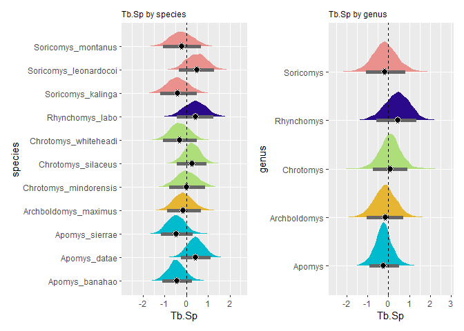<!-- -->


```r
# conn.D, species
chr.4 <-
  brm(data = d, 
      family = student,
      cond_s ~ 0 + taxon + mass_s + (1|gr(phylo, cov = ch)),
      control = list(adapt_delta = 0.95), #inserted to decrease the number of divergent transitions here
      prior = c(
        prior(gamma(2, 0.1), class = nu),
        prior(normal(0, 1), class = b),
        prior(normal(0, 1), class = sd),
        prior(exponential(1), class = sigma)
        ),
      data2 = list(ch = ch),
      iter = 2000, warmup = 1000, chains = 4, cores = 4,
      file = "G:\\My Drive\\Philippine rodents\\chrotomyini\\fits\\chr.4")
print(chr.4)
```

```
##  Family: student 
##   Links: mu = identity; sigma = identity; nu = identity 
## Formula: cond_s ~ 0 + taxon + mass_s + (1 | gr(phylo, cov = ch)) 
##    Data: d (Number of observations: 67) 
##   Draws: 4 chains, each with iter = 2000; warmup = 1000; thin = 1;
##          total post-warmup draws = 4000
## 
## Group-Level Effects: 
## ~phylo (Number of levels: 11) 
##               Estimate Est.Error l-95% CI u-95% CI Rhat Bulk_ESS Tail_ESS
## sd(Intercept)     0.30      0.25     0.01     0.95 1.00      838     1578
## 
## Population-Level Effects: 
##                            Estimate Est.Error l-95% CI u-95% CI Rhat Bulk_ESS
## taxonApomys_banahao            0.14      0.37    -0.57     0.92 1.00     2826
## taxonApomys_datae             -0.57      0.37    -1.25     0.25 1.00     2824
## taxonApomys_sierrae           -0.13      0.41    -0.89     0.74 1.00     3128
## taxonArchboldomys_maximus     -0.29      0.43    -1.13     0.63 1.00     3187
## taxonChrotomys_mindorensis    -0.12      0.44    -0.98     0.76 1.00     1708
## taxonChrotomys_silaceus        0.24      0.39    -0.54     1.02 1.00     2570
## taxonChrotomys_whiteheadi     -0.08      0.42    -0.88     0.74 1.00     2021
## taxonRhynchomys_labo           0.22      0.46    -0.70     1.15 1.00     2201
## taxonSoricomys_kalinga        -0.01      0.48    -0.97     0.94 1.00     2291
## taxonSoricomys_leonardocoi     0.07      0.44    -0.86     0.93 1.00     2645
## taxonSoricomys_montanus        0.10      0.52    -0.94     1.09 1.00     2293
## mass_s                        -0.72      0.25    -1.21    -0.22 1.00     1567
##                            Tail_ESS
## taxonApomys_banahao            2115
## taxonApomys_datae              2111
## taxonApomys_sierrae            2084
## taxonArchboldomys_maximus      1998
## taxonChrotomys_mindorensis     2198
## taxonChrotomys_silaceus        2196
## taxonChrotomys_whiteheadi      2390
## taxonRhynchomys_labo           2538
## taxonSoricomys_kalinga         2282
## taxonSoricomys_leonardocoi     2669
## taxonSoricomys_montanus        2769
## mass_s                         1793
## 
## Family Specific Parameters: 
##       Estimate Est.Error l-95% CI u-95% CI Rhat Bulk_ESS Tail_ESS
## sigma     0.52      0.11     0.32     0.76 1.00     2414     2687
## nu        6.31      6.50     1.57    26.15 1.00     2663     2727
## 
## Draws were sampled using sampling(NUTS). For each parameter, Bulk_ESS
## and Tail_ESS are effective sample size measures, and Rhat is the potential
## scale reduction factor on split chains (at convergence, Rhat = 1).
```

```r
# conn.D, genus
chr.4.1 <-
  brm(data = d, 
      family = student,
      cond_s ~ 0 + genus + mass_s + (1|gr(phylo, cov = ch)),
      control = list(adapt_delta = 0.95), #inserted to decrease the number of divergent transitions here
      prior = c(
        prior(gamma(2, 0.1), class = nu),
        prior(normal(0, 1), class = b),
        prior(normal(0, 1), class = sd),
        prior(exponential(1), class = sigma)
        ),
      data2 = list(ch = ch),
      iter = 2000, warmup = 1000, chains = 4, cores = 4,
      file = "G:\\My Drive\\Philippine rodents\\chrotomyini\\fits\\chr.4.1")
print(chr.4.1)
```

```
##  Family: student 
##   Links: mu = identity; sigma = identity; nu = identity 
## Formula: cond_s ~ 0 + genus + mass_s + (1 | gr(phylo, cov = ch)) 
##    Data: d (Number of observations: 67) 
##   Draws: 4 chains, each with iter = 2000; warmup = 1000; thin = 1;
##          total post-warmup draws = 4000
## 
## Group-Level Effects: 
## ~phylo (Number of levels: 11) 
##               Estimate Est.Error l-95% CI u-95% CI Rhat Bulk_ESS Tail_ESS
## sd(Intercept)     0.34      0.22     0.02     0.83 1.00     1163     1627
## 
## Population-Level Effects: 
##                   Estimate Est.Error l-95% CI u-95% CI Rhat Bulk_ESS Tail_ESS
## genusApomys          -0.21      0.34    -0.88     0.54 1.00     2523     1971
## genusArchboldomys    -0.28      0.45    -1.15     0.66 1.00     2687     2339
## genusChrotomys        0.01      0.40    -0.79     0.79 1.00     2330     2090
## genusRhynchomys       0.22      0.47    -0.74     1.14 1.00     2768     2622
## genusSoricomys        0.07      0.48    -0.85     1.04 1.00     2676     2286
## mass_s               -0.72      0.26    -1.22    -0.21 1.00     2759     2755
## 
## Family Specific Parameters: 
##       Estimate Est.Error l-95% CI u-95% CI Rhat Bulk_ESS Tail_ESS
## sigma     0.52      0.11     0.33     0.74 1.00     2353     2389
## nu        6.31      6.32     1.60    24.28 1.00     2871     2964
## 
## Draws were sampled using sampling(NUTS). For each parameter, Bulk_ESS
## and Tail_ESS are effective sample size measures, and Rhat is the potential
## scale reduction factor on split chains (at convergence, Rhat = 1).
```

```r
chr.4.plot <- chr.4 %>%
  gather_draws(b_taxonApomys_banahao, b_taxonApomys_datae, b_taxonApomys_sierrae, b_taxonArchboldomys_maximus, b_taxonChrotomys_mindorensis, b_taxonChrotomys_silaceus, b_taxonChrotomys_whiteheadi, b_taxonRhynchomys_labo, b_taxonSoricomys_kalinga, b_taxonSoricomys_leonardocoi, b_taxonSoricomys_montanus) %>%
  mutate(.variable = str_replace_all(.variable, "b_taxon", "")) %>%
  ggplot(aes(y = .variable, x = .value)) +
  stat_halfeye(aes(fill = .variable), 
               point_fill = "#000000", 
               shape = 21, 
               point_size = 3, 
               point_color = "#FFFFFF",
               interval_size = 10,
               interval_color = "grey40",
               .width = .89) +
  scale_fill_manual(values = cols2)+
  geom_vline(xintercept = 0, linetype = "dashed")+
  theme(legend.position = "none", 
        plot.title = element_text(size = 9))+
  labs(x = "Conn.D", y = "species")+
  ggtitle(label = "Conn.D by species")

chr.4.1.plot <- chr.4.1 %>%
  gather_draws(b_genusApomys,b_genusArchboldomys, b_genusChrotomys, b_genusRhynchomys, b_genusSoricomys) %>%
  mutate(.variable = str_replace_all(.variable, "b_genus", "")) %>%
  ggplot(aes(y = .variable, x = .value)) +
  stat_halfeye(aes(fill = .variable), 
               point_fill = "#000000", 
               shape = 21, 
               point_size = 3, 
               point_color = "#FFFFFF",
               interval_size = 10,
               interval_color = "grey40",
               .width = .95) +
  scale_fill_manual(values = cols)+
  geom_vline(xintercept = 0, linetype = "dashed")+
  theme(legend.position = "none", 
        plot.title = element_text(size = 9))+
  labs(x = "Conn.D", y = "genus")+
  ggtitle(label = "Conn.D by genus")

chr.4.plot|chr.4.1.plot
```

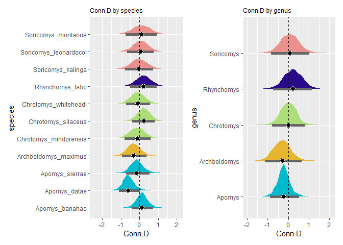<!-- -->

II. Comparison of TB metrics between taxa (substrate use proxy).


```r
#### BV.TV ####
bvtv.comp.s <-chr.1 %>%
  gather_draws(b_taxonApomys_banahao, b_taxonApomys_datae, b_taxonApomys_sierrae, b_taxonArchboldomys_maximus, b_taxonChrotomys_mindorensis, b_taxonChrotomys_silaceus, b_taxonChrotomys_whiteheadi, b_taxonRhynchomys_labo, b_taxonSoricomys_kalinga, b_taxonSoricomys_leonardocoi, b_taxonSoricomys_montanus) %>%
  compare_levels(.value, by = .variable) %>%
  mutate(.variable = str_replace_all(.variable, "b_taxon", "")) %>%
  ungroup() %>%
  mutate(loco = reorder(.variable, .value)) %>%
  ggplot(aes(y = .variable, x = .value)) +
  stat_halfeye() +
  geom_vline(xintercept = 0, linetype = "dashed") +
  ggtitle(label = "Between-species BV.TV difference distributions")+
  labs(x = "difference", y = "comparison")

bvtv.comp.g <-chr.1.1 %>%
  gather_draws(b_genusApomys,b_genusArchboldomys, b_genusChrotomys, b_genusRhynchomys, b_genusSoricomys) %>%
  compare_levels(.value, by = .variable) %>%
  mutate(.variable = str_replace_all(.variable, "b_genus", "")) %>%
  ungroup() %>%
  mutate(loco = reorder(.variable, .value)) %>%
  ggplot(aes(y = .variable, x = .value)) +
  stat_halfeye() +
  geom_vline(xintercept = 0, linetype = "dashed") +
  ggtitle(label = "Between-genus BV.TV difference distributions")+
  labs(x = "difference", y = "comparison")
bvtv.comp.g
```

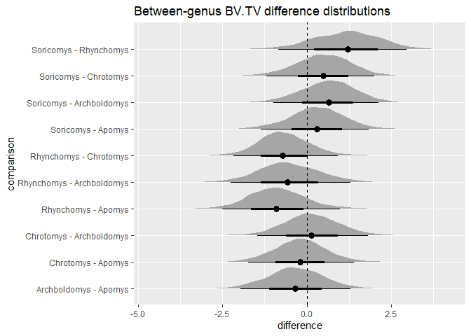<!-- -->

```r
bvtv.comp.s
```

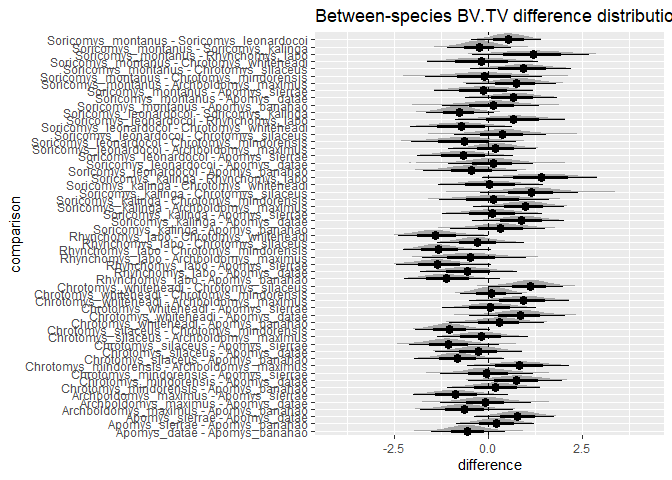<!-- -->


```r
#### Tb.Th ####
tbth.comp.s <-chr.2 %>%
  gather_draws(b_taxonApomys_banahao, b_taxonApomys_datae, b_taxonApomys_sierrae, b_taxonArchboldomys_maximus, b_taxonChrotomys_mindorensis, b_taxonChrotomys_silaceus, b_taxonChrotomys_whiteheadi, b_taxonRhynchomys_labo, b_taxonSoricomys_kalinga, b_taxonSoricomys_leonardocoi, b_taxonSoricomys_montanus) %>%
  compare_levels(.value, by = .variable) %>%
  mutate(.variable = str_replace_all(.variable, "b_taxon", "")) %>%
  ungroup() %>%
  mutate(loco = reorder(.variable, .value)) %>%
  ggplot(aes(y = .variable, x = .value)) +
  stat_halfeye() +
  geom_vline(xintercept = 0, linetype = "dashed") +
  ggtitle(label = "Between-species Tb.Th difference distributions")+
  labs(x = "difference", y = "comparison")

tbth.comp.g <-chr.2.1 %>%
  gather_draws(b_genusApomys,b_genusArchboldomys, b_genusChrotomys, b_genusRhynchomys, b_genusSoricomys) %>%
  compare_levels(.value, by = .variable) %>%
  mutate(.variable = str_replace_all(.variable, "b_genus", "")) %>%
  ungroup() %>%
  mutate(loco = reorder(.variable, .value)) %>%
  ggplot(aes(y = .variable, x = .value)) +
  stat_halfeye() +
  geom_vline(xintercept = 0, linetype = "dashed") +
  ggtitle(label = "Between-genus Tb.Th difference distributions")+
  labs(x = "difference", y = "comparison")
tbth.comp.g
```

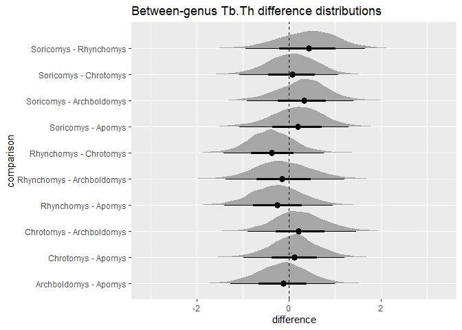<!-- -->

```r
tbth.comp.s
```

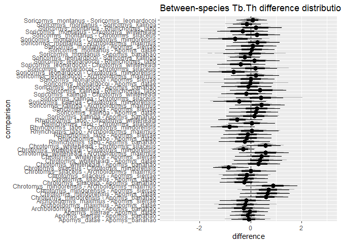<!-- -->


```r
#### Tb.Sp ####
tbsp.comp.s <-chr.3 %>%
  gather_draws(b_taxonApomys_banahao, b_taxonApomys_datae, b_taxonApomys_sierrae, b_taxonArchboldomys_maximus, b_taxonChrotomys_mindorensis, b_taxonChrotomys_silaceus, b_taxonChrotomys_whiteheadi, b_taxonRhynchomys_labo, b_taxonSoricomys_kalinga, b_taxonSoricomys_leonardocoi, b_taxonSoricomys_montanus) %>%
  compare_levels(.value, by = .variable) %>%
  mutate(.variable = str_replace_all(.variable, "b_taxon", "")) %>%
  ungroup() %>%
  mutate(loco = reorder(.variable, .value)) %>%
  ggplot(aes(y = .variable, x = .value)) +
  stat_halfeye() +
  geom_vline(xintercept = 0, linetype = "dashed") +
  ggtitle(label = "Between-species Tb.Sp difference distributions")+
  labs(x = "difference", y = "comparison")

tbsp.comp.g <-chr.3.1 %>%
  gather_draws(b_genusApomys,b_genusArchboldomys, b_genusChrotomys, b_genusRhynchomys, b_genusSoricomys) %>%
  compare_levels(.value, by = .variable) %>%
  mutate(.variable = str_replace_all(.variable, "b_genus", "")) %>%
  ungroup() %>%
  mutate(loco = reorder(.variable, .value)) %>%
  ggplot(aes(y = .variable, x = .value)) +
  stat_halfeye() +
  geom_vline(xintercept = 0, linetype = "dashed") +
  ggtitle(label = "Between-genus Tb.Sp difference distributions")+
  labs(x = "difference", y = "comparison")
tbsp.comp.g
```

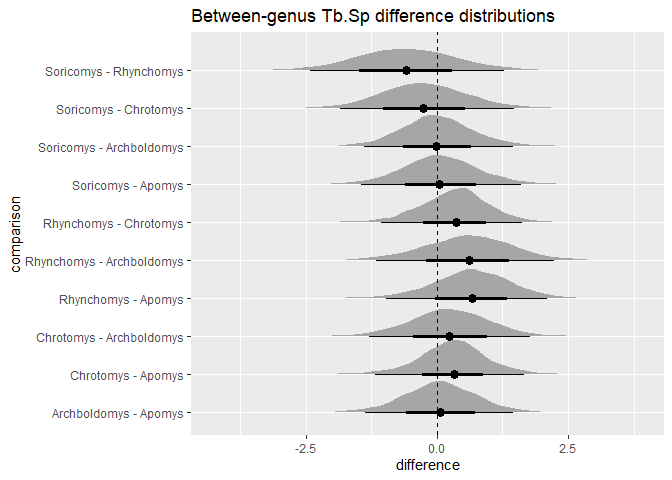<!-- -->

```r
tbsp.comp.s
```

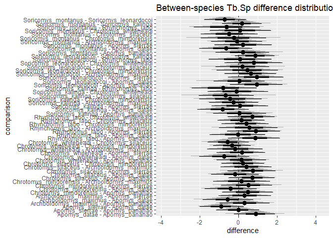<!-- -->


```r
#### Conn.D ####
cond.comp.s <-chr.4 %>%
  gather_draws(b_taxonApomys_banahao, b_taxonApomys_datae, b_taxonApomys_sierrae, b_taxonArchboldomys_maximus, b_taxonChrotomys_mindorensis, b_taxonChrotomys_silaceus, b_taxonChrotomys_whiteheadi, b_taxonRhynchomys_labo, b_taxonSoricomys_kalinga, b_taxonSoricomys_leonardocoi, b_taxonSoricomys_montanus) %>%
  compare_levels(.value, by = .variable) %>%
  mutate(.variable = str_replace_all(.variable, "b_taxon", "")) %>%
  ungroup() %>%
  mutate(loco = reorder(.variable, .value)) %>%
  ggplot(aes(y = .variable, x = .value)) +
  stat_halfeye() +
  geom_vline(xintercept = 0, linetype = "dashed") +
  ggtitle(label = "Between-species Conn.D difference distributions")+
  labs(x = "difference", y = "comparison")

cond.comp.g <-chr.4.1 %>%
  gather_draws(b_genusApomys,b_genusArchboldomys, b_genusChrotomys, b_genusRhynchomys, b_genusSoricomys) %>%
  compare_levels(.value, by = .variable) %>%
  mutate(.variable = str_replace_all(.variable, "b_genus", "")) %>%
  ungroup() %>%
  mutate(loco = reorder(.variable, .value)) %>%
  ggplot(aes(y = .variable, x = .value)) +
  stat_halfeye() +
  geom_vline(xintercept = 0, linetype = "dashed") +
  ggtitle(label = "Between-genus Conn.D difference distributions")+
  labs(x = "difference", y = "comparison")
cond.comp.g
```

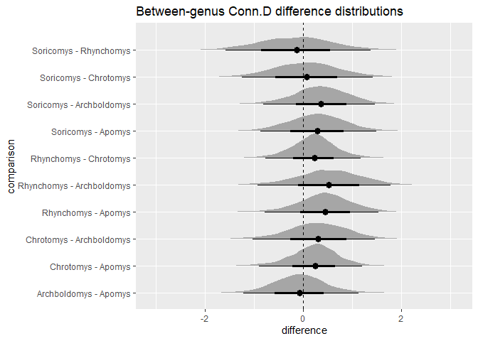<!-- -->

```r
cond.comp.s
```

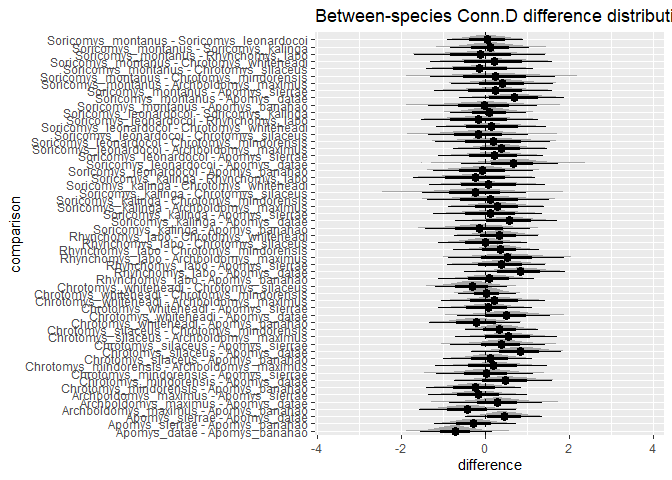<!-- -->

III. Allometry with brms, smatr, and pgls.


```r
#### BV.TV ####
# brms
chr.5 <-
  brm(data = dlog, 
      family = student,
      bvtvlog ~ 1 + masslog + (1|gr(phylo, cov = ch)),
      prior = c(
        prior(gamma(2, 0.1), class = nu),
        prior(normal(0, 1), class = b),
        prior(normal(0, 1), class = sd),
        prior(exponential(1), class = sigma)
        ),
      data2 = list(ch = ch),
      iter = 2000, warmup = 1000, chains = 4, cores = 4,
      file = "G:\\My Drive\\Philippine rodents\\chrotomyini\\fits\\chr.5")
print(chr.5)
```

```
##  Family: student 
##   Links: mu = identity; sigma = identity; nu = identity 
## Formula: bvtvlog ~ 1 + masslog + (1 | gr(phylo, cov = ch)) 
##    Data: dlog (Number of observations: 67) 
##   Draws: 4 chains, each with iter = 2000; warmup = 1000; thin = 1;
##          total post-warmup draws = 4000
## 
## Group-Level Effects: 
## ~phylo (Number of levels: 11) 
##               Estimate Est.Error l-95% CI u-95% CI Rhat Bulk_ESS Tail_ESS
## sd(Intercept)     0.09      0.03     0.04     0.15 1.00     1110     1802
## 
## Population-Level Effects: 
##           Estimate Est.Error l-95% CI u-95% CI Rhat Bulk_ESS Tail_ESS
## Intercept    -1.02      0.15    -1.33    -0.73 1.00     1562     2142
## masslog       0.22      0.08     0.07     0.39 1.00     1782     2212
## 
## Family Specific Parameters: 
##       Estimate Est.Error l-95% CI u-95% CI Rhat Bulk_ESS Tail_ESS
## sigma     0.06      0.01     0.04     0.08 1.00     1568     2178
## nu        9.82      9.95     1.94    37.51 1.00     1934     2418
## 
## Draws were sampled using sampling(NUTS). For each parameter, Bulk_ESS
## and Tail_ESS are effective sample size measures, and Rhat is the potential
## scale reduction factor on split chains (at convergence, Rhat = 1).
```

```r
# smatr
bvtv.sma <- sma(bvtv~mass_g, data = dmean, slope.test = 0, log = "xy", robust = T)
summary(bvtv.sma)
```

```
## Call: sma(formula = bvtv ~ mass_g, data = dmean, log = "xy", slope.test = 0, 
##     robust = T) 
## 
## Fit using Standardized Major Axis 
## 
## These variables were log-transformed before fitting: xy 
## 
## Confidence intervals (CI) are at 95%
## 
## ------------------------------------------------------------
## Coefficients:
##              elevation     slope
## estimate    -1.0859498 0.2636912
## lower limit -1.3118960 0.1701654
## upper limit -0.8600036 0.4086203
## 
## H0 : variables uncorrelated
## R-squared : 0.5280571 
## P-value : 0.011305 
## 
## ------------------------------------------------------------
## H0 : slope not different from 0 
## Test statistic : r= 1 with 9 degrees of freedom under H0
## P-value : < 2.22e-16
```

```r
# PGLS
bvtv.pgls <-  gls(log10(bvtv) ~ log10(mass_g), correlation = corBrownian(phy = ch.tre, form = ~taxon), data = d, method = "ML")
coef(bvtv.pgls)
```

```
##   (Intercept) log10(mass_g) 
##    -0.9625998     0.2121541
```

```r
#### Tb.Th ####
# brms
chr.6 <-
  brm(data = dlog, 
      family = student,
      tbthlog ~ 1 + masslog + (1|gr(phylo, cov = ch)),
      prior = c(
        prior(gamma(2, 0.1), class = nu),
        prior(normal(0, 1), class = b),
        prior(normal(0, 1), class = sd),
        prior(exponential(1), class = sigma)
        ),
      data2 = list(ch = ch),
      iter = 2000, warmup = 1000, chains = 4, cores = 4,
      file = "G:\\My Drive\\Philippine rodents\\chrotomyini\\fits\\chr.6")
print(chr.6)
```

```
##  Family: student 
##   Links: mu = identity; sigma = identity; nu = identity 
## Formula: tbthlog ~ 1 + masslog + (1 | gr(phylo, cov = ch)) 
##    Data: dlog (Number of observations: 67) 
##   Draws: 4 chains, each with iter = 2000; warmup = 1000; thin = 1;
##          total post-warmup draws = 4000
## 
## Group-Level Effects: 
## ~phylo (Number of levels: 11) 
##               Estimate Est.Error l-95% CI u-95% CI Rhat Bulk_ESS Tail_ESS
## sd(Intercept)     0.03      0.01     0.01     0.06 1.01      919     1429
## 
## Population-Level Effects: 
##           Estimate Est.Error l-95% CI u-95% CI Rhat Bulk_ESS Tail_ESS
## Intercept    -2.60      0.06    -2.71    -2.48 1.00     1603     1962
## masslog       0.30      0.03     0.24     0.36 1.00     1639     2050
## 
## Family Specific Parameters: 
##       Estimate Est.Error l-95% CI u-95% CI Rhat Bulk_ESS Tail_ESS
## sigma     0.03      0.00     0.02     0.03 1.00     2075     2529
## nu       22.32     14.11     5.13    58.82 1.00     3355     2591
## 
## Draws were sampled using sampling(NUTS). For each parameter, Bulk_ESS
## and Tail_ESS are effective sample size measures, and Rhat is the potential
## scale reduction factor on split chains (at convergence, Rhat = 1).
```

```r
# smatr
tbth.sma <- sma(tbth~mass_g, data = dmean, slope.test = 0, log = "xy", robust = T)
summary(tbth.sma)
```

```
## Call: sma(formula = tbth ~ mass_g, data = dmean, log = "xy", slope.test = 0, 
##     robust = T) 
## 
## Fit using Standardized Major Axis 
## 
## These variables were log-transformed before fitting: xy 
## 
## Confidence intervals (CI) are at 95%
## 
## ------------------------------------------------------------
## Coefficients:
##             elevation     slope
## estimate    -2.613261 0.3136491
## lower limit -2.703467 0.2690209
## upper limit -2.523054 0.3656809
## 
## H0 : variables uncorrelated
## R-squared : 0.9598809 
## P-value : 1.3649e-07 
## 
## ------------------------------------------------------------
## H0 : slope not different from 0 
## Test statistic : r= 1 with 9 degrees of freedom under H0
## P-value : < 2.22e-16
```

```r
# PGLS
tbth.pgls <-  gls(log10(tbth) ~ log10(mass_g), correlation = corBrownian(phy = ch.tre, form = ~taxon), data = d, method = "ML")
coef(tbth.pgls)
```

```
##   (Intercept) log10(mass_g) 
##    -2.5470773     0.2786858
```

```r
#### Tb.Sp ####
# brms
chr.7 <-
  brm(data = dlog, 
      family = student,
      tbsplog ~ 1 + masslog + (1|gr(phylo, cov = ch)),
      control = list(adapt_delta = 0.98), #inserted to decrease the number of divergent transitions here
      prior = c(
        prior(gamma(2, 0.1), class = nu),
        prior(normal(0, 1), class = b),
        prior(normal(0, 1), class = sd),
        prior(exponential(1), class = sigma)
        ),
      data2 = list(ch = ch),
      iter = 2000, warmup = 1000, chains = 4, cores = 4,
      file = "G:\\My Drive\\Philippine rodents\\chrotomyini\\fits\\chr.7")
print(chr.7)
```

```
##  Family: student 
##   Links: mu = identity; sigma = identity; nu = identity 
## Formula: tbsplog ~ 1 + masslog + (1 | gr(phylo, cov = ch)) 
##    Data: dlog (Number of observations: 67) 
##   Draws: 4 chains, each with iter = 2000; warmup = 1000; thin = 1;
##          total post-warmup draws = 4000
## 
## Group-Level Effects: 
## ~phylo (Number of levels: 11) 
##               Estimate Est.Error l-95% CI u-95% CI Rhat Bulk_ESS Tail_ESS
## sd(Intercept)     0.04      0.03     0.00     0.11 1.01      796     1569
## 
## Population-Level Effects: 
##           Estimate Est.Error l-95% CI u-95% CI Rhat Bulk_ESS Tail_ESS
## Intercept    -1.75      0.11    -1.95    -1.52 1.00     1980     1703
## masslog       0.13      0.06     0.00     0.23 1.00     2003     1788
## 
## Family Specific Parameters: 
##       Estimate Est.Error l-95% CI u-95% CI Rhat Bulk_ESS Tail_ESS
## sigma     0.07      0.01     0.06     0.09 1.00     2364     1820
## nu       18.89     13.22     3.65    53.03 1.00     3015     2058
## 
## Draws were sampled using sampling(NUTS). For each parameter, Bulk_ESS
## and Tail_ESS are effective sample size measures, and Rhat is the potential
## scale reduction factor on split chains (at convergence, Rhat = 1).
```

```r
# smatr
tbsp.sma <- sma(tbsp~mass_g, data = dmean, slope.test = 0, log = "xy", robust = T)
summary(tbsp.sma)
```

```
## Call: sma(formula = tbsp ~ mass_g, data = dmean, log = "xy", slope.test = 0, 
##     robust = T) 
## 
## Fit using Standardized Major Axis 
## 
## These variables were log-transformed before fitting: xy 
## 
## Confidence intervals (CI) are at 95%
## 
## ------------------------------------------------------------
## Coefficients:
##             elevation     slope
## estimate    -1.844914 0.1823642
## lower limit -2.004710 0.1166563
## upper limit -1.685119 0.2850828
## 
## H0 : variables uncorrelated
## R-squared : 0.4641995 
## P-value : 0.020973 
## 
## ------------------------------------------------------------
## H0 : slope not different from 0 
## Test statistic : r= 1 with 9 degrees of freedom under H0
## P-value : < 2.22e-16
```

```r
# PGLS
tbsp.pgls <-  gls(log10(tbsp) ~ log10(mass_g), correlation = corBrownian(phy = ch.tre, form = ~taxon), data = d, method = "ML")
coef(tbsp.pgls)
```

```
##   (Intercept) log10(mass_g) 
##    -1.7825813     0.1219635
```

```r
#### conn.D ####
# brms
chr.8 <-
  brm(data = dlog, 
      family = student,
      condlog ~ 1 + masslog + (1|gr(phylo, cov = ch)),
      control = list(adapt_delta = 0.9), #inserted to decrease the number of divergent transitions here
      prior = c(
        prior(gamma(2, 0.1), class = nu),
        prior(normal(0, 1), class = b),
        prior(normal(0, 1), class = sd),
        prior(exponential(1), class = sigma)
        ),
      data2 = list(ch = ch),
      iter = 2000, warmup = 1000, chains = 4, cores = 4,
      file = "G:\\My Drive\\Philippine rodents\\chrotomyini\\fits\\chr.8")
print(chr.8)
```

```
##  Family: student 
##   Links: mu = identity; sigma = identity; nu = identity 
## Formula: condlog ~ 1 + masslog + (1 | gr(phylo, cov = ch)) 
##    Data: dlog (Number of observations: 67) 
##   Draws: 4 chains, each with iter = 2000; warmup = 1000; thin = 1;
##          total post-warmup draws = 4000
## 
## Group-Level Effects: 
## ~phylo (Number of levels: 11) 
##               Estimate Est.Error l-95% CI u-95% CI Rhat Bulk_ESS Tail_ESS
## sd(Intercept)     0.11      0.07     0.01     0.26 1.01      814     1210
## 
## Population-Level Effects: 
##           Estimate Est.Error l-95% CI u-95% CI Rhat Bulk_ESS Tail_ESS
## Intercept     5.78      0.28     5.25     6.39 1.00     1936     2070
## masslog      -0.71      0.14    -1.03    -0.44 1.00     2281     1954
## 
## Family Specific Parameters: 
##       Estimate Est.Error l-95% CI u-95% CI Rhat Bulk_ESS Tail_ESS
## sigma     0.18      0.02     0.14     0.23 1.00     2015     1769
## nu       16.02     12.47     3.20    49.69 1.00     2895     2238
## 
## Draws were sampled using sampling(NUTS). For each parameter, Bulk_ESS
## and Tail_ESS are effective sample size measures, and Rhat is the potential
## scale reduction factor on split chains (at convergence, Rhat = 1).
```

```r
# smatr
cond.sma <- sma(m_connd~mass_g, data = dmean, slope.test = 0, log = "xy", robust = T)
summary(cond.sma)
```

```
## Call: sma(formula = m_connd ~ mass_g, data = dmean, log = "xy", slope.test = 0, 
##     robust = T) 
## 
## Fit using Standardized Major Axis 
## 
## These variables were log-transformed before fitting: xy 
## 
## Confidence intervals (CI) are at 95%
## 
## ------------------------------------------------------------
## Coefficients:
##             elevation      slope
## estimate     5.823363 -0.7176566
## lower limit  5.421751 -0.9608985
## upper limit  6.224975 -0.5359890
## 
## H0 : variables uncorrelated
## R-squared : 0.7955083 
## P-value : 0.00022428 
## 
## ------------------------------------------------------------
## H0 : slope not different from 0 
## Test statistic : r= 1 with 9 degrees of freedom under H0
## P-value : 1
```

```r
# PGLS
cond.pgls <-  gls(log10(m_connd) ~ log10(mass_g), correlation = corBrownian(phy = ch.tre, form = ~taxon), data = d, method = "ML")
coef(cond.pgls)
```

```
##   (Intercept) log10(mass_g) 
##     6.0268941    -0.7581094
```


IV. Phylogenetic signal of trabecular bone metrics.


```r
# Establish hypothesis to be tested
hyp <- "sd_phylo__Intercept^2 / (sd_phylo__Intercept^2 + sigma^2) = 0"

# BV.TV
ps.bvtv.1 <- hypothesis(chr.1.1, hyp, class = NULL)
ps.bvtv.1 # genus
```

```
## Hypothesis Tests for class :
##                 Hypothesis Estimate Est.Error CI.Lower CI.Upper Evid.Ratio
## 1 (sd_phylo__Interc... = 0     0.55      0.18     0.14     0.84         NA
##   Post.Prob Star
## 1        NA    *
## ---
## 'CI': 90%-CI for one-sided and 95%-CI for two-sided hypotheses.
## '*': For one-sided hypotheses, the posterior probability exceeds 95%;
## for two-sided hypotheses, the value tested against lies outside the 95%-CI.
## Posterior probabilities of point hypotheses assume equal prior probabilities.
```

```r
ps.bvtv <- hypothesis(chr.1, hyp, class = NULL)
ps.bvtv # species
```

```
## Hypothesis Tests for class :
##                 Hypothesis Estimate Est.Error CI.Lower CI.Upper Evid.Ratio
## 1 (sd_phylo__Interc... = 0     0.24      0.23        0     0.77         NA
##   Post.Prob Star
## 1        NA    *
## ---
## 'CI': 90%-CI for one-sided and 95%-CI for two-sided hypotheses.
## '*': For one-sided hypotheses, the posterior probability exceeds 95%;
## for two-sided hypotheses, the value tested against lies outside the 95%-CI.
## Posterior probabilities of point hypotheses assume equal prior probabilities.
```

```r
# Tb.Th
ps.tbth.1 <- hypothesis(chr.2.1, hyp, class = NULL)
ps.tbth.1 # genus
```

```
## Hypothesis Tests for class :
##                 Hypothesis Estimate Est.Error CI.Lower CI.Upper Evid.Ratio
## 1 (sd_phylo__Interc... = 0      0.7      0.15     0.32     0.92         NA
##   Post.Prob Star
## 1        NA    *
## ---
## 'CI': 90%-CI for one-sided and 95%-CI for two-sided hypotheses.
## '*': For one-sided hypotheses, the posterior probability exceeds 95%;
## for two-sided hypotheses, the value tested against lies outside the 95%-CI.
## Posterior probabilities of point hypotheses assume equal prior probabilities.
```

```r
ps.tbth <- hypothesis(chr.2, hyp, class = NULL)
ps.tbth # species
```

```
## Hypothesis Tests for class :
##                 Hypothesis Estimate Est.Error CI.Lower CI.Upper Evid.Ratio
## 1 (sd_phylo__Interc... = 0     0.43       0.3        0     0.92         NA
##   Post.Prob Star
## 1        NA    *
## ---
## 'CI': 90%-CI for one-sided and 95%-CI for two-sided hypotheses.
## '*': For one-sided hypotheses, the posterior probability exceeds 95%;
## for two-sided hypotheses, the value tested against lies outside the 95%-CI.
## Posterior probabilities of point hypotheses assume equal prior probabilities.
```

```r
# Tb.Sp
ps.tbsp.1 <- hypothesis(chr.3.1, hyp, class = NULL)
ps.tbsp.1 # genus
```

```
## Hypothesis Tests for class :
##                 Hypothesis Estimate Est.Error CI.Lower CI.Upper Evid.Ratio
## 1 (sd_phylo__Interc... = 0     0.28      0.21        0     0.72         NA
##   Post.Prob Star
## 1        NA    *
## ---
## 'CI': 90%-CI for one-sided and 95%-CI for two-sided hypotheses.
## '*': For one-sided hypotheses, the posterior probability exceeds 95%;
## for two-sided hypotheses, the value tested against lies outside the 95%-CI.
## Posterior probabilities of point hypotheses assume equal prior probabilities.
```

```r
ps.tbsp <- hypothesis(chr.3, hyp, class = NULL)
ps.tbsp # species
```

```
## Hypothesis Tests for class :
##                 Hypothesis Estimate Est.Error CI.Lower CI.Upper Evid.Ratio
## 1 (sd_phylo__Interc... = 0     0.16      0.18        0     0.62         NA
##   Post.Prob Star
## 1        NA    *
## ---
## 'CI': 90%-CI for one-sided and 95%-CI for two-sided hypotheses.
## '*': For one-sided hypotheses, the posterior probability exceeds 95%;
## for two-sided hypotheses, the value tested against lies outside the 95%-CI.
## Posterior probabilities of point hypotheses assume equal prior probabilities.
```

```r
# conn.D
ps.cond.1 <- hypothesis(chr.4.1, hyp, class = NULL)
ps.cond.1  # genus
```

```
## Hypothesis Tests for class :
##                 Hypothesis Estimate Est.Error CI.Lower CI.Upper Evid.Ratio
## 1 (sd_phylo__Interc... = 0     0.31      0.23        0     0.77         NA
##   Post.Prob Star
## 1        NA    *
## ---
## 'CI': 90%-CI for one-sided and 95%-CI for two-sided hypotheses.
## '*': For one-sided hypotheses, the posterior probability exceeds 95%;
## for two-sided hypotheses, the value tested against lies outside the 95%-CI.
## Posterior probabilities of point hypotheses assume equal prior probabilities.
```

```r
ps.cond <- hypothesis(chr.4, hyp, class = NULL)
ps.cond # species
```

```
## Hypothesis Tests for class :
##                 Hypothesis Estimate Est.Error CI.Lower CI.Upper Evid.Ratio
## 1 (sd_phylo__Interc... = 0     0.25      0.24        0     0.81         NA
##   Post.Prob Star
## 1        NA    *
## ---
## 'CI': 90%-CI for one-sided and 95%-CI for two-sided hypotheses.
## '*': For one-sided hypotheses, the posterior probability exceeds 95%;
## for two-sided hypotheses, the value tested against lies outside the 95%-CI.
## Posterior probabilities of point hypotheses assume equal prior probabilities.
```

```r
#### Plots: species-level ####

bvtv.stpl <- ggplot() +
  geom_density(aes(x = ps.bvtv$samples$H1), fill = "#fc2187", alpha = 0.5) +
  theme_bw() +
  xlim(0,1) +
  labs(y = "density", x = "lambda: bone volume fraction")

tbth.stpl <- ggplot() +
  geom_density(aes(x = ps.tbth$samples$H1), fill = "#66116a", alpha = 0.5) +
  theme_bw() +
  xlim(0,1) +
  labs(y = "density", x = "lambda: trabecular thickness")

tbsp.stpl <- ggplot() +
  geom_density(aes(x = ps.tbsp$samples$H1), fill = "#9f9ad2", alpha = 0.5) +
  theme_bw() +
  xlim(0,1) +
  labs(y = "density", x = "lambda: trabecular separation")

cond.stpl <- ggplot() +
  geom_density(aes(x = ps.cond$samples$H1), fill = "#ecd156", alpha = 0.5) +
  theme_bw() +
  xlim(0,1) +
  labs(y = "density", x = "lambda: connectivity density")
bvtv.stpl/cond.stpl|tbth.stpl/tbsp.stpl
```

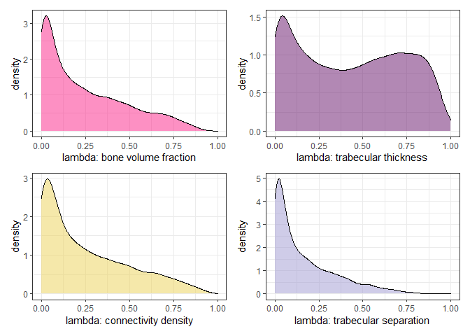<!-- -->


```r
#### Plots: genus-level ####
bvtv.stpl.1 <- ggplot() +
  geom_density(aes(x = ps.bvtv.1$samples$H1), fill = "#fc2187", alpha = 0.5) +
  theme_bw() +
  xlim(0,1) +
  labs(y = "density", x = "lambda: bone volume fraction")

tbth.stpl.1 <- ggplot() +
  geom_density(aes(x = ps.tbth.1$samples$H1), fill = "#66116a", alpha = 0.5) +
  theme_bw() +
  xlim(0,1) +
  labs(y = "density", x = "lambda: trabecular thickness")

tbsp.stpl.1 <- ggplot() +
  geom_density(aes(x = ps.tbsp.1$samples$H1), fill = "#9f9ad2", alpha = 0.5) +
  theme_bw() +
  xlim(0,1) +
  labs(y = "density", x = "lambda: trabecular separation")

cond.stpl.1 <- ggplot() +
  geom_density(aes(x = ps.cond.1$samples$H1), fill = "#ecd156", alpha = 0.5) +
  theme_bw() +
  xlim(0,1) +
  labs(y = "density", x = "lambda: connectivity density")
bvtv.stpl.1/cond.stpl.1|tbth.stpl.1/tbsp.stpl.1
```

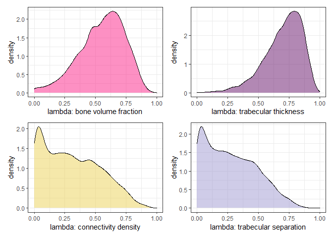<!-- -->


V. Connectivity density (Conn.D) vs BV.TV

```r
cor.test(d$cond_s,d$bvtv_s) # cor = -0.16, p = 0.18. CIs = -0.38-0.080. Weak.
```

```
## 
## 	Pearson's product-moment correlation
## 
## data:  d$cond_s and d$bvtv_s
## t = -1.337, df = 65, p-value = 0.1859
## alternative hypothesis: true correlation is not equal to 0
## 95 percent confidence interval:
##  -0.38853711  0.07974542
## sample estimates:
##       cor 
## -0.163597
```

```r
ggplot(aes(y = cond_s, x = bvtv_s, color = genus), data = d)+
  scale_fill_manual(values = cols)+
  geom_point()
```

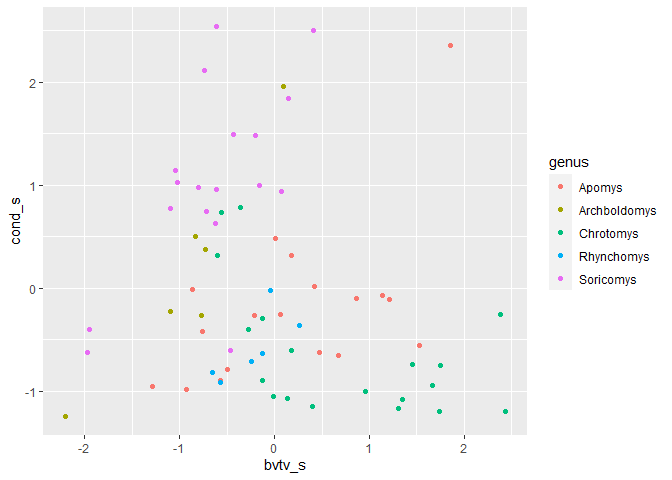<!-- -->

VI. Phylogenetic signal of mass alone.


```r
chr.9 <-   
  brm(data = d, 
      family = student,
      mass_s ~ 0 + (1|gr(phylo, cov = ch)),
      control = list(adapt_delta = 0.98), #inserted to decrease the number of divergent transitions
      prior = c(
        prior(gamma(2, 0.1), class = nu),
        prior(normal(0, 1), class = sd),
        prior(exponential(1), class = sigma)
        ),
      data2 = list(ch = ch),
      iter = 2000, warmup = 1000, chains = 4, cores = 4,
      file = "G:\\My Drive\\Philippine rodents\\chrotomyini\\fits\\chr.9")
print(chr.9)
```

```
##  Family: student 
##   Links: mu = identity; sigma = identity; nu = identity 
## Formula: mass_s ~ 0 + (1 | gr(phylo, cov = ch)) 
##    Data: d (Number of observations: 67) 
##   Draws: 4 chains, each with iter = 2000; warmup = 1000; thin = 1;
##          total post-warmup draws = 4000
## 
## Group-Level Effects: 
## ~phylo (Number of levels: 11) 
##               Estimate Est.Error l-95% CI u-95% CI Rhat Bulk_ESS Tail_ESS
## sd(Intercept)     0.98      0.21     0.66     1.48 1.02      435      920
## 
## Family Specific Parameters: 
##       Estimate Est.Error l-95% CI u-95% CI Rhat Bulk_ESS Tail_ESS
## sigma     0.20      0.02     0.15     0.25 1.00     1893     1202
## nu       20.79     13.87     3.87    55.78 1.00     2209     1649
## 
## Draws were sampled using sampling(NUTS). For each parameter, Bulk_ESS
## and Tail_ESS are effective sample size measures, and Rhat is the potential
## scale reduction factor on split chains (at convergence, Rhat = 1).
```


```r
ps.mass <- hypothesis(chr.9, hyp, class = NULL)
ps.mass #lambda = 0.95, CIs: 0.91-0.98
```

```
## Hypothesis Tests for class :
##                 Hypothesis Estimate Est.Error CI.Lower CI.Upper Evid.Ratio
## 1 (sd_phylo__Interc... = 0     0.95      0.02     0.91     0.98         NA
##   Post.Prob Star
## 1        NA    *
## ---
## 'CI': 90%-CI for one-sided and 95%-CI for two-sided hypotheses.
## '*': For one-sided hypotheses, the posterior probability exceeds 95%;
## for two-sided hypotheses, the value tested against lies outside the 95%-CI.
## Posterior probabilities of point hypotheses assume equal prior probabilities.
```

```r
mass.stpl <- ggplot() +
  geom_density(aes(x =ps.mass$samples$H1), fill = "#fc2187", alpha = 0.5) +
  theme_bw() +
  xlim(0,1) +
  labs(y = "density", x = "lambda: mass")

mass.stpl
```

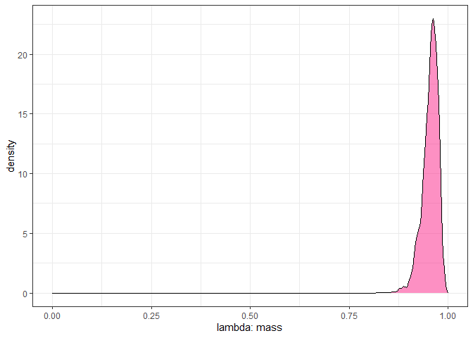<!-- -->


