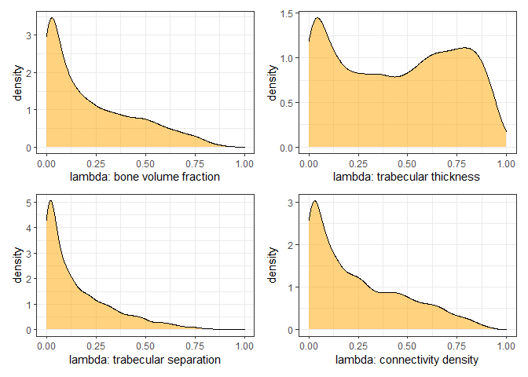
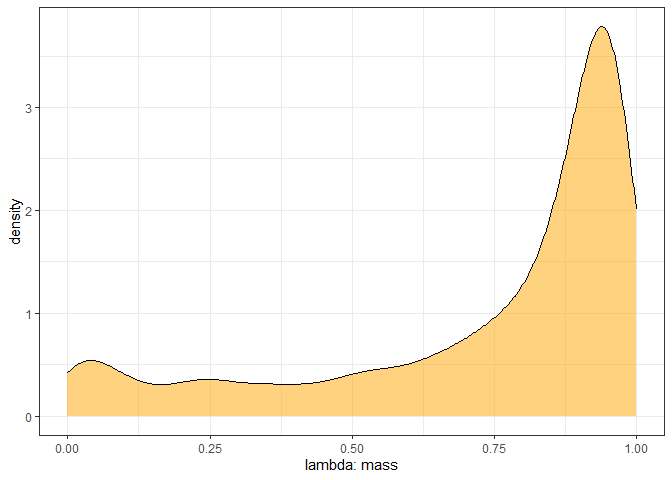
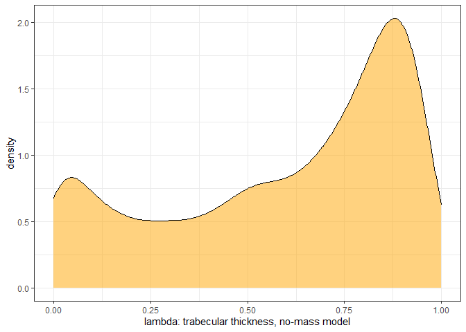
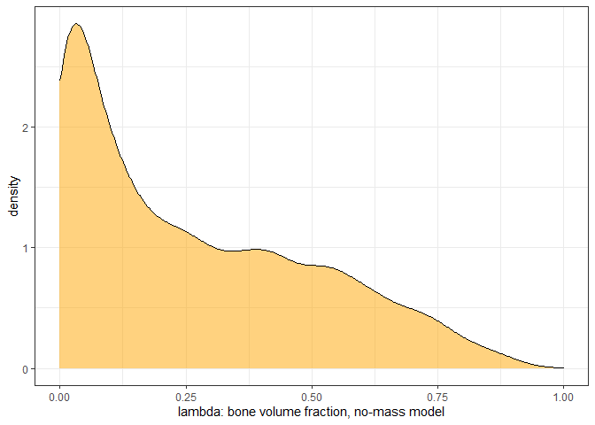

Load up Chrotomyini trabecular bone architecture (TBA) data and standardize variables:


```r
d <- read.csv(file = "G:\\My Drive\\Philippine rodents\\chrotomyini\\05062022 Philippine Murids segmentation parameters and morphological data - TBA data total BoneJ (full).csv", header = T)

d <- d[d$tribe=="chroto",c(1:2, 4:23)]

d <- 
  d %>% 
  mutate(bvtv = as.numeric(bvtv))

d <- 
  d %>%
  mutate(mass_s = rethinking::standardize(log10(mass_g)),
         elev_s = rethinking::standardize(elev), 
         bvtv_s = rethinking::standardize(bvtv),
         tbth_s = rethinking::standardize(tbth),
         tbsp_s = rethinking::standardize(tbsp),
         conn_s = rethinking::standardize(conn),
         cond_s = rethinking::standardize(m_connd),
         cond_s2 = rethinking::standardize(connd), 
         da_s = rethinking::standardize(da))

# remove C. gonzalesi and R. isarogensis, singletons:
d <- 
  d %>% 
  filter(taxon!="Chrotomys_gonzalesi") %>% 
  filter(taxon!="Rhynchomys_isarogensis")

# Make categorical vars into factors
d <- 
  d %>%
  mutate(loco = factor(loco), 
         hab_simp = factor(hab_simp),
         genus = factor(genus))

# Specify colors for plots:
cols = c("#86acca","#ab685b", "#3370a3", "#1f314c","#5a9fa8")
```

Load in phylogeny: 
REMEMBER: A <- ape::vcv.phylo(phylo), add corr = T if your tree is NOT SCALED TO 1. 


```r
ch.tre <- read.nexus(file = "G:\\My Drive\\Philippine rodents\\Chrotomys\\analysis\\SMS_PRUNED_and_COLLAPSED_03292022_OTUsrenamed_Rowsey_PhBgMCC_LzChrotomyini.nex")

ch <- ape::vcv.phylo(ch.tre, corr = T)

d <- 
  d %>% 
  mutate(phylo = taxon)
```

Estimate lambda: all four trabecular bone variables. All are by taxon (species-level) and include mass and phylo structure terms. Eg:


```r
ch.74.3 <- 
  brm(file = "G:\\My Drive\\Philippine rodents\\chrotomyini\\fits\\ch.74.3")
print(ch.74.3)
```

```
## Warning: There were 2 divergent transitions after warmup. Increasing adapt_delta
## above 0.85 may help. See http://mc-stan.org/misc/warnings.html#divergent-
## transitions-after-warmup
```

```
##  Family: student 
##   Links: mu = identity; sigma = identity; nu = identity 
## Formula: bvtv_s ~ 0 + taxon + mass_s + (1 | gr(phylo, cov = ch)) 
##    Data: d (Number of observations: 67) 
##   Draws: 4 chains, each with iter = 2000; warmup = 1000; thin = 1;
##          total post-warmup draws = 4000
## 
## Group-Level Effects: 
## ~phylo (Number of levels: 11) 
##               Estimate Est.Error l-95% CI u-95% CI Rhat Bulk_ESS Tail_ESS
## sd(Intercept)     0.32      0.26     0.01     0.98 1.00      948     1706
## 
## Population-Level Effects: 
##                            Estimate Est.Error l-95% CI u-95% CI Rhat Bulk_ESS
## taxonApomys_banahao            0.20      0.39    -0.60     0.98 1.00     2138
## taxonApomys_datae             -0.34      0.39    -1.13     0.41 1.00     2598
## taxonApomys_sierrae            0.45      0.41    -0.38     1.26 1.00     2853
## taxonArchboldomys_maximus     -0.41      0.42    -1.19     0.44 1.00     2646
## taxonChrotomys_mindorensis     0.41      0.47    -0.51     1.33 1.00     1716
## taxonChrotomys_silaceus       -0.60      0.37    -1.33     0.20 1.00     2532
## taxonChrotomys_whiteheadi      0.50      0.45    -0.41     1.36 1.00     1907
## taxonRhynchomys_labo          -0.87      0.48    -1.77     0.14 1.00     2273
## taxonSoricomys_kalinga         0.54      0.46    -0.35     1.46 1.00     1902
## taxonSoricomys_leonardocoi    -0.23      0.44    -1.10     0.61 1.00     1934
## taxonSoricomys_montanus        0.32      0.50    -0.70     1.28 1.00     2114
## mass_s                         0.66      0.25     0.16     1.13 1.00     1729
##                            Tail_ESS
## taxonApomys_banahao            1865
## taxonApomys_datae              2440
## taxonApomys_sierrae            2152
## taxonArchboldomys_maximus      1652
## taxonChrotomys_mindorensis     1688
## taxonChrotomys_silaceus        2383
## taxonChrotomys_whiteheadi      1791
## taxonRhynchomys_labo           2206
## taxonSoricomys_kalinga         2384
## taxonSoricomys_leonardocoi     2361
## taxonSoricomys_montanus        2399
## mass_s                         2302
## 
## Family Specific Parameters: 
##       Estimate Est.Error l-95% CI u-95% CI Rhat Bulk_ESS Tail_ESS
## sigma     0.61      0.08     0.45     0.77 1.00     2748     2188
## nu       18.46     13.39     3.44    52.07 1.00     3607     1994
## 
## Draws were sampled using sampling(NUTS). For each parameter, Bulk_ESS
## and Tail_ESS are effective sample size measures, and Rhat is the potential
## scale reduction factor on split chains (at convergence, Rhat = 1).
```

Calculating lambda:


```r
hyp <- "sd_phylo__Intercept^2 / (sd_phylo__Intercept^2 + sigma^2) = 0"

#BV.TV
h.bvtv <- hypothesis(ch.74.3, hyp, class = NULL)

#Tb.Th
ch.76 <- 
  brm(file = "G:\\My Drive\\Philippine rodents\\chrotomyini\\fits\\ch.76")
h.tbth <- hypothesis(ch.76, hyp, class = NULL)

#Tb.Sp
ch.77 <- 
  brm(file = "G:\\My Drive\\Philippine rodents\\chrotomyini\\fits\\ch.77")
h.tbsp <- hypothesis(ch.77, hyp, class = NULL)

#Conn.d
ch.78 <- 
  brm(file = "G:\\My Drive\\Philippine rodents\\chrotomyini\\fits\\ch.78")
h.cond <- hypothesis(ch.78, hyp, class = NULL)


bvtv.stpl <- ggplot() +
  geom_density(aes(x = h.bvtv$samples$H1), fill = "orange", alpha = 0.5) +
  theme_bw() +
  xlim(0,1) +
  labs(y = "density", x = "lambda: bone volume fraction")

tbth.stpl <- ggplot() +
  geom_density(aes(x = h.tbth$samples$H1), fill = "orange", alpha = 0.5) +
  theme_bw() +
  xlim(0,1) +
  labs(y = "density", x = "lambda: trabecular thickness")

tbsp.stpl <- ggplot() +
  geom_density(aes(x = h.tbsp$samples$H1), fill = "orange", alpha = 0.5) +
  theme_bw() +
  xlim(0,1) +
  labs(y = "density", x = "lambda: trabecular separation")

cond.stpl <- ggplot() +
  geom_density(aes(x = h.cond$samples$H1), fill = "orange", alpha = 0.5) +
  theme_bw() +
  xlim(0,1) +
  labs(y = "density", x = "lambda: connectivity density")
bvtv.stpl/tbsp.stpl|tbth.stpl/cond.stpl
```

<!-- -->

All have peak density at low values for lambda except Tb.Th, which is pretty confused. Tb.Th is the most correlated with mass, so I checked on what the phylogenetic signal is in mass by itself:


```r
ch.80 <- 
  brm(file = "G:\\My Drive\\Philippine rodents\\chrotomyini\\fits\\ch.80")
h.mass <- hypothesis(ch.80, hyp, class = NULL)
mass.stpl <- ggplot() +
  geom_density(aes(x = h.mass$samples$H1), fill = "orange", alpha = 0.5) +
  theme_bw() +
  xlim(0,1) +
  labs(y = "density", x = "lambda: mass")
mass.stpl
```

<!-- -->

Pretty high peak near 1. Is the phylo signal reflective of the effect that mass has on the metric? What if we calculate lambda on tbth without including mass? If that's the issue, I would expect that without mass as a predictor there is a very high phylo signal.


```r
ch.80.2 <-
  brm(data = d, 
      family = student,
      tbth_s ~ 0 + taxon + (1|gr(phylo, cov = ch)),
      control = list(adapt_delta = 0.98), #inserted to decrease the number of divergent transitions here
      prior = c(
        prior(gamma(2, 0.1), class = nu),
        prior(normal(0, 1), class = b),
        prior(normal(0, 1), class = sd),
        prior(exponential(1), class = sigma)
        ),
      data2 = list(ch = ch),
      iter = 2000, warmup = 1000, chains = 4, cores = 4,
      file = "G:\\My Drive\\Philippine rodents\\chrotomyini\\fits\\ch.80.2")
print(ch.80.2)
```

```
## Warning: There were 1 divergent transitions after warmup. Increasing adapt_delta
## above 0.98 may help. See http://mc-stan.org/misc/warnings.html#divergent-
## transitions-after-warmup
```

```
##  Family: student 
##   Links: mu = identity; sigma = identity; nu = identity 
## Formula: tbth_s ~ 0 + taxon + (1 | gr(phylo, cov = ch)) 
##    Data: d (Number of observations: 67) 
##   Draws: 4 chains, each with iter = 2000; warmup = 1000; thin = 1;
##          total post-warmup draws = 4000
## 
## Group-Level Effects: 
## ~phylo (Number of levels: 11) 
##               Estimate Est.Error l-95% CI u-95% CI Rhat Bulk_ESS Tail_ESS
## sd(Intercept)     0.51      0.36     0.02     1.36 1.01      608     1935
## 
## Population-Level Effects: 
##                            Estimate Est.Error l-95% CI u-95% CI Rhat Bulk_ESS
## taxonApomys_banahao            0.07      0.45    -0.87     1.02 1.00     3307
## taxonApomys_datae             -0.15      0.45    -1.09     0.81 1.00     3182
## taxonApomys_sierrae            0.11      0.46    -0.92     1.06 1.00     2873
## taxonArchboldomys_maximus     -0.68      0.49    -1.57     0.45 1.00     3114
## taxonChrotomys_mindorensis     1.37      0.50     0.18     2.12 1.00     1239
## taxonChrotomys_silaceus        0.05      0.47    -0.99     0.92 1.00     2803
## taxonChrotomys_whiteheadi      0.88      0.50    -0.31     1.62 1.00     1324
## taxonRhynchomys_labo           0.63      0.49    -0.57     1.51 1.00     3078
## taxonSoricomys_kalinga        -0.79      0.48    -1.57     0.33 1.00     1463
## taxonSoricomys_leonardocoi    -0.80      0.48    -1.56     0.38 1.00     1462
## taxonSoricomys_montanus       -1.01      0.48    -1.77     0.14 1.00     1366
##                            Tail_ESS
## taxonApomys_banahao            2731
## taxonApomys_datae              2388
## taxonApomys_sierrae            1649
## taxonArchboldomys_maximus      2190
## taxonChrotomys_mindorensis     2045
## taxonChrotomys_silaceus        2292
## taxonChrotomys_whiteheadi      1356
## taxonRhynchomys_labo           2333
## taxonSoricomys_kalinga         2540
## taxonSoricomys_leonardocoi     1819
## taxonSoricomys_montanus        1964
## 
## Family Specific Parameters: 
##       Estimate Est.Error l-95% CI u-95% CI Rhat Bulk_ESS Tail_ESS
## sigma     0.30      0.04     0.22     0.38 1.00     3166     2473
## nu       17.44     12.88     3.07    51.36 1.00     4205     2474
## 
## Draws were sampled using sampling(NUTS). For each parameter, Bulk_ESS
## and Tail_ESS are effective sample size measures, and Rhat is the potential
## scale reduction factor on split chains (at convergence, Rhat = 1).
```

```r
h.thnomass <- hypothesis(ch.80.2, hyp, class = NULL)
thnomass.stpl <- ggplot() +
  geom_density(aes(x = h.thnomass$samples$H1), fill = "orange", alpha = 0.5) +
  theme_bw() +
  xlim(0,1) +
  labs(y = "density", x = "lambda: trabecular thickness, no-mass model")
thnomass.stpl
```

<!-- -->

I think this result supports my idea about what's causing this. Check the other metrics:


```r
ch.80.3 <-
  brm(data = d, 
      family = student,
      bvtv_s ~ 0 + taxon + (1|gr(phylo, cov = ch)),
      control = list(adapt_delta = 0.98), #inserted to decrease the number of divergent transitions here
      prior = c(
        prior(gamma(2, 0.1), class = nu),
        prior(normal(0, 1), class = b),
        prior(normal(0, 1), class = sd),
        prior(exponential(1), class = sigma)
        ),
      data2 = list(ch = ch),
      iter = 2000, warmup = 1000, chains = 4, cores = 4,
      file = "G:\\My Drive\\Philippine rodents\\chrotomyini\\fits\\ch.80.3")
h.bvnomass <- hypothesis(ch.80.3, hyp, class = NULL)
bvnomass.stpl <- ggplot() +
  geom_density(aes(x = h.bvnomass$samples$H1), fill = "orange", alpha = 0.5) +
  theme_bw() +
  xlim(0,1) +
  labs(y = "density", x = "lambda: bone volume fraction, no-mass model")
bvnomass.stpl
```

<!-- -->

Ok so maybe that's the cause here. When you add mass to the Tb.Th model, the error structures are too similar to be able to tell if the error is from phylo or from mass, and there's very little other information there.  
