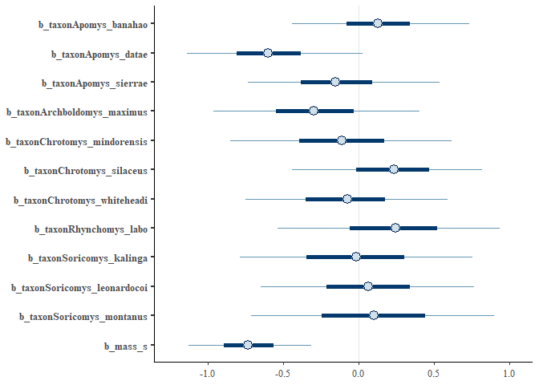
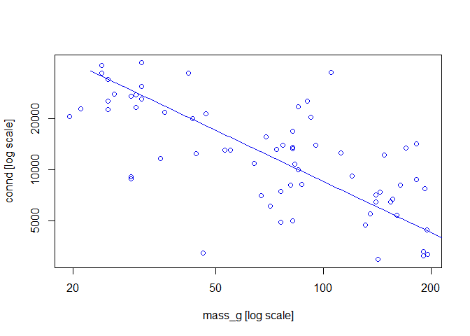

Load up Chrotomyini trabecular bone architecture (TBA) data and standardize variables:

```r
d <- read.csv(file = "G:\\My Drive\\Philippine rodents\\chrotomyini\\05062022 Philippine Murids segmentation parameters and morphological data - TBA data total BoneJ (full).csv", header = T)

d <- d[d$tribe=="chroto",c(1:2, 4:23)]

d <- 
  d %>% 
  mutate(bvtv = as.numeric(bvtv))

d <- 
  d %>%
  mutate(mass_s = rethinking::standardize(log10(mass_g)),
         elev_s = rethinking::standardize(elev), 
         bvtv_s = rethinking::standardize(bvtv),
         tbth_s = rethinking::standardize(tbth),
         tbsp_s = rethinking::standardize(tbsp),
         conn_s = rethinking::standardize(conn),
         cond_s = rethinking::standardize(m_connd),
         cond_s2 = rethinking::standardize(connd), 
         da_s = rethinking::standardize(da))

# remove C. gonzalesi and R. isarogensis, singletons:
d <- 
  d %>% 
  filter(taxon!="Chrotomys_gonzalesi") %>% 
  filter(taxon!="Rhynchomys_isarogensis")

# Make categorical vars into factors
d <- 
  d %>%
  mutate(loco = factor(loco), 
         hab_simp = factor(hab_simp),
         genus = factor(genus))

# Specify colors for plots:
cols = c("#86acca","#ab685b", "#3370a3", "#1f314c","#5a9fa8")
```

Load in phylogeny: 
REMEMBER: A <- ape::vcv.phylo(phylo), add corr = T if your tree is NOT SCALED TO 1. 

```r
ch.tre <- read.nexus(file = "G:\\My Drive\\Philippine rodents\\Chrotomys\\analysis\\SMS_PRUNED_and_COLLAPSED_03292022_OTUsrenamed_Rowsey_PhBgMCC_LzChrotomyini.nex")

ch <- ape::vcv.phylo(ch.tre, corr = T)

d <- 
  d %>% 
  mutate(phylo = taxon)
```

From existing fits: call up some models for comparison. These are all BV.TV.

```r
# Just mass, wide gamma for nu
ch.70 <- 
  brm(file = "G:\\My Drive\\Philippine rodents\\chrotomyini\\fits\\ch.70")
ch.70 <- add_criterion(ch.70, c("loo", "waic"))


# Just genus, wide gamma for nu
ch.71 <- 
  brm(file = "G:\\My Drive\\Philippine rodents\\chrotomyini\\fits\\ch.71")
ch.71 <- add_criterion(ch.71, c("loo", "waic"))

# Just genus, nu fixed at 2
ch.71b <-
  brm(file = "G:\\My Drive\\Philippine rodents\\chrotomyini\\fits\\ch.71b")
ch.71b <- add_criterion(ch.71b, c("loo", "waic"))

# By genus and mass
ch.72 <- 
  brm(file = "G:\\My Drive\\Philippine rodents\\chrotomyini\\fits\\ch.72")
ch.72 <- add_criterion(ch.72, c("loo", "waic"))

# By genus and mass with fixed nu
ch.72b <- 
  brm(file = "G:\\My Drive\\Philippine rodents\\chrotomyini\\fits\\ch.72b")
ch.72b <- add_criterion(ch.72b, c("loo", "waic"))

# By genus, mass, and BOTH phylogeny/intraspecific variance
ch.74 <-
  brm(file = "G:\\My Drive\\Philippine rodents\\chrotomyini\\fits\\ch.74")
ch.74 <- add_criterion(ch.74, c("loo", "waic"))

# By genus, mass, and phylogeny only
ch.74.1 <-
  brm(file = "G:\\My Drive\\Philippine rodents\\chrotomyini\\fits\\ch.74.1")
mcmc_plot(ch.74.1, pars = "^b_")
```

```
## Warning: Argument 'pars' is deprecated. Please use 'variable' instead.
```

<!-- -->

```r
ch.74.1 <- add_criterion(ch.74.1, c("loo", "waic"))

# By genus, mass, and intraspecific variance only
ch.74.2 <-
  brm(file = "G:\\My Drive\\Philippine rodents\\chrotomyini\\fits\\ch.74.2")
ch.74.2 <- add_criterion(ch.74.2, c("loo", "waic"))

# by SPECIES, mass, and phylo
ch.74.3 <-
  brm(file = "G:\\My Drive\\Philippine rodents\\chrotomyini\\fits\\ch.74.3")
print(ch.74.3)
```

```
## Warning: There were 2 divergent transitions after warmup. Increasing adapt_delta
## above 0.85 may help. See http://mc-stan.org/misc/warnings.html#divergent-
## transitions-after-warmup
```

```
##  Family: student 
##   Links: mu = identity; sigma = identity; nu = identity 
## Formula: bvtv_s ~ 0 + taxon + mass_s + (1 | gr(phylo, cov = ch)) 
##    Data: d (Number of observations: 67) 
##   Draws: 4 chains, each with iter = 2000; warmup = 1000; thin = 1;
##          total post-warmup draws = 4000
## 
## Group-Level Effects: 
## ~phylo (Number of levels: 11) 
##               Estimate Est.Error l-95% CI u-95% CI Rhat Bulk_ESS Tail_ESS
## sd(Intercept)     0.32      0.26     0.01     0.98 1.00      948     1706
## 
## Population-Level Effects: 
##                            Estimate Est.Error l-95% CI u-95% CI Rhat Bulk_ESS
## taxonApomys_banahao            0.20      0.39    -0.60     0.98 1.00     2138
## taxonApomys_datae             -0.34      0.39    -1.13     0.41 1.00     2598
## taxonApomys_sierrae            0.45      0.41    -0.38     1.26 1.00     2853
## taxonArchboldomys_maximus     -0.41      0.42    -1.19     0.44 1.00     2646
## taxonChrotomys_mindorensis     0.41      0.47    -0.51     1.33 1.00     1716
## taxonChrotomys_silaceus       -0.60      0.37    -1.33     0.20 1.00     2532
## taxonChrotomys_whiteheadi      0.50      0.45    -0.41     1.36 1.00     1907
## taxonRhynchomys_labo          -0.87      0.48    -1.77     0.14 1.00     2273
## taxonSoricomys_kalinga         0.54      0.46    -0.35     1.46 1.00     1902
## taxonSoricomys_leonardocoi    -0.23      0.44    -1.10     0.61 1.00     1934
## taxonSoricomys_montanus        0.32      0.50    -0.70     1.28 1.00     2114
## mass_s                         0.66      0.25     0.16     1.13 1.00     1729
##                            Tail_ESS
## taxonApomys_banahao            1865
## taxonApomys_datae              2440
## taxonApomys_sierrae            2152
## taxonArchboldomys_maximus      1652
## taxonChrotomys_mindorensis     1688
## taxonChrotomys_silaceus        2383
## taxonChrotomys_whiteheadi      1791
## taxonRhynchomys_labo           2206
## taxonSoricomys_kalinga         2384
## taxonSoricomys_leonardocoi     2361
## taxonSoricomys_montanus        2399
## mass_s                         2302
## 
## Family Specific Parameters: 
##       Estimate Est.Error l-95% CI u-95% CI Rhat Bulk_ESS Tail_ESS
## sigma     0.61      0.08     0.45     0.77 1.00     2748     2188
## nu       18.46     13.39     3.44    52.07 1.00     3607     1994
## 
## Draws were sampled using sampling(NUTS). For each parameter, Bulk_ESS
## and Tail_ESS are effective sample size measures, and Rhat is the potential
## scale reduction factor on split chains (at convergence, Rhat = 1).
```

```r
mcmc_plot(ch.74.3, pars = "^b_")
```

```
## Warning: Argument 'pars' is deprecated. Please use 'variable' instead.
```

<!-- -->

```r
ch.74.3 <- add_criterion(ch.74.3, c("loo", "waic"))


# By genus, mass, phylogeny/intraspcific var, fixed nu = 2
ch.74b <-
  brm(file = "G:\\My Drive\\Philippine rodents\\chrotomyini\\fits\\ch.74b")
ch.74b <- add_criterion(ch.74b, c("loo", "waic"))

# By genus, mass, phylogeny/intraspcific var, with estimated nu, more robust gamma(4,1) as demonstrated by Kurz - a slightly more restrictive prior but not as much as the fixed one:

ch.74c <-
  brm(file = "G:\\My Drive\\Philippine rodents\\chrotomyini\\fits\\ch.74c")
ch.74c <- add_criterion(ch.74c, c("loo", "waic"))

b_estimates <-
  tibble(model = c("ch.74", "ch.74b", "ch.74c")) %>% 
  mutate(fit = map(model, get)) %>% 
  mutate(posterior_summary = map(fit, ~posterior_summary(.) %>% 
                                   data.frame() %>% 
                                   rownames_to_column("term"))) %>% 
  unnest(posterior_summary) %>% 
  select(-fit) %>% 
  arrange(term)
```

Ok try some other things. Model just based on phylogeny:

```r
ch.75 <- 
  brm(data = d, 
      family = student,
      bf(bvtv_s ~ 1+ (1|gr(phylo, cov = ch)), nu = 2),
      prior = c(
        prior(exponential(1), class = sigma)),
      data2 = list(ch = ch),
      iter = 2000, warmup = 1000, chains = 4, cores = 4,
      file = "G:\\My Drive\\Philippine rodents\\chrotomyini\\fits\\ch.75")

ch.75 <- add_criterion(ch.75, c("loo", "waic"))

loo_compare(ch.75, ch.74, ch.74.1, ch.74.2, ch.74.3, ch.70, ch.71, ch.71b)%>% 
  print(simplify = F)
```

```
##         elpd_diff se_diff elpd_loo se_elpd_loo p_loo se_p_loo looic se_looic
## ch.74     0.0       0.0   -73.7      6.8        11.2   1.7    147.4  13.6   
## ch.74.1  -0.1       0.4   -73.8      6.8        10.8   1.7    147.5  13.6   
## ch.74.2  -0.2       0.2   -73.8      6.7        11.2   1.6    147.7  13.5   
## ch.74.3  -0.3       0.8   -74.0      7.0        12.0   1.8    147.9  13.9   
## ch.75    -2.6       2.8   -76.3      7.3        12.9   1.2    152.6  14.7   
## ch.70   -10.9       5.1   -84.6      5.0         2.9   0.4    169.1  10.0   
## ch.71   -12.2       5.1   -85.9      5.0         4.9   0.6    171.9  10.0   
## ch.71b  -19.2       5.5   -92.8      5.8         7.2   0.5    185.7  11.7
```

Try some more species things: 

```r
# by species tbth
ch.76 <-
  brm(data = d, 
      family = student,
      tbth_s ~ 0 + taxon + mass_s + (1|gr(phylo, cov = ch)),
      control = list(adapt_delta = 0.98), #inserted to decrease the number of divergent transitions here
      prior = c(
        prior(gamma(2, 0.1), class = nu),
        prior(normal(0, 1), class = b),
        prior(normal(0, 1), class = sd),
        prior(exponential(1), class = sigma)
        ),
      data2 = list(ch = ch),
      iter = 2000, warmup = 1000, chains = 4, cores = 4,
      file = "G:\\My Drive\\Philippine rodents\\chrotomyini\\fits\\ch.76")
ch.76 <- add_criterion(ch.76, c("loo", "waic"))

# by phylo only tbth
ch.76.1 <- 
  brm(data = d, 
      family = student,
      bf(tbth_s ~ 1+ (1|gr(phylo, cov = ch)), nu = 2),
      prior = c(
        prior(exponential(1), class = sigma)),
      data2 = list(ch = ch),
      iter = 2000, warmup = 1000, chains = 4, cores = 4,
      file = "G:\\My Drive\\Philippine rodents\\chrotomyini\\fits\\ch.76.1")
ch.76.1 <- add_criterion(ch.76.1, c("loo", "waic"))

hyp <- "sd_phylo__Intercept^2 / (sd_phylo__Intercept^2 + sigma^2) = 0"
h.bvtv <- hypothesis(ch.76, hyp, class = NULL)
h.bvtv
```

```
## Hypothesis Tests for class :
##                 Hypothesis Estimate Est.Error CI.Lower CI.Upper Evid.Ratio
## 1 (sd_phylo__Interc... = 0     0.44       0.3        0     0.92         NA
##   Post.Prob Star
## 1        NA    *
## ---
## 'CI': 90%-CI for one-sided and 95%-CI for two-sided hypotheses.
## '*': For one-sided hypotheses, the posterior probability exceeds 95%;
## for two-sided hypotheses, the value tested against lies outside the 95%-CI.
## Posterior probabilities of point hypotheses assume equal prior probabilities.
```

```r
# By mass only
ch.76.2 <- 
  brm(data = d, 
      family = student,
      tbth_s ~ 1+mass_s,
      prior = c(prior(normal(0, 1), class = b),
                prior(gamma(2, 0.1), class = nu),
                prior(exponential(1), class = sigma)),
      iter = 2000, warmup = 1000, chains = 4, cores = 4,
      seed = 5,
      file = "G:\\My Drive\\Philippine rodents\\chrotomyini\\fits\\ch.76.2")

ch.76.2 <- add_criterion(ch.76.2, c("loo", "waic"))

loo_compare(ch.76, ch.76.1, ch.76.2) %>% 
  print(simplify = F)
```

```
##         elpd_diff se_diff elpd_loo se_elpd_loo p_loo se_p_loo looic se_looic
## ch.76     0.0       0.0   -16.7      5.9        12.2   1.7     33.4  11.7   
## ch.76.1 -10.9       5.7   -27.6      7.6        15.2   1.6     55.2  15.3   
## ch.76.2 -13.5       6.1   -30.2      5.6         3.2   0.5     60.4  11.3
```

```r
print(ch.76)
```

```
## Warning: There were 1 divergent transitions after warmup. Increasing adapt_delta
## above 0.98 may help. See http://mc-stan.org/misc/warnings.html#divergent-
## transitions-after-warmup
```

```
##  Family: student 
##   Links: mu = identity; sigma = identity; nu = identity 
## Formula: tbth_s ~ 0 + taxon + mass_s + (1 | gr(phylo, cov = ch)) 
##    Data: d (Number of observations: 67) 
##   Draws: 4 chains, each with iter = 2000; warmup = 1000; thin = 1;
##          total post-warmup draws = 4000
## 
## Group-Level Effects: 
## ~phylo (Number of levels: 11) 
##               Estimate Est.Error l-95% CI u-95% CI Rhat Bulk_ESS Tail_ESS
## sd(Intercept)     0.29      0.24     0.01     0.89 1.01      776     1534
## 
## Population-Level Effects: 
##                            Estimate Est.Error l-95% CI u-95% CI Rhat Bulk_ESS
## taxonApomys_banahao            0.01      0.32    -0.67     0.71 1.00     2259
## taxonApomys_datae             -0.08      0.32    -0.75     0.64 1.00     2284
## taxonApomys_sierrae           -0.10      0.33    -0.75     0.61 1.00     2924
## taxonArchboldomys_maximus     -0.27      0.36    -0.98     0.51 1.00     2992
## taxonChrotomys_mindorensis     0.58      0.36    -0.15     1.29 1.00     1945
## taxonChrotomys_silaceus       -0.28      0.32    -0.93     0.39 1.00     2880
## taxonChrotomys_whiteheadi      0.28      0.34    -0.43     0.94 1.00     2152
## taxonRhynchomys_labo          -0.22      0.38    -0.97     0.61 1.00     2541
## taxonSoricomys_kalinga         0.13      0.37    -0.63     0.84 1.00     2404
## taxonSoricomys_leonardocoi    -0.11      0.34    -0.80     0.57 1.00     2622
## taxonSoricomys_montanus       -0.03      0.36    -0.78     0.65 1.00     2425
## mass_s                         0.86      0.16     0.55     1.17 1.00     2237
##                            Tail_ESS
## taxonApomys_banahao            1587
## taxonApomys_datae              1708
## taxonApomys_sierrae            2207
## taxonArchboldomys_maximus      2054
## taxonChrotomys_mindorensis     2152
## taxonChrotomys_silaceus        2402
## taxonChrotomys_whiteheadi      2032
## taxonRhynchomys_labo           1635
## taxonSoricomys_kalinga         2657
## taxonSoricomys_leonardocoi     2633
## taxonSoricomys_montanus        2238
## mass_s                         1885
## 
## Family Specific Parameters: 
##       Estimate Est.Error l-95% CI u-95% CI Rhat Bulk_ESS Tail_ESS
## sigma     0.27      0.03     0.21     0.33 1.00     3903     2565
## nu       22.55     13.76     5.14    56.82 1.00     4680     3088
## 
## Draws were sampled using sampling(NUTS). For each parameter, Bulk_ESS
## and Tail_ESS are effective sample size measures, and Rhat is the potential
## scale reduction factor on split chains (at convergence, Rhat = 1).
```

```r
mcmc_plot(ch.76, pars = "^b_")
```

```
## Warning: Argument 'pars' is deprecated. Please use 'variable' instead.
```

<!-- -->


```r
# by species tbsp
ch.77 <-
  brm(data = d, 
      family = student,
      tbsp_s ~ 0 + taxon + mass_s + (1|gr(phylo, cov = ch)),
      control = list(adapt_delta = 0.98), #inserted to decrease the number of divergent transitions here
      prior = c(
        prior(gamma(2, 0.1), class = nu),
        prior(normal(0, 1), class = b),
        prior(normal(0, 1), class = sd),
        prior(exponential(1), class = sigma)
        ),
      data2 = list(ch = ch),
      iter = 2000, warmup = 1000, chains = 4, cores = 4,
      file = "G:\\My Drive\\Philippine rodents\\chrotomyini\\fits\\ch.77")
print(ch.77)
```

```
##  Family: student 
##   Links: mu = identity; sigma = identity; nu = identity 
## Formula: tbsp_s ~ 0 + taxon + mass_s + (1 | gr(phylo, cov = ch)) 
##    Data: d (Number of observations: 67) 
##   Draws: 4 chains, each with iter = 2000; warmup = 1000; thin = 1;
##          total post-warmup draws = 4000
## 
## Group-Level Effects: 
## ~phylo (Number of levels: 11) 
##               Estimate Est.Error l-95% CI u-95% CI Rhat Bulk_ESS Tail_ESS
## sd(Intercept)     0.32      0.26     0.01     0.95 1.00     1114     1812
## 
## Population-Level Effects: 
##                            Estimate Est.Error l-95% CI u-95% CI Rhat Bulk_ESS
## taxonApomys_banahao           -0.44      0.43    -1.24     0.45 1.00     3553
## taxonApomys_datae              0.41      0.44    -0.48     1.32 1.00     3574
## taxonApomys_sierrae           -0.46      0.48    -1.41     0.53 1.00     3762
## taxonArchboldomys_maximus     -0.14      0.48    -1.10     0.81 1.00     3659
## taxonChrotomys_mindorensis     0.03      0.52    -0.98     1.09 1.00     2478
## taxonChrotomys_silaceus        0.27      0.44    -0.61     1.17 1.00     2780
## taxonChrotomys_whiteheadi     -0.28      0.48    -1.24     0.69 1.00     2450
## taxonRhynchomys_labo           0.40      0.54    -0.72     1.47 1.00     3264
## taxonSoricomys_kalinga        -0.39      0.51    -1.41     0.58 1.00     2543
## taxonSoricomys_leonardocoi     0.49      0.50    -0.49     1.47 1.00     2735
## taxonSoricomys_montanus       -0.23      0.53    -1.26     0.78 1.00     2402
## mass_s                         0.35      0.28    -0.20     0.90 1.00     1776
##                            Tail_ESS
## taxonApomys_banahao            2588
## taxonApomys_datae              3101
## taxonApomys_sierrae            2639
## taxonArchboldomys_maximus      2544
## taxonChrotomys_mindorensis     2979
## taxonChrotomys_silaceus        2744
## taxonChrotomys_whiteheadi      2683
## taxonRhynchomys_labo           3074
## taxonSoricomys_kalinga         3046
## taxonSoricomys_leonardocoi     2876
## taxonSoricomys_montanus        2696
## mass_s                         2378
## 
## Family Specific Parameters: 
##       Estimate Est.Error l-95% CI u-95% CI Rhat Bulk_ESS Tail_ESS
## sigma     0.80      0.11     0.56     1.02 1.00     3106     2140
## nu       16.61     12.90     2.71    49.48 1.00     3322     2171
## 
## Draws were sampled using sampling(NUTS). For each parameter, Bulk_ESS
## and Tail_ESS are effective sample size measures, and Rhat is the potential
## scale reduction factor on split chains (at convergence, Rhat = 1).
```

```r
mcmc_plot(ch.77, pars = "^b_")
```

```
## Warning: Argument 'pars' is deprecated. Please use 'variable' instead.
```

<!-- -->

```r
# by phylo only tbsp
ch.77.1 <- 
  brm(data = d, 
      family = student,
      bf(tbsp_s ~ 1+ (1|gr(phylo, cov = ch)), nu = 2),
      prior = c(
        prior(exponential(1), class = sigma)),
      data2 = list(ch = ch),
      iter = 2000, warmup = 1000, chains = 4, cores = 4,
      file = "G:\\My Drive\\Philippine rodents\\chrotomyini\\fits\\ch.77.1")
ch.77.1 <- add_criterion(ch.77.1, c("loo", "waic"))

# By mass only
ch.77.2 <- 
  brm(data = d, 
      family = student,
      tbsp_s ~ 1+mass_s,
      prior = c(prior(normal(0, 1), class = b),
                prior(gamma(2, 0.1), class = nu),
                prior(exponential(1), class = sigma)),
      iter = 2000, warmup = 1000, chains = 4, cores = 4,
      seed = 5,
      file = "G:\\My Drive\\Philippine rodents\\chrotomyini\\fits\\ch.77.2")

ch.77.2 <- add_criterion(ch.77.2, c("loo", "waic"))

# By genus tbsp
ch.77.3 <-
  brm(data = d, 
      family = student,
      tbsp_s ~ 0 + genus + mass_s + (1|gr(phylo, cov = ch)),
      control = list(adapt_delta = 0.98), #inserted to decrease the number of divergent transitions here
      prior = c(
        prior(gamma(2, 0.1), class = nu),
        prior(normal(0, 1), class = b),
        prior(normal(0, 1), class = sd),
        prior(exponential(1), class = sigma)
        ),
      data2 = list(ch = ch),
      iter = 2000, warmup = 1000, chains = 4, cores = 4,
      file = "G:\\My Drive\\Philippine rodents\\chrotomyini\\fits\\ch.77.3")
print(ch.77.3)
```

```
##  Family: student 
##   Links: mu = identity; sigma = identity; nu = identity 
## Formula: tbsp_s ~ 0 + genus + mass_s + (1 | gr(phylo, cov = ch)) 
##    Data: d (Number of observations: 67) 
##   Draws: 4 chains, each with iter = 2000; warmup = 1000; thin = 1;
##          total post-warmup draws = 4000
## 
## Group-Level Effects: 
## ~phylo (Number of levels: 11) 
##               Estimate Est.Error l-95% CI u-95% CI Rhat Bulk_ESS Tail_ESS
## sd(Intercept)     0.48      0.31     0.02     1.17 1.00     1084     1432
## 
## Population-Level Effects: 
##                   Estimate Est.Error l-95% CI u-95% CI Rhat Bulk_ESS Tail_ESS
## genusApomys          -0.20      0.44    -1.07     0.74 1.00     2376     1829
## genusArchboldomys    -0.16      0.55    -1.24     0.93 1.00     3383     2958
## genusChrotomys        0.10      0.50    -0.89     1.13 1.00     2459     2631
## genusRhynchomys       0.44      0.61    -0.82     1.62 1.00     2538     2653
## genusSoricomys       -0.15      0.60    -1.30     1.05 1.00     2842     2921
## mass_s                0.27      0.32    -0.37     0.89 1.00     2302     2552
## 
## Family Specific Parameters: 
##       Estimate Est.Error l-95% CI u-95% CI Rhat Bulk_ESS Tail_ESS
## sigma     0.82      0.11     0.59     1.04 1.00     2492     1998
## nu       16.38     12.59     2.88    48.98 1.00     3043     2791
## 
## Draws were sampled using sampling(NUTS). For each parameter, Bulk_ESS
## and Tail_ESS are effective sample size measures, and Rhat is the potential
## scale reduction factor on split chains (at convergence, Rhat = 1).
```

```r
hyp <- "sd_phylo__Intercept^2 / (sd_phylo__Intercept^2 + sigma^2) = 0"
h.bvtv <- hypothesis(ch.77.3, hyp, class = NULL)
h.bvtv
```

```
## Hypothesis Tests for class :
##                 Hypothesis Estimate Est.Error CI.Lower CI.Upper Evid.Ratio
## 1 (sd_phylo__Interc... = 0     0.27      0.21        0     0.71         NA
##   Post.Prob Star
## 1        NA    *
## ---
## 'CI': 90%-CI for one-sided and 95%-CI for two-sided hypotheses.
## '*': For one-sided hypotheses, the posterior probability exceeds 95%;
## for two-sided hypotheses, the value tested against lies outside the 95%-CI.
## Posterior probabilities of point hypotheses assume equal prior probabilities.
```

```r
ch.77.3 <- add_criterion(ch.77.3, c("loo", "waic"))
plot(ch.77.3)
```

<!-- --><!-- -->

```r
ph.bvtv.pl <- ggplot() +
  geom_density(aes(x = h.bvtv$samples$H1), fill = "red", alpha = 0.5) +
  theme_bw() +
  xlim(0,1) +
  labs(y = "density", x = "lambda: Trabecular spacing")
ph.bvtv.pl
```

<!-- -->

```r
loo_compare(ch.77, ch.77.1, ch.77.2, ch.77.3) %>% 
  print(simplify = F)
```

```
##         elpd_diff se_diff elpd_loo se_elpd_loo p_loo se_p_loo looic se_looic
## ch.77.1   0.0       0.0   -92.1      8.1        10.9   0.8    184.3  16.3   
## ch.77.2  -0.2       3.4   -92.3      7.5         3.8   0.6    184.6  15.1   
## ch.77    -1.4       3.3   -93.5      7.4        11.6   1.7    187.0  14.8   
## ch.77.3  -1.5       3.0   -93.6      7.4         9.5   1.5    187.3  14.8
```


```r
# by species cond
ch.78 <-
  brm(data = d, 
      family = student,
      cond_s ~ 0 + taxon + mass_s + (1|gr(phylo, cov = ch)),
      control = list(adapt_delta = 0.98), #inserted to decrease the number of divergent transitions here
      prior = c(
        prior(gamma(2, 0.1), class = nu),
        prior(normal(0, 1), class = b),
        prior(normal(0, 1), class = sd),
        prior(exponential(1), class = sigma)
        ),
      data2 = list(ch = ch),
      iter = 2000, warmup = 1000, chains = 4, cores = 4,
      file = "G:\\My Drive\\Philippine rodents\\chrotomyini\\fits\\ch.78")
print(ch.78)
```

```
##  Family: student 
##   Links: mu = identity; sigma = identity; nu = identity 
## Formula: cond_s ~ 0 + taxon + mass_s + (1 | gr(phylo, cov = ch)) 
##    Data: d (Number of observations: 67) 
##   Draws: 4 chains, each with iter = 2000; warmup = 1000; thin = 1;
##          total post-warmup draws = 4000
## 
## Group-Level Effects: 
## ~phylo (Number of levels: 11) 
##               Estimate Est.Error l-95% CI u-95% CI Rhat Bulk_ESS Tail_ESS
## sd(Intercept)     0.29      0.24     0.01     0.90 1.00      944     1455
## 
## Population-Level Effects: 
##                            Estimate Est.Error l-95% CI u-95% CI Rhat Bulk_ESS
## taxonApomys_banahao            0.14      0.36    -0.59     0.90 1.00     3557
## taxonApomys_datae             -0.58      0.36    -1.26     0.24 1.00     3329
## taxonApomys_sierrae           -0.13      0.39    -0.86     0.69 1.00     3606
## taxonArchboldomys_maximus     -0.29      0.42    -1.10     0.59 1.00     3829
## taxonChrotomys_mindorensis    -0.11      0.44    -0.99     0.76 1.00     2202
## taxonChrotomys_silaceus        0.22      0.39    -0.59     0.98 1.00     3339
## taxonChrotomys_whiteheadi     -0.08      0.41    -0.92     0.73 1.00     2342
## taxonRhynchomys_labo           0.23      0.45    -0.69     1.10 1.00     2688
## taxonSoricomys_kalinga        -0.02      0.48    -0.97     0.96 1.00     2356
## taxonSoricomys_leonardocoi     0.07      0.43    -0.80     0.93 1.00     2561
## taxonSoricomys_montanus        0.10      0.50    -0.89     1.08 1.00     2443
## mass_s                        -0.73      0.25    -1.20    -0.23 1.00     1857
##                            Tail_ESS
## taxonApomys_banahao            2711
## taxonApomys_datae              2282
## taxonApomys_sierrae            2882
## taxonArchboldomys_maximus      2872
## taxonChrotomys_mindorensis     2638
## taxonChrotomys_silaceus        2504
## taxonChrotomys_whiteheadi      2686
## taxonRhynchomys_labo           2281
## taxonSoricomys_kalinga         2717
## taxonSoricomys_leonardocoi     2603
## taxonSoricomys_montanus        2873
## mass_s                         2092
## 
## Family Specific Parameters: 
##       Estimate Est.Error l-95% CI u-95% CI Rhat Bulk_ESS Tail_ESS
## sigma     0.52      0.11     0.33     0.75 1.00     2469     2753
## nu        6.35      6.43     1.63    25.29 1.00     3067     2788
## 
## Draws were sampled using sampling(NUTS). For each parameter, Bulk_ESS
## and Tail_ESS are effective sample size measures, and Rhat is the potential
## scale reduction factor on split chains (at convergence, Rhat = 1).
```

```r
mcmc_plot(ch.78, pars = "^b_")
```

```
## Warning: Argument 'pars' is deprecated. Please use 'variable' instead.
```

<!-- -->

```r
ch.78 <- add_criterion(ch.78, c("loo", "waic"))


# by phylo only cond
ch.78.1 <- 
  brm(data = d, 
      family = student,
      bf(cond_s ~ 1+ (1|gr(phylo, cov = ch)), nu = 2),
      prior = c(
        prior(exponential(1), class = sigma)),
      data2 = list(ch = ch),
      iter = 2000, warmup = 1000, chains = 4, cores = 4,
      file = "G:\\My Drive\\Philippine rodents\\chrotomyini\\fits\\ch.78.1")
ch.78.1 <- add_criterion(ch.78.1, c("loo", "waic"))
print(ch.78.1)
```

```
##  Family: student 
##   Links: mu = identity; sigma = identity; nu = identity 
## Formula: cond_s ~ 1 + (1 | gr(phylo, cov = ch)) 
##          nu = 2
##    Data: d (Number of observations: 67) 
##   Draws: 4 chains, each with iter = 2000; warmup = 1000; thin = 1;
##          total post-warmup draws = 4000
## 
## Group-Level Effects: 
## ~phylo (Number of levels: 11) 
##               Estimate Est.Error l-95% CI u-95% CI Rhat Bulk_ESS Tail_ESS
## sd(Intercept)     0.89      0.25     0.54     1.51 1.00     1095     1522
## 
## Population-Level Effects: 
##           Estimate Est.Error l-95% CI u-95% CI Rhat Bulk_ESS Tail_ESS
## Intercept    -0.15      0.47    -1.06     0.80 1.00      933     1410
## 
## Family Specific Parameters: 
##       Estimate Est.Error l-95% CI u-95% CI Rhat Bulk_ESS Tail_ESS
## sigma     0.42      0.06     0.31     0.55 1.00     3704     2540
## nu        2.00      0.00     2.00     2.00   NA       NA       NA
## 
## Draws were sampled using sampling(NUTS). For each parameter, Bulk_ESS
## and Tail_ESS are effective sample size measures, and Rhat is the potential
## scale reduction factor on split chains (at convergence, Rhat = 1).
```

```r
# By mass only
ch.78.2 <- 
  brm(data = d, 
      family = student,
      cond_s ~ 1+mass_s,
      prior = c(prior(normal(0, 1), class = b),
                prior(gamma(2, 0.1), class = nu),
                prior(exponential(1), class = sigma)),
      iter = 2000, warmup = 1000, chains = 4, cores = 4,
      seed = 5,
      file = "G:\\My Drive\\Philippine rodents\\chrotomyini\\fits\\ch.78.2")

ch.78.2 <- add_criterion(ch.78.2, c("loo", "waic"))

# By genus tbsp
ch.78.3 <-
  brm(data = d, 
      family = student,
      cond_s ~ 0 + genus + mass_s + (1|gr(phylo, cov = ch)),
      control = list(adapt_delta = 0.98), #inserted to decrease the number of divergent transitions here
      prior = c(
        prior(gamma(2, 0.1), class = nu),
        prior(normal(0, 1), class = b),
        prior(normal(0, 1), class = sd),
        prior(exponential(1), class = sigma)
        ),
      data2 = list(ch = ch),
      iter = 2000, warmup = 1000, chains = 4, cores = 4,
      file = "G:\\My Drive\\Philippine rodents\\chrotomyini\\fits\\ch.78.3")
print(ch.78.3)
```

```
##  Family: student 
##   Links: mu = identity; sigma = identity; nu = identity 
## Formula: cond_s ~ 0 + genus + mass_s + (1 | gr(phylo, cov = ch)) 
##    Data: d (Number of observations: 67) 
##   Draws: 4 chains, each with iter = 2000; warmup = 1000; thin = 1;
##          total post-warmup draws = 4000
## 
## Group-Level Effects: 
## ~phylo (Number of levels: 11) 
##               Estimate Est.Error l-95% CI u-95% CI Rhat Bulk_ESS Tail_ESS
## sd(Intercept)     0.35      0.22     0.03     0.83 1.00     1280     1927
## 
## Population-Level Effects: 
##                   Estimate Est.Error l-95% CI u-95% CI Rhat Bulk_ESS Tail_ESS
## genusApomys          -0.21      0.34    -0.90     0.52 1.00     2903     2072
## genusArchboldomys    -0.28      0.43    -1.11     0.63 1.00     3419     2536
## genusChrotomys        0.02      0.41    -0.83     0.85 1.00     2727     2510
## genusRhynchomys       0.23      0.48    -0.73     1.19 1.00     2937     2299
## genusSoricomys        0.06      0.49    -0.94     1.02 1.00     2749     2475
## mass_s               -0.72      0.26    -1.23    -0.21 1.00     2902     2780
## 
## Family Specific Parameters: 
##       Estimate Est.Error l-95% CI u-95% CI Rhat Bulk_ESS Tail_ESS
## sigma     0.52      0.11     0.32     0.75 1.00     2582     2525
## nu        6.24      6.41     1.57    24.08 1.00     2906     2745
## 
## Draws were sampled using sampling(NUTS). For each parameter, Bulk_ESS
## and Tail_ESS are effective sample size measures, and Rhat is the potential
## scale reduction factor on split chains (at convergence, Rhat = 1).
```

```r
ch.78.3 <- add_criterion(ch.78.3, c("loo", "waic"))

loo_compare(ch.78, ch.78.1, ch.78.2, ch.78.3) %>% 
  print(simplify = F)
```

```
##         elpd_diff se_diff elpd_loo se_elpd_loo p_loo se_p_loo looic se_looic
## ch.78.2   0.0       0.0   -75.3      8.6         4.3   0.9    150.5  17.2   
## ch.78.3  -0.1       2.4   -75.4      9.4        10.6   1.4    150.8  18.8   
## ch.78.1  -0.6       3.9   -75.9      8.7        11.7   0.9    151.7  17.4   
## ch.78    -1.9       2.9   -77.2      9.3        13.5   1.6    154.3  18.6
```

Some models by species and mass only to plot on the phylogeny as a continuous trait. Is this allowed? I don't know for sure but I'm gonna try it.

```r
# by species tbth no phy
ch.75.4 <-
  brm(data = d, 
      family = student,
      bvtv_s ~ 0 + taxon + mass_s,
      control = list(adapt_delta = 0.98), #inserted to decrease the number of divergent transitions here
      prior = c(
        prior(gamma(2, 0.1), class = nu),
        prior(normal(0, 1), class = b),
        prior(exponential(1), class = sigma)
        ),
      data2 = list(ch = ch),
      iter = 2000, warmup = 1000, chains = 4, cores = 4,
      file = "G:\\My Drive\\Philippine rodents\\chrotomyini\\fits\\ch.75.4")
print(ch.75.4)
```

```
##  Family: student 
##   Links: mu = identity; sigma = identity; nu = identity 
## Formula: bvtv_s ~ 0 + taxon + mass_s 
##    Data: d (Number of observations: 67) 
##   Draws: 4 chains, each with iter = 2000; warmup = 1000; thin = 1;
##          total post-warmup draws = 4000
## 
## Population-Level Effects: 
##                            Estimate Est.Error l-95% CI u-95% CI Rhat Bulk_ESS
## taxonApomys_banahao            0.23      0.27    -0.30     0.76 1.00     4161
## taxonApomys_datae             -0.34      0.26    -0.84     0.19 1.00     3903
## taxonApomys_sierrae            0.48      0.29    -0.12     1.04 1.00     2633
## taxonArchboldomys_maximus     -0.45      0.30    -1.04     0.16 1.00     2337
## taxonChrotomys_mindorensis     0.45      0.40    -0.31     1.22 1.00     1458
## taxonChrotomys_silaceus       -0.62      0.26    -1.14    -0.11 1.00     2228
## taxonChrotomys_whiteheadi      0.53      0.36    -0.15     1.25 1.00     1668
## taxonRhynchomys_labo          -0.98      0.37    -1.70    -0.26 1.00     1446
## taxonSoricomys_kalinga         0.61      0.41    -0.18     1.41 1.00     1338
## taxonSoricomys_leonardocoi    -0.19      0.37    -0.92     0.52 1.01     1477
## taxonSoricomys_montanus        0.39      0.44    -0.46     1.27 1.00     1366
## mass_s                         0.67      0.24     0.19     1.13 1.01     1041
##                            Tail_ESS
## taxonApomys_banahao            2852
## taxonApomys_datae              2542
## taxonApomys_sierrae            2773
## taxonArchboldomys_maximus      2570
## taxonChrotomys_mindorensis     2252
## taxonChrotomys_silaceus        2698
## taxonChrotomys_whiteheadi      2342
## taxonRhynchomys_labo           2039
## taxonSoricomys_kalinga         2143
## taxonSoricomys_leonardocoi     2537
## taxonSoricomys_montanus        2274
## mass_s                         1667
## 
## Family Specific Parameters: 
##       Estimate Est.Error l-95% CI u-95% CI Rhat Bulk_ESS Tail_ESS
## sigma     0.61      0.08     0.45     0.77 1.00     2221     1664
## nu       18.69     13.04     3.36    51.72 1.00     2324     1746
## 
## Draws were sampled using sampling(NUTS). For each parameter, Bulk_ESS
## and Tail_ESS are effective sample size measures, and Rhat is the potential
## scale reduction factor on split chains (at convergence, Rhat = 1).
```

```r
mcmc_plot(ch.75.4, pars = "^b_")
```

```
## Warning: Argument 'pars' is deprecated. Please use 'variable' instead.
```

<!-- -->

```r
ch.75.4 <- add_criterion(ch.75.4, c("loo", "waic"))

# by species tbth no phy
ch.76.4 <-
  brm(data = d, 
      family = student,
      tbth_s ~ 0 + taxon + mass_s,
      control = list(adapt_delta = 0.98), #inserted to decrease the number of divergent transitions here
      prior = c(
        prior(gamma(2, 0.1), class = nu),
        prior(normal(0, 1), class = b),
        prior(exponential(1), class = sigma)
        ),
      data2 = list(ch = ch),
      iter = 2000, warmup = 1000, chains = 4, cores = 4,
      file = "G:\\My Drive\\Philippine rodents\\chrotomyini\\fits\\ch.76.4")
print(ch.76.4)
```

```
##  Family: student 
##   Links: mu = identity; sigma = identity; nu = identity 
## Formula: tbth_s ~ 0 + taxon + mass_s 
##    Data: d (Number of observations: 67) 
##   Draws: 4 chains, each with iter = 2000; warmup = 1000; thin = 1;
##          total post-warmup draws = 4000
## 
## Population-Level Effects: 
##                            Estimate Est.Error l-95% CI u-95% CI Rhat Bulk_ESS
## taxonApomys_banahao           -0.02      0.12    -0.26     0.21 1.00     3055
## taxonApomys_datae             -0.10      0.11    -0.31     0.12 1.00     3168
## taxonApomys_sierrae           -0.12      0.13    -0.37     0.13 1.00     2306
## taxonArchboldomys_maximus     -0.30      0.15    -0.58     0.00 1.00     1575
## taxonChrotomys_mindorensis     0.62      0.22     0.19     1.03 1.00     1048
## taxonChrotomys_silaceus       -0.27      0.14    -0.54     0.02 1.00     1636
## taxonChrotomys_whiteheadi      0.32      0.19    -0.07     0.70 1.00     1126
## taxonRhynchomys_labo          -0.25      0.21    -0.68     0.16 1.00     1060
## taxonSoricomys_kalinga         0.15      0.24    -0.33     0.64 1.00     1006
## taxonSoricomys_leonardocoi    -0.09      0.20    -0.48     0.32 1.00     1024
## taxonSoricomys_montanus       -0.01      0.26    -0.49     0.50 1.00      974
## mass_s                         0.87      0.15     0.58     1.17 1.00      850
##                            Tail_ESS
## taxonApomys_banahao            2598
## taxonApomys_datae              2874
## taxonApomys_sierrae            2811
## taxonArchboldomys_maximus      2625
## taxonChrotomys_mindorensis     1902
## taxonChrotomys_silaceus        2426
## taxonChrotomys_whiteheadi      2052
## taxonRhynchomys_labo           1823
## taxonSoricomys_kalinga         1832
## taxonSoricomys_leonardocoi     1664
## taxonSoricomys_montanus        1729
## mass_s                         1422
## 
## Family Specific Parameters: 
##       Estimate Est.Error l-95% CI u-95% CI Rhat Bulk_ESS Tail_ESS
## sigma     0.27      0.03     0.21     0.33 1.00     2138     2130
## nu       22.21     14.35     4.43    57.76 1.00     2424     1644
## 
## Draws were sampled using sampling(NUTS). For each parameter, Bulk_ESS
## and Tail_ESS are effective sample size measures, and Rhat is the potential
## scale reduction factor on split chains (at convergence, Rhat = 1).
```

```r
mcmc_plot(ch.76.4, pars = "^b_")
```

```
## Warning: Argument 'pars' is deprecated. Please use 'variable' instead.
```

<!-- -->

```r
ch.76.4 <- add_criterion(ch.76.4, c("loo", "waic"))

# by species tbsp no phy
ch.77.4 <-
  brm(data = d, 
      family = student,
      tbsp_s ~ 0 + taxon + mass_s,
      control = list(adapt_delta = 0.98), #inserted to decrease the number of divergent transitions here
      prior = c(
        prior(gamma(2, 0.1), class = nu),
        prior(normal(0, 1), class = b),
        prior(exponential(1), class = sigma)
        ),
      data2 = list(ch = ch),
      iter = 2000, warmup = 1000, chains = 4, cores = 4,
      file = "G:\\My Drive\\Philippine rodents\\chrotomyini\\fits\\ch.77.4")
print(ch.77.4)
```

```
##  Family: student 
##   Links: mu = identity; sigma = identity; nu = identity 
## Formula: tbsp_s ~ 0 + taxon + mass_s 
##    Data: d (Number of observations: 67) 
##   Draws: 4 chains, each with iter = 2000; warmup = 1000; thin = 1;
##          total post-warmup draws = 4000
## 
## Population-Level Effects: 
##                            Estimate Est.Error l-95% CI u-95% CI Rhat Bulk_ESS
## taxonApomys_banahao           -0.50      0.31    -1.08     0.14 1.00     3675
## taxonApomys_datae              0.40      0.33    -0.25     1.04 1.00     3805
## taxonApomys_sierrae           -0.53      0.37    -1.25     0.18 1.00     3528
## taxonArchboldomys_maximus     -0.15      0.38    -0.89     0.59 1.00     2407
## taxonChrotomys_mindorensis     0.01      0.46    -0.88     0.93 1.00     1781
## taxonChrotomys_silaceus        0.26      0.33    -0.40     0.94 1.00     2421
## taxonChrotomys_whiteheadi     -0.31      0.42    -1.13     0.51 1.00     1943
## taxonRhynchomys_labo           0.42      0.46    -0.49     1.32 1.00     2041
## taxonSoricomys_kalinga        -0.39      0.46    -1.32     0.51 1.00     1594
## taxonSoricomys_leonardocoi     0.50      0.45    -0.38     1.36 1.00     1899
## taxonSoricomys_montanus       -0.24      0.49    -1.20     0.72 1.00     1603
## mass_s                         0.36      0.27    -0.15     0.88 1.00     1127
##                            Tail_ESS
## taxonApomys_banahao            2786
## taxonApomys_datae              3078
## taxonApomys_sierrae            2603
## taxonArchboldomys_maximus      2756
## taxonChrotomys_mindorensis     2542
## taxonChrotomys_silaceus        2167
## taxonChrotomys_whiteheadi      2392
## taxonRhynchomys_labo           2869
## taxonSoricomys_kalinga         2166
## taxonSoricomys_leonardocoi     2445
## taxonSoricomys_montanus        2498
## mass_s                         1470
## 
## Family Specific Parameters: 
##       Estimate Est.Error l-95% CI u-95% CI Rhat Bulk_ESS Tail_ESS
## sigma     0.79      0.11     0.56     1.01 1.00     1741     1248
## nu       16.00     12.68     2.68    51.03 1.00     1804     1614
## 
## Draws were sampled using sampling(NUTS). For each parameter, Bulk_ESS
## and Tail_ESS are effective sample size measures, and Rhat is the potential
## scale reduction factor on split chains (at convergence, Rhat = 1).
```

```r
mcmc_plot(ch.77.4, pars = "^b_")
```

```
## Warning: Argument 'pars' is deprecated. Please use 'variable' instead.
```

<!-- -->

```r
ch.77.4 <- add_criterion(ch.77.4, c("loo", "waic"))

# by species cond no phy
ch.78.4 <-
  brm(data = d, 
      family = student,
      cond_s ~ 0 + taxon + mass_s,
      control = list(adapt_delta = 0.98), #inserted to decrease the number of divergent transitions here
      prior = c(
        prior(gamma(2, 0.1), class = nu),
        prior(normal(0, 1), class = b),
        prior(exponential(1), class = sigma)
        ),
      iter = 2000, warmup = 1000, chains = 4, cores = 4,
      file = "G:\\My Drive\\Philippine rodents\\chrotomyini\\fits\\ch.78.4")
print(ch.78)
```

```
##  Family: student 
##   Links: mu = identity; sigma = identity; nu = identity 
## Formula: cond_s ~ 0 + taxon + mass_s + (1 | gr(phylo, cov = ch)) 
##    Data: d (Number of observations: 67) 
##   Draws: 4 chains, each with iter = 2000; warmup = 1000; thin = 1;
##          total post-warmup draws = 4000
## 
## Group-Level Effects: 
## ~phylo (Number of levels: 11) 
##               Estimate Est.Error l-95% CI u-95% CI Rhat Bulk_ESS Tail_ESS
## sd(Intercept)     0.29      0.24     0.01     0.90 1.00      944     1455
## 
## Population-Level Effects: 
##                            Estimate Est.Error l-95% CI u-95% CI Rhat Bulk_ESS
## taxonApomys_banahao            0.14      0.36    -0.59     0.90 1.00     3557
## taxonApomys_datae             -0.58      0.36    -1.26     0.24 1.00     3329
## taxonApomys_sierrae           -0.13      0.39    -0.86     0.69 1.00     3606
## taxonArchboldomys_maximus     -0.29      0.42    -1.10     0.59 1.00     3829
## taxonChrotomys_mindorensis    -0.11      0.44    -0.99     0.76 1.00     2202
## taxonChrotomys_silaceus        0.22      0.39    -0.59     0.98 1.00     3339
## taxonChrotomys_whiteheadi     -0.08      0.41    -0.92     0.73 1.00     2342
## taxonRhynchomys_labo           0.23      0.45    -0.69     1.10 1.00     2688
## taxonSoricomys_kalinga        -0.02      0.48    -0.97     0.96 1.00     2356
## taxonSoricomys_leonardocoi     0.07      0.43    -0.80     0.93 1.00     2561
## taxonSoricomys_montanus        0.10      0.50    -0.89     1.08 1.00     2443
## mass_s                        -0.73      0.25    -1.20    -0.23 1.00     1857
##                            Tail_ESS
## taxonApomys_banahao            2711
## taxonApomys_datae              2282
## taxonApomys_sierrae            2882
## taxonArchboldomys_maximus      2872
## taxonChrotomys_mindorensis     2638
## taxonChrotomys_silaceus        2504
## taxonChrotomys_whiteheadi      2686
## taxonRhynchomys_labo           2281
## taxonSoricomys_kalinga         2717
## taxonSoricomys_leonardocoi     2603
## taxonSoricomys_montanus        2873
## mass_s                         2092
## 
## Family Specific Parameters: 
##       Estimate Est.Error l-95% CI u-95% CI Rhat Bulk_ESS Tail_ESS
## sigma     0.52      0.11     0.33     0.75 1.00     2469     2753
## nu        6.35      6.43     1.63    25.29 1.00     3067     2788
## 
## Draws were sampled using sampling(NUTS). For each parameter, Bulk_ESS
## and Tail_ESS are effective sample size measures, and Rhat is the potential
## scale reduction factor on split chains (at convergence, Rhat = 1).
```

```r
mcmc_plot(ch.78.4, pars = "^b_")
```

```
## Warning: Argument 'pars' is deprecated. Please use 'variable' instead.
```

<!-- -->

```r
ch.78 <- add_criterion(ch.78, c("loo", "waic"))
```

How about some PCAs? Just real quick.


```r
d_pc <- d %>% 
  select(c("taxon", "specno","genus", (ends_with("_s")))) %>% 
  select(!c("elev_s", "da_s", "conn_s")) %>% 
  column_to_rownames("specno")
pc_s <- prcomp(d_pc[,3:7])

pc12 <- autoplot(pc_s, x = 1, y = 2, data = d_pc, colour = "genus", size = 3, loadings.label = T, loadings = T, loadings.colour = "#000000", loadings.label.colour = "#000000",scale = 0)

pc12species <- autoplot(pc_s, x = 1, y = 2, data = d_pc,  colour = "taxon", size = 3, loadings.label = T, loadings = T, shape = "genus", scale = 0)

pc32 <- autoplot(pc_s, x = 3, y = 2, data = d_pc, colour = "genus", size = 3, loadings.label = T, loadings = T, loadings.colour = "#000000", loadings.label.colour = "#000000", scale = 0)

pc12|pc32
```

<!-- -->

Can I plot JUST the Chrotomys guys?


```r
pcchrot <- pc_s$x %>% 
  as.data.frame() %>% 
  mutate(genus = d_pc$genus,
         taxon = d_pc$taxon) %>% 
  filter(genus=="Chrotomys")

pcchplot <- autoplot(pc_s, x = 1, y = 2, data = d_pc, shape = F, label = F, loadings.label = T, loadings = T, loadings.colour = "#000000", loadings.label.colour = "#000000", scale = 0) +
  geom_point(aes(PC1, y=PC2, color = taxon), data = pcchrot, size = 3)

pcchplot
```

<!-- -->

May as well do ones for Apomys and Soricomys. 
Apomys:

```r
pcap <- pc_s$x %>% 
  as.data.frame() %>% 
  mutate(genus = d_pc$genus,
         taxon = d_pc$taxon) %>% 
  filter(genus=="Apomys")

pcapplot <- autoplot(pc_s, x = 1, y = 2, data = d_pc, shape = F, label = F, loadings.label = T, loadings = T, loadings.colour = "#000000", loadings.label.colour = "#000000", scale = 0) +
  geom_point(aes(PC1, y=PC2, color = taxon), data = pcap, size = 3)

pcapplot
```

<!-- -->

Soricomys:

```r
pcsor <- pc_s$x %>% 
  as.data.frame() %>% 
  mutate(genus = d_pc$genus,
         taxon = d_pc$taxon) %>% 
  filter(genus=="Soricomys")

pcsorplot <- autoplot(pc_s, x = 1, y = 2, data = d_pc, shape = F, label = F, loadings.label = T, loadings = T, loadings.colour = "#000000", loadings.label.colour = "#000000", scale = 0) +
  geom_point(aes(PC1, y=PC2, color = taxon), data = pcsor, size = 3)

pcsorplot
```

<!-- -->

How about some allometry in case someone asks?

```r
ggplot(aes(x=bvtv, y = mass_g), data = d)+
  geom_point() +
  scale_x_log10()+
  scale_y_log10()+
  stat_smooth(method = lm)
```

```
## `geom_smooth()` using formula 'y ~ x'
```

<!-- -->

```r
library(smatr)
```

```
## 
## Attaching package: 'smatr'
```

```
## The following object is masked from 'package:brms':
## 
##     ma
```

```r
g <- sma(bvtv~mass_g, data = d, slope.test = 0, log = "xy", robust = T)

print(g) # slope = 0.315, p = 2.22e-16: positive allometry (slope is > 0). It's right around what the slope would be for isometry in a linear measurement, which is interesting, but there's no reason for it to be that because it is a dimensionless ratio. Bone Volume(mm^3)/Total volume (mm^3): the units cancel out. Right?
```

```
## Call: sma(formula = bvtv ~ mass_g, data = d, log = "xy", slope.test = 0, 
##     robust = T) 
## 
## Fit using Standardized Major Axis 
## 
## These variables were log-transformed before fitting: xy 
## 
## Confidence intervals (CI) are at 95%
## 
## ------------------------------------------------------------
## Coefficients:
##             elevation     slope
## estimate    -1.184860 0.3153760
## lower limit -1.303616 0.2588522
## upper limit -1.066104 0.3842426
## 
## H0 : variables uncorrelated
## R-squared : 0.3174043 
## P-value : 6.9236e-07 
## 
## ------------------------------------------------------------
## H0 : slope not different from 0 
## Test statistic : r= 1 with 65 degrees of freedom under H0
## P-value : < 2.22e-16
```

```r
plot(g)
```

<!-- -->


```r
ggplot(aes(x=tbth, y = mass_g), data = d)+
  geom_point() +
  scale_x_log10()+
  scale_y_log10()+
  stat_smooth(method = lm)
```

```
## `geom_smooth()` using formula 'y ~ x'
```

<!-- -->

```r
g2 <- sma(tbth~mass_g, data = d, slope.test = 1/3, log = "xy", robust = T)
print(g2) # slope = 0.328, p = 0.65: isometry (slope is not different from 1/3).  This differs from what Mielke et al 2018 uses because her body mass proxy is linear (she uses isometry = 1).
```

```
## Call: sma(formula = tbth ~ mass_g, data = d, log = "xy", slope.test = 1/3, 
##     robust = T) 
## 
## Fit using Standardized Major Axis 
## 
## These variables were log-transformed before fitting: xy 
## 
## Confidence intervals (CI) are at 95%
## 
## ------------------------------------------------------------
## Coefficients:
##             elevation     slope
## estimate    -2.638962 0.3277853
## lower limit -2.685338 0.3040050
## upper limit -2.592587 0.3534258
## 
## H0 : variables uncorrelated
## R-squared : 0.9013391 
## P-value : < 2.22e-16 
## 
## ------------------------------------------------------------
## H0 : slope not different from 0.3333333 
## Test statistic : r= -0.05501 with 65 degrees of freedom under H0
## P-value : 0.65803
```

```r
plot(g2)
```

<!-- -->


```r
ggplot(aes(x=mass_g, y = tbsp), data = d)+
  geom_point() +
  scale_x_log10()+
  scale_y_log10()+
  geom_abline(slope = 0.271, intercept = -2.02)
```

<!-- -->

```r
g3 <- sma(tbsp~mass_g, data = d, slope.test = 1/3, log = "xy", robust = T)
print(g3) # slope = 0.271, p = 0.051... Isometry? Right on the damn edge. If it's negative allometry (slope is less than 1/3 is the test), it's very slight. This differs from what Mielke et al 2018 uses because her body mass proxy is linear (she uses isometry = 1).
```

```
## Call: sma(formula = tbsp ~ mass_g, data = d, log = "xy", slope.test = 1/3, 
##     robust = T) 
## 
## Fit using Standardized Major Axis 
## 
## These variables were log-transformed before fitting: xy 
## 
## Confidence intervals (CI) are at 95%
## 
## ------------------------------------------------------------
## Coefficients:
##             elevation     slope
## estimate    -2.015510 0.2709343
## lower limit -2.123233 0.2199276
## upper limit -1.907786 0.3337708
## 
## H0 : variables uncorrelated
## R-squared : 0.1735632 
## P-value : 0.00045353 
## 
## ------------------------------------------------------------
## H0 : slope not different from 0.3333333 
## Test statistic : r= -0.2367 with 65 degrees of freedom under H0
## P-value : 0.051436
```

```r
plot(g3)
```

<!-- -->


```r
ggplot(aes(x=connd, y = mass_g), data = d)+
  geom_point() +
  scale_x_log10()+
  scale_y_log10()+
  #stat_smooth(method = lm)+
  geom_abline(slope = -1, intercept = 5.931)
```

<!-- -->

```r
g4 <- sma(connd~mass_g, data = d, slope.test = -1, log = "xy", robust = T) # isometric slope -1 because it's connectivity per unit volume (1/mm^3). This differs from what Mielke et al 2018 uses because her body mass proxy is linear (she uses -3).
print(g4) #slope = -1, p = 0.99: Isometry (slope not diff from -1)
```

```
## Call: sma(formula = connd ~ mass_g, data = d, log = "xy", slope.test = -1, 
##     robust = T) 
## 
## Fit using Standardized Major Axis 
## 
## These variables were log-transformed before fitting: xy 
## 
## Confidence intervals (CI) are at 95%
## 
## ------------------------------------------------------------
## Coefficients:
##             elevation      slope
## estimate     5.931699 -1.0002817
## lower limit  5.619226 -1.1795909
## upper limit  6.244173 -0.8482292
## 
## H0 : variables uncorrelated
## R-squared : 0.4587377 
## P-value : 3.1005e-10 
## 
## ------------------------------------------------------------
## H0 : slope not different from -1 
## Test statistic : r= 0.0004212 with 65 degrees of freedom under H0
## P-value : 0.9973
```

```r
plot(g4)
```

<!-- -->

